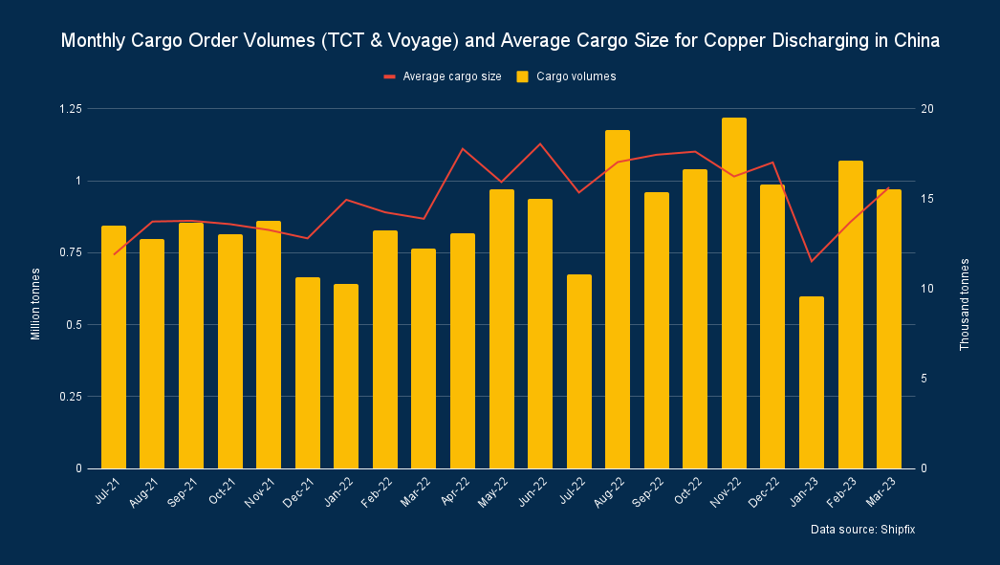

# Shipfix - Global Market Update

**Date:** March 31, 2023  
**Publisher:** Breakwave Advisors | **Category:** Market Insights  
**Original URL:** [https://www.breakwaveadvisors.com/insights/2023/3/31/shipfix-global-market-update](https://www.breakwaveadvisors.com/insights/2023/3/31/shipfix-global-market-update)  

---

[

> **Figure 1: 1 (7)**  
> **Interactive Data & Source:** [Linkedin](https://www.linkedin.com/in/ulf-bergman-81570425/) | [Local Asset](file:///C:/Users/Dell/Github/Shipping/corpus/03-breakwave/insights/2023/assets/2023-03-31_shipfix-global-market-update_img_128729_6a1eba4cf887.png)](https://www.breakwaveadvisors.com/insights/2023/3/31/did-you-know)

*By*[*Ulf Bergman*](https://www.linkedin.com/in/ulf-bergman-81570425/)

## Macro/geopolitics

Today’s release of Chinese PMI data showed that the rebound for the world’s second-largest economy is accelerating following last year’s removal of the country’s strict anti-Covid policies. The indicators for industrial production, services and construction remained robust despite global headwinds and delivered a promise of solid Chinese growth for the remainder of the year. The development is likely to lend support to commodity demand and prices in the near term, which will benefit freight rates in both the dry and wet markets.

While the manufacturing PMI retreated somewhat compared to the reading published at the end of February, the gauge nevertheless exceeded market expectations and at 51.9 it remained well into expansionary territory. However, the big news was the non-manufacturing PMI, which includes the construction sector. The indicator soared to 58.2, the highest level since May 2011. The sub-index for construction reached a new record, helped by government investments in infrastructure projects.

## Commodity Markets

The crude oil futures recovered from Wednesday’s marginal losses yesterday and moved higher on signs of a recovery in demand and an unexpected drop in US crude oil inventories. The Brent June futures recorded a daily gain of 1,3 per cent, ending Thursday’s session at 78.60 dollars per barrel. The contracts began today’s trading in the red with losses of around one per cent, but they have since recovered.

European natural gas prices rose yesterday as meteorologists projected a brief return to colder weather across the continent. In addition, planned maintenance work in Norway, which will weigh on supplies, supported the prices. The futures for delivery in May advanced by 2.1 per cent during Thursday’s trading and settled at 43.58 euros per megawatt-hour. The contracts have continued to move higher in today’s trading, with gains of around three per cent.

The thermal coal futures markets experienced diverging fortunes on Thursday. The Newcastle futures for delivery in May advanced by 0.7 per cent and ended the day at 199 dollars per tonne. In contrast, the May contracts for delivery in Rotterdam declined by 1.7 per cent to 133 dollars per tonne, despite rising natural gas prices.

Expectations of a recovery in Chinese demand amid a rebound in economic activities and declining inventories supported iron ore prices yesterday. The futures for delivery in May listed on the Singapore Exchange closed at 125.33 dollars per tonne yesterday, two per cent higher than the end of the previous session. However, prices have remained relatively stable during today’s session, despite the solid Chinese PMI data.

In contrast to yesterday’s gains for iron ore, the base metal futures had a more mixed day. The three-month copper contracts listed on the London Metal Exchange ended the session broadly unchanged, while the aluminium futures gained a quarter per cent. On the other hand, the zinc and nickel contracts ended the day deep in the red, with the former shedding 1.2 per cent and the latter declining by 2.3 per cent.

As recent supply concerns eased, the May wheat futures listed on the Chicago Board of Trade declined by 1.8 per cent yesterday. For the soybean and corn contracts due for delivery in May, the day was less eventful, with a decline of around 0.2 per cent for both.

## Freight and Bunker Markets

The headline Baltic Dry Index declined by 0.3 per cent yesterday amid weakness for the smaller vessel segments, with the Supramaxes particularly severely affected. In contrast, the Capesizes and Panamaxes extended on Wednesday’s gains amid a recovery in ordering activities. The gauge for the former segment rose by 0.8 per cent, and the latter recorded an increase of 1.7 per cent. The Supramaxes were the day’s laggards, with their sub-index declining by 3.7 per cent, while their smaller siblings, the Handysizes, saw their freight rate indicator retreating by 0.6 per cent.

The Baltic Exchange’s wet freight indices had a mixed day on Thursday. The gauge for the dirty tankers declined by 1.8 per cent, while their clean relatives saw their freight indicator rise by 0.4 per cent. The index for the LPG tankers extended Wednesday’s sharp drop, with a decline of twelve per cent. At the same time, the indicator for the LNG carriers remained unchanged for a second consecutive day.

Despite rising crude oil prices, bunker prices generally retreated yesterday. The trading in MGO faced most of the headwinds, with the fuel declining by 4.9 per cent in Houston. In Rotterdam and Singapore, the fuel declined by 2.0 and 0.9 per cent, respectively. The VLSFO recorded only marginal moves in Singapore and Rotterdam, while prices in Houston retreated by 1.2 per cent.

## The View From the Shipfix Desk

Today’s release of robust Chinese PMI is putting the world’s second-largest on track for solid growth during the remainder of the year. On the back of the high readings, many economists expect the year’s growth to top five per cent. While much can happen that will alter the outlook before the end of the year, in the short term, the PMI data suggest that Chinese demand for commodities will continue to rebound.

Demand for copper is usually seen as a leading indicator of economic growth. Hence, recent months’ high cargo order volumes for copper discharging in China lend support to the positive outlook for the Chinese economy. While aggregate volumes look set for a minor decline in March compared to February, they still remain respectable in the context of the past few years. Cargo order volumes have also been trending higher during the past few weeks, suggesting that copper prices will continue to rebound in the near term.

> **Figure 2: Market Chart 2**  
> **Interactive Data & Source:** [Shipfix](https://shipfix.com/) | [Local Asset](file:///C:/Users/Dell/Github/Shipping/corpus/03-breakwave/insights/2023/assets/2023-03-31_shipfix-global-market-update_img_unnamed-2023-03-31t140207586_735fe03066ce.png)

Data Source:[Shipfix](https://shipfix.com/)
