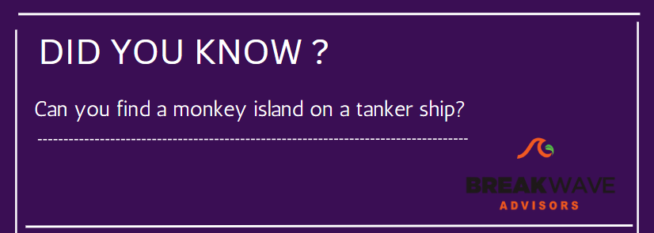
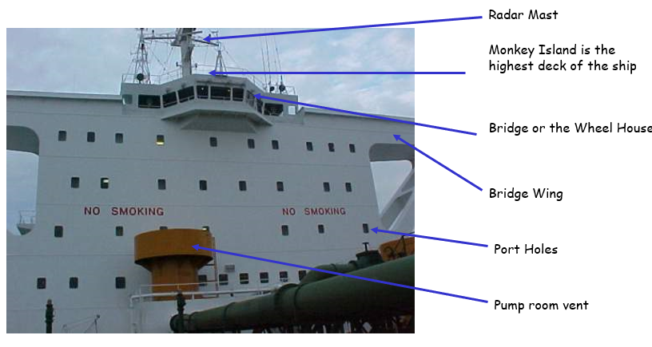
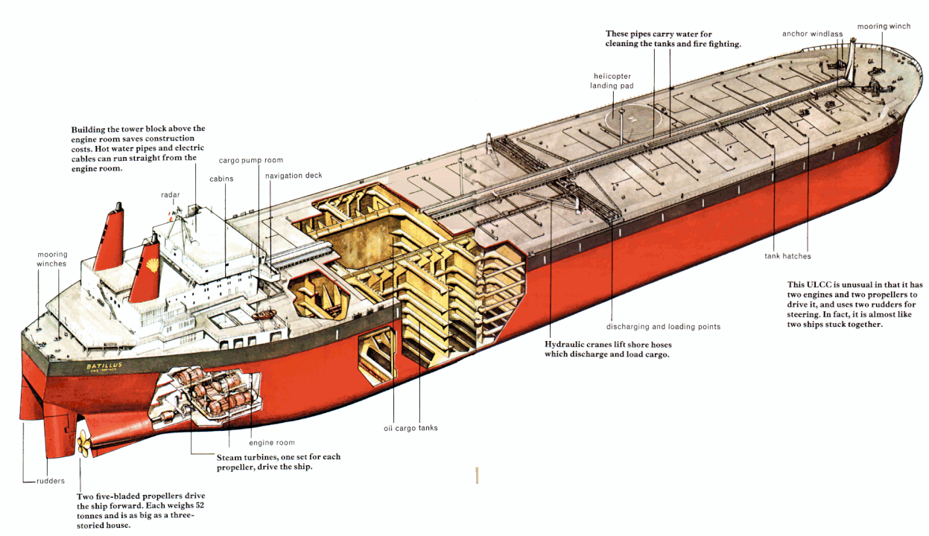

# Did you know?

**Date:** April 03, 2023  
**Publisher:** Breakwave Advisors | **Category:** Market Insights  
**Original URL:** [https://www.breakwaveadvisors.com/insights/2023/4/3/did-you-know-1](https://www.breakwaveadvisors.com/insights/2023/4/3/did-you-know-1)  

---

> **Figure 1: 1 (10)**  
> [Local Asset](file:///C:/Users/Dell/Github/Shipping/corpus/03-breakwave/insights/2023/assets/2023-04-03_did-you-know-1_img_1281029_33f02b9ceb43.png)

The term “monkey island” refers to a place on the ship which is located at the top most accessible height. Technically, it is a deck located directly above the navigating bridge of the ship. It is also referred to as the flying bridge on top of a pilothouse or chart house, and also as the ship’s upper bridge.

> **Figure 2: Atm39**  
> [Local Asset](file:///C:/Users/Dell/Github/Shipping/corpus/03-breakwave/insights/2023/assets/2023-04-03_did-you-know-1_img_atm39_fbd82eda3466.png)

## Parts of a Tanker

> **Figure 3: Εικόνα1**  
> [Local Asset](file:///C:/Users/Dell/Github/Shipping/corpus/03-breakwave/insights/2023/assets/2023-04-03_did-you-know-1_img_ce95ceb9cebacf8ccebdceb11_297a70f876b4.png)
