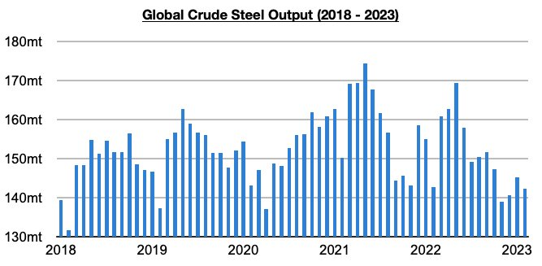
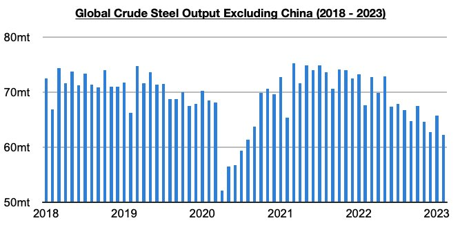

# Ongoing Weakness Outside of China

**Date:** April 04, 2023  
**Publisher:** Breakwave Advisors | **Category:** Market Insights  
**Original URL:** [https://www.breakwaveadvisors.com/insights/2023/3/31/ongoing-weakness-outside-of-china](https://www.breakwaveadvisors.com/insights/2023/3/31/ongoing-weakness-outside-of-china)  

---

*By*[*Jeffrey Landsberg*](https://www.linkedin.com/in/jeffrey-landsberg-70ab957/)

Global crude steel production totaled 142.4 million tons in February. This is down month-on-month by 2.9 million tons (-2%) and is 300,000 tons less than was reported last year for February 2022’s production. China's own steel production has continued to fare well as we have continued to stress in Weekly Dry Bulk Reports and Weekly China Reports however. Overall, it is in much of the world outside of China where significant problems remain.

> **Figure 1: Chart 1 (76)**  
> [Local Asset](file:///C:/Users/Dell/Github/Shipping/corpus/03-breakwave/insights/2023/assets/2023-04-04_ongoing-weakness-outside-of-china_img_chart1287629_1a3bbfdba412.jpg)

Global crude steel production outside of China totaled 62.3 million tons in February. This is down month-on-month by 3.5 million tons (-5%) and is 5.3 million tons (-8%) less than was reported last year for February 2022’s production. Concerning is that global crude steel production outside of China has now contracted on a year-on-year basis for twelve straight months. Other than during several months in 2020 when many nations were facing lockdowns, the last time that such a small amount of steel was produced in the world outside of China was in 2016.

> **Figure 2: Chart 2 (65)**  
> [Local Asset](file:///C:/Users/Dell/Github/Shipping/corpus/03-breakwave/insights/2023/assets/2023-04-04_ongoing-weakness-outside-of-china_img_chart2286529_8a6f94c28b3b.jpg)

Of particular note is that the European Union produced approximately 10.5 million tons of crude steel. This is 200,000 tons (2%) more than was produced in January but is 1.2 million tons (-10%) less than was reported last year for February 2022’s production. EU production has now contracted on a year-on-year basis for fifteen straight months. India produced 10 million tons of crude steel. This is 900,000 tons (-8%) less than was produced in January and is 100,000 tons (-1%) less than was reported last year for February 2022’s production. As we have continued to stress in our work, the Indian economy remains one other rare bright spot in the global economy. Just two months ago, India’s steel production matched a record. Japan produced approximately 6.9 million tons of crude steel. This is 300,000 tons (-4%) less than was produced in January and is 400,000 tons (-6%) less than was reported last year for February 2022’s production. Japan's production has now contracted on a year-on-year basis for fourteen straight months.
