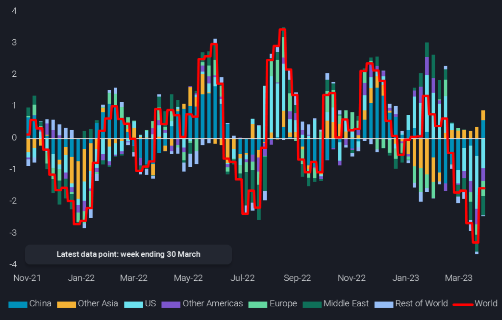

# Time to get bullish again on crude?

**Date:** April 04, 2023  
**Publisher:** Breakwave Advisors | **Category:** Market Insights  
**Original URL:** [https://www.breakwaveadvisors.com/insights/2023/4/4/time-to-get-bullish-again-on-crude](https://www.breakwaveadvisors.com/insights/2023/4/4/time-to-get-bullish-again-on-crude)  

---

Numerous structural and seasonal factors are pointing to higher crude prices in the coming months, and onshore crude inventories are already drawing right now.

*By*[*David Wech*](https://www.linkedin.com/search/results/all/?fetchDeterministicClustersOnly=false&heroEntityKey=urn%3Ali%3Afsd_profile%3AACoAACdbGu4B25CFPSM8gOGM562N0GXP-oL0T1Y&keywords=david%20wech&origin=RICH_QUERY_SUGGESTION&position=1&searchId=78f7a457-2a43-4953-81e1-cba74bc57e2d&sid=MTA)

Most investors and oil traders started the year 2023 with a bullish outlook on crude prices, primarily driven by strong oil demand growth expectations of around 2mbd. That was particularly palpable at the IE Week in London in late February. Fast forward to mid March, crude oil was trading around $10/b lower, with ICE Brent zooming in to just $70/b. So, were most people wrong?

Probably not. The mini collapse was largely driven by the banking crisis, with some poor economic readings coming in as well for Q1, feeding GDP growth fears. However, not much is pointing towards a fully-fledged recession. And it may anyway be better to look at direct crude/oil market fundamentals than macro indicators. What are we seeing there?

**Demand**is surely not doing particularly well right now. Apart from the slow economic growth and wider inflation pressure, we are just coming out of a winter period that from an oil (and gas) seller’s point of view was nothing else than horrendously disappointing. Weather, and the anticipation and actions of consumers and fuel suppliers worked together to allow markets coming out of the season with reasonably ample fuel stocks. And Q2 is the seasonal low point in oil demand. So it may still take 4-8 weeks for dynamics on the product-side to catch up. But crude procurement has to be ahead of the curve and buying should already and increasingly reflect expectations for the summer travel and construction season in the Northern Hemisphere, including China. US refiners are already upping runs post maintenance and that will very soon eat into US crude exports.

This leads us to the**supply**side, where US production expectations are revised down on a regular and consistent basis. The recent fall of WTI and related prices into the $60ies is surely not helping any of the many trends curtailing US shale production. Pretty much everybody around the globe is producing flat out, including most OPEC countries and at least until very recently Russia. Product exports from the latter have been running at ridiculously high levels in March, but also Russian crude exports are close to the upper end of the Covid-era range. As projected in our analysis pieces earlier this year, the country is not really struggling to place its exports, and the preference for clean product exports will prevail due the higher sales value amid Russia’s dire budget situation. So there appears to be only one direction for Russian crude exports out of many reasons (incl. announced cuts and seasonality), which is southwards. Otherwise, production outages have been rare recently, with the Kirkuk blockade serving as reminder that new hiccups will show up down the line.

With ample supply and limited demand, crude**balances**shouldn’t be supportive to prices at this point of the year, with the picture widely expected to tighten substantially, but only in H2 2023. However, Vortexa real-time global onshore inventory data is showing substantial, widespread and persistent draws over the last two months. Seven of the last nine weeks saw draws, averaging a strong 1.6mbd.

> **Figure 1: 20230330 1024x654**  
> **Interactive Data & Source:** [Analytics Vortexa](https://analytics.vortexa.com/?chartView=analysis&dateRange=2022-01-01T00%3A00%3A00.000Z__2023-03-30T23%3A59%3A59.999Z&hiddenSeries=%5B%224bd22474bec28e0d2576ff0ad204966df7f082d85af4f062763c49c4b1cac65d%22%2C%223663536da3c85053556bc0d1a803481aa137a854da8bc835f614e84e810b1bb7%22%2C%226034694c5c614aecd76df3e55851fdbe17f05a2b3e3d55a4630ee5c030dc9e95%22%2C%227a8292b7fbc1786ffa991850919e22ea4bc7a84382075453768367386576b0b7%22%2C%229601c1f3570258ff1b61537034a11570bda4001b4b75df5d99697ce5d5ac00de%22%2C%225190e0bccad9bf9e0ab42bfbf078d5a6151c0862a5c65d073944d38bdcfbf4d8%22%2C%22f77b3f9efb465601faafacfa2f847a997af32aa9d2a2849720b86a9ef60e937b%22%2C%22898667e32a8ddfc0f123347154d4fc6e4a8396f789709e2988dc4defd557479d%22%5D&onshoreInventoriesLocations=%5B%22a50f4a476665d3d507f54398b1a1aed1746c5469619c83c3398716724f8dda27%22%2C%22934c47f36c16a58d68ef5e007e62a23f5f036ee3f3d1f5f85a48c572b90ad8b2%22%2C%22e9e556620469f46a4dc171aef71073f5286a288da35c5883cac760446b0ceb46%22%2C%224e79eb8e84d26f5c3c0006283bc1aa52c170b58d667be9848e136afea91a57e9%22%2C%2250182d9d05051a6c8d24f0514d4ee828da6eaa29eacbb11cfe368f51526328ce%22%2C%2243a70ba6b21894cd24165d9d7ee59b012e698cf97e22fd275ccdd05a556e7061%22%2C%222aaad41b89dfad19e5668918018ae02695d7710bcbe5f2dc689234e8da492de3%22%2C%225e0cb0b66780a00576309aecff1b65934fc580d775bab29ac2a79397d8544e04%22%2C%220897165b41870b76487889ee9f4bf3c25441df38968f25a3527083df809a5250%22%2C%2202c0b7bcc4d2aa75332fb32dadfd4eba09d1d351ca7215a94d20a12c40f4ebc9%22%2C%2254c244fa8d2aae5a2318d3262422d2b2212a4ee46cd88619eadff653255823a5%22%2C%22b996521be9c996db3560ca234a56286ac38f798d34be229437555fab4f12a6a5%22%2C%22f39d455f5d38907394d6da3a91da4e391f9a34bd6a17e826d6042761067e88f4%22%2C%22c4a371acd7c3df8bd70e49805e76cb39b1309ccac3d0f4289120079a9ad68bcd%22%2C%22eb51f8315cf769b317615f7fcbdad3ff8612baaea0e9a39d3a63550c44784658%22%2C%22cde783a902c7837b814dfa5988ed74fb14841c2999d6984952c7cbfc543d5073%22%2C%223eac69e760d9ec571e57ed806a244168f12b4374af47f53d983d71ca6d01b61b%22%2C%22e6955a2c59dc90833986fe0894cf6718dddaa7816bb51bc955cdd3eb4470e554%22%2C%220fddbfd0d90bad306a92fcb483a19276f101a5f7f0783363f9f2a9d40c10558d%22%2C%22459d056652a0b7aa7f630bd2a26c97d192a61154e4c2c7afeaa06ce2880fc91f%22%2C%22ae06d7e47d6ca2a5bcd7625b8ad402d39e5e92fcc740157dc3301a6d2a6bb207%22%2C%222d92cc08f22524dba59f6a7e340f132a9da0ce9573cca968eb8e3752ef17a963%22%5D&page=OnShoreCrudeInventories&splitSelected=location_region&tabId=4f041ee4-02fd-4f08-8349-cd51eef6df22&tankCrude=%5B%22confirmed%22%2C%22probable%22%5D) | [Local Asset](file:///C:/Users/Dell/Github/Shipping/corpus/03-breakwave/insights/2023/assets/2023-04-04_time-to-get-bullish-again-on-crude_img_20230330-1024x654_6248ce77cb55.png)

[**World onshore crude inventory change by region**](https://analytics.vortexa.com/?chartView=analysis&dateRange=2022-01-01T00%3A00%3A00.000Z__2023-03-30T23%3A59%3A59.999Z&hiddenSeries=%5B%224bd22474bec28e0d2576ff0ad204966df7f082d85af4f062763c49c4b1cac65d%22%2C%223663536da3c85053556bc0d1a803481aa137a854da8bc835f614e84e810b1bb7%22%2C%226034694c5c614aecd76df3e55851fdbe17f05a2b3e3d55a4630ee5c030dc9e95%22%2C%227a8292b7fbc1786ffa991850919e22ea4bc7a84382075453768367386576b0b7%22%2C%229601c1f3570258ff1b61537034a11570bda4001b4b75df5d99697ce5d5ac00de%22%2C%225190e0bccad9bf9e0ab42bfbf078d5a6151c0862a5c65d073944d38bdcfbf4d8%22%2C%22f77b3f9efb465601faafacfa2f847a997af32aa9d2a2849720b86a9ef60e937b%22%2C%22898667e32a8ddfc0f123347154d4fc6e4a8396f789709e2988dc4defd557479d%22%5D&onshoreInventoriesLocations=%5B%22a50f4a476665d3d507f54398b1a1aed1746c5469619c83c3398716724f8dda27%22%2C%22934c47f36c16a58d68ef5e007e62a23f5f036ee3f3d1f5f85a48c572b90ad8b2%22%2C%22e9e556620469f46a4dc171aef71073f5286a288da35c5883cac760446b0ceb46%22%2C%224e79eb8e84d26f5c3c0006283bc1aa52c170b58d667be9848e136afea91a57e9%22%2C%2250182d9d05051a6c8d24f0514d4ee828da6eaa29eacbb11cfe368f51526328ce%22%2C%2243a70ba6b21894cd24165d9d7ee59b012e698cf97e22fd275ccdd05a556e7061%22%2C%222aaad41b89dfad19e5668918018ae02695d7710bcbe5f2dc689234e8da492de3%22%2C%225e0cb0b66780a00576309aecff1b65934fc580d775bab29ac2a79397d8544e04%22%2C%220897165b41870b76487889ee9f4bf3c25441df38968f25a3527083df809a5250%22%2C%2202c0b7bcc4d2aa75332fb32dadfd4eba09d1d351ca7215a94d20a12c40f4ebc9%22%2C%2254c244fa8d2aae5a2318d3262422d2b2212a4ee46cd88619eadff653255823a5%22%2C%22b996521be9c996db3560ca234a56286ac38f798d34be229437555fab4f12a6a5%22%2C%22f39d455f5d38907394d6da3a91da4e391f9a34bd6a17e826d6042761067e88f4%22%2C%22c4a371acd7c3df8bd70e49805e76cb39b1309ccac3d0f4289120079a9ad68bcd%22%2C%22eb51f8315cf769b317615f7fcbdad3ff8612baaea0e9a39d3a63550c44784658%22%2C%22cde783a902c7837b814dfa5988ed74fb14841c2999d6984952c7cbfc543d5073%22%2C%223eac69e760d9ec571e57ed806a244168f12b4374af47f53d983d71ca6d01b61b%22%2C%22e6955a2c59dc90833986fe0894cf6718dddaa7816bb51bc955cdd3eb4470e554%22%2C%220fddbfd0d90bad306a92fcb483a19276f101a5f7f0783363f9f2a9d40c10558d%22%2C%22459d056652a0b7aa7f630bd2a26c97d192a61154e4c2c7afeaa06ce2880fc91f%22%2C%22ae06d7e47d6ca2a5bcd7625b8ad402d39e5e92fcc740157dc3301a6d2a6bb207%22%2C%222d92cc08f22524dba59f6a7e340f132a9da0ce9573cca968eb8e3752ef17a963%22%5D&page=OnShoreCrudeInventories&splitSelected=location_region&tabId=4f041ee4-02fd-4f08-8349-cd51eef6df22&tankCrude=%5B%22confirmed%22%2C%22probable%22%5D)**(4-week average, mbd)**

China has kicked off the trend of draws early in the year, but has turned around to builds in more recent weeks. This may be reflective of two things: currently lacklustre refining economics and strong crude procurement from all around the world, including Russia, Iran and parts of the Atlantic Basin. Barrels arriving currently and over the coming months have been bought at low outright prices, and more is expected to come as seasonal demand and rising prices may stimulate more purchases amid concerns of even high prices in the future.

Dirty tanker rates are already lofty, especially for the bigger vessel classes, giving support to the notion of strong Chinese buying and even more upside is expected for the remainder of the year. That is if the supply is actually there to meet crude oil demand! But either way, crude prices are set to rise.

Data Source:[Vortexa](https://www.vortexa.com//oil-gas-data-traders-analysts-data-scientists?gclid=Cj0KCQjw8_qRBhCXARIsAE2AtRZKOvMnbilZ_6_91d7huSFFy71pWLrnPwGwOHVzXsmsG-1a1mZnQw8aAt89EALw_wcB&hsa_acc=1782073842&hsa_ad=548425387665&hsa_cam=14746637662&hsa_grp=125038601902&hsa_kw=&hsa_mt=&hsa_net=adwords&hsa_src=g&hsa_tgt=dsa-1431852288425&hsa_ver=3&utm_campaign=%5BCD%5D%20-%20DSA%20-%20EMEA&utm_medium=cpc&utm_medium=ppc&utm_source=google&utm_source=adwords&utm_term=)
