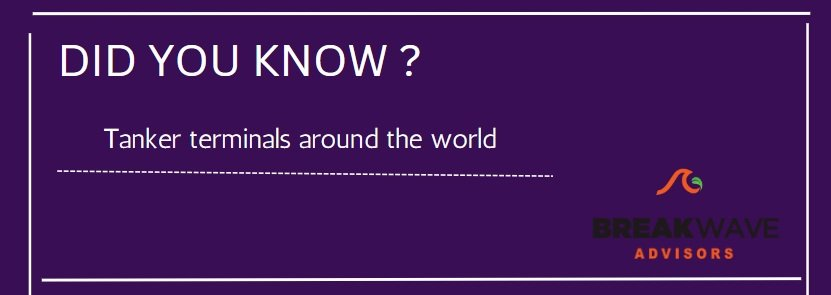
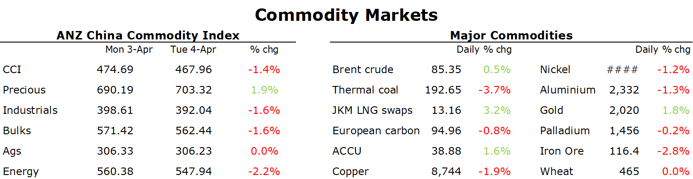

# Gold gains amid weak economic data

**Date:** April 05, 2023  
**Publisher:** Breakwave Advisors | **Category:** Market Insights  
**Original URL:** [https://www.breakwaveadvisors.com/insights/2023/4/5/gold-gains-amid-weak-economic-data](https://www.breakwaveadvisors.com/insights/2023/4/5/gold-gains-amid-weak-economic-data)  

---

[

> **Figure 1: 1+%2811%29**  
> **Interactive Data & Source:** [Linkedin](https://www.linkedin.com/in/dahynes/) | [Local Asset](file:///C:/Users/Dell/Github/Shipping/corpus/03-breakwave/insights/2023/assets/2023-04-05_gold-gains-amid-weak-economic-data_img_12b2528112529_91b7a76fcf68.jpg)](https://www.breakwaveadvisors.com/insights/2023/4/5/odzn86c14jl5mxlgrju9q70dtly66k)

*By*[*Daniel Hynes*](https://www.linkedin.com/in/dahynes/)

Weak economic data weighed on sentiment across the commodity complex. The rally in oil also seemed to raise concerns for industrial metals.

> **Figure 2: 1680645097584**  
> **Interactive Data & Source:** [Linkedin](https://www.linkedin.com/newsletters/commodities-wrap-6692196755876012032/?fbclid=IwAR3kiXJqZdxmp9ZcRwBNI7FsBySI-XSC0pfPur1qzjt7OZp7PTE59Tsl1QI) | [Local Asset](file:///C:/Users/Dell/Github/Shipping/corpus/03-breakwave/insights/2023/assets/2023-04-05_gold-gains-amid-weak-economic-data_img_1680645097584_66c7e042de45.png)

**Gold**rallied amid concerns over a global economic slowdown. A monthly decline in US job openings raised the prospect of the US Federal Reserve may be nearing the end of its aggressive rate hike cycle. Treasury yields fell, and the USD weakened, adding to the tailwinds for gold. The precious metals surged to its highest level in a year amid the flight to safety.

**Crude oil’s**rally ran out of steam amid the weak economic data. Brent crude extended gains early in the session as the market continued to digest the decision by OPEC to cut output. Led by Saudi Arabia, the group said it will cut production by 1.1mb/d from the start of May. Following the official ministerial meeting with other non-OPEC producers, Russia reaffirmed its 500kb/d cut, bring the total adjustment to 1.6mb/d. The market largely shrugged off the potential of oil exports from Iraq’s autonomous Kurdistan region. Officials said they will sign an agreement on Tuesday that may clear the path to resuming oil exports via the Turkish port of Ceyhan. Elsewhere, Exxon Mobil said its restarting units over the coming days at the oil complex near Le Havre in France following recent protests.

**European gas**slumped amid concerns the recent recovery in demand may be limited. The rally in oil renewed concerns that inflationary pressure could dampen economic activity. That put pressure on the gas markets, which were already facing high stockpiles and forecasts for warmer weather in coming weeks. That lead to a wave of profit taking by traders, with Dutch front month futures falling nearly 10%.**North Asian LNG**bucked the trend to push higher as cold weather hit China’s north. Some coal mines in Inner Mongolia halted production due to a blizzard. The spectre of more cold weather raised the prospect of an increase in LNG demand from the world’s largest importer.

Tumbling gas prices weighed on**European carbon.**EUA prices snapped a five-day winning streak amid light trading ahead of the holiday period.**Australian carbon credit units**continued to extend gains following the new climate change policies that were passed through parliament. Generic ACCUs have now gained nearly 8% to trade near AUD39/t.

**Copper**led the base metal sector lower as investors weighed up weaker factory data and the impact of the OPEC production cut. The decline in manufacturing activity in the US and China is fuelling concerns of weaker economic growth. The market also shrugged off concerns of supply disruptions. Chile’s state-owned copper producer, Codelco warned that output woes of 2022 will only get worse this year as it strives to revive its aging operations following years of under-investment.

Data source:[Commodities Wrap](https://www.linkedin.com/newsletters/commodities-wrap-6692196755876012032/?fbclid=IwAR3kiXJqZdxmp9ZcRwBNI7FsBySI-XSC0pfPur1qzjt7OZp7PTE59Tsl1QI)
