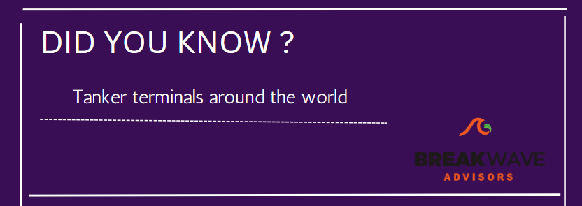
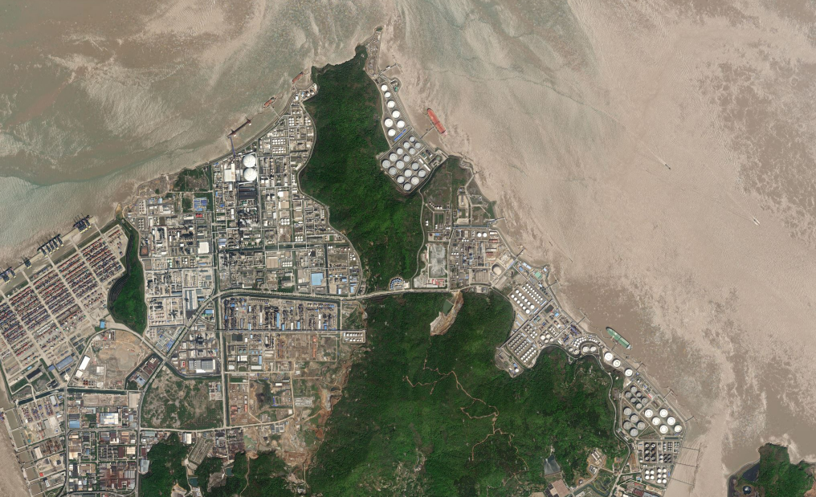
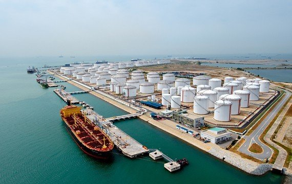
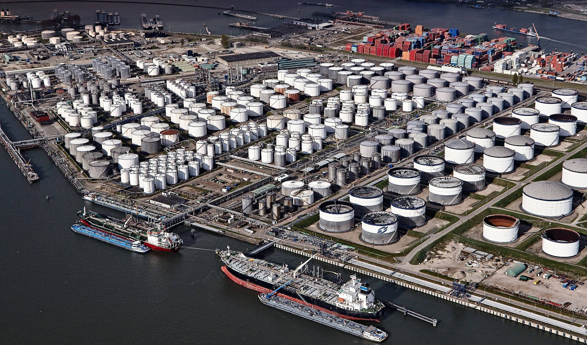
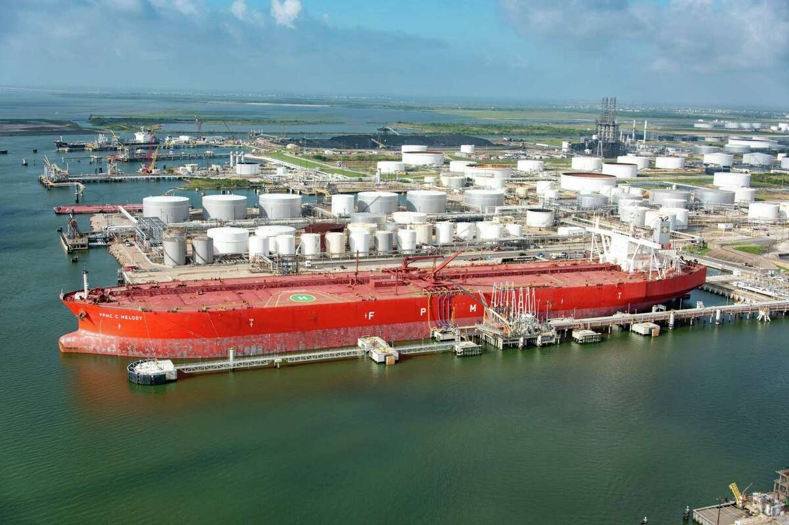

# Did you know?

**Date:** April 05, 2023  
**Publisher:** Breakwave Advisors | **Category:** Market Insights  
**Original URL:** [https://www.breakwaveadvisors.com/insights/2023/4/5/odzn86c14jl5mxlgrju9q70dtly66k](https://www.breakwaveadvisors.com/insights/2023/4/5/odzn86c14jl5mxlgrju9q70dtly66k)  

---

> **Figure 1: 1 (11)**  
> [Local Asset](file:///C:/Users/Dell/Github/Shipping/corpus/03-breakwave/insights/2023/assets/2023-04-05_odzn86c14jl5mxlgrju9q70dtly66k_img_1281129_63f2c0ca8a17.png)

A tank terminal is a facility that houses multiple bulk liquid storage tanks.

Liquid storage tanks house all types of products, from petroleum and petroleum products, like crude oil, gasoline, diesel and jet fuel, biofuels, agricultural goods such as olive oil and molasses, chemicals, asphalt, and so much more.

Tanks allow owners of the liquid products to store their products in a location as terminal operators work to help them arrange logistics operations to get the liquids to their destination.

## Discharge Port: Refining, Storage and Distribution

> **Figure 2: Εικόνα1**  
> [Local Asset](file:///C:/Users/Dell/Github/Shipping/corpus/03-breakwave/insights/2023/assets/2023-04-05_odzn86c14jl5mxlgrju9q70dtly66k_img_ce95ceb9cebacf8ccebdceb11_e7b8c4748849.png)

## Some of the Best Known:

1. ## Singapore

> **Figure 3: Horizon Oil Terminal 1**  
> [Local Asset](file:///C:/Users/Dell/Github/Shipping/corpus/03-breakwave/insights/2023/assets/2023-04-05_odzn86c14jl5mxlgrju9q70dtly66k_img_horizon-oil-terminal-1_9e2fce98c062.jpg)

## 2. Rotterdam

> **Figure 4: Photo Odfjell 90754**  
> [Local Asset](file:///C:/Users/Dell/Github/Shipping/corpus/03-breakwave/insights/2023/assets/2023-04-05_odzn86c14jl5mxlgrju9q70dtly66k_img_photo-odfjell-90754_28049b1e6bd6.jpg)

## 3.fujairah

## 4. Galveston

## 5. Houston

> **Figure 5: 1200x0 (1)**  
> [Local Asset](file:///C:/Users/Dell/Github/Shipping/corpus/03-breakwave/insights/2023/assets/2023-04-05_odzn86c14jl5mxlgrju9q70dtly66k_img_1200x028129_c673e6442e69.jpg)
