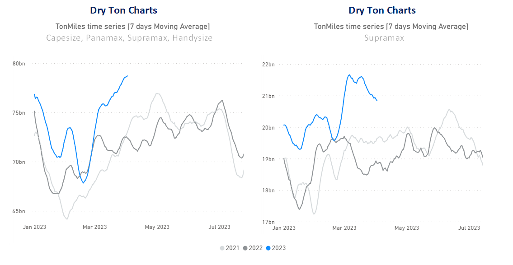
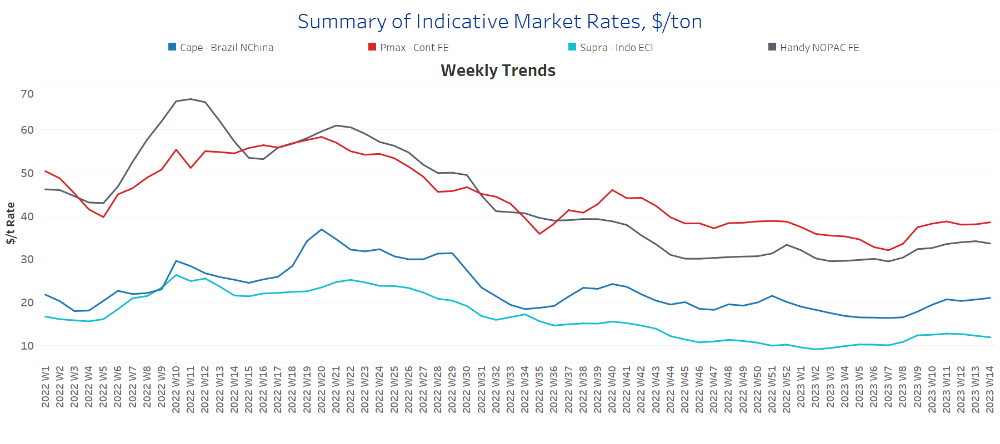
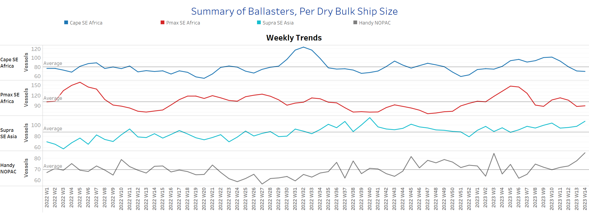
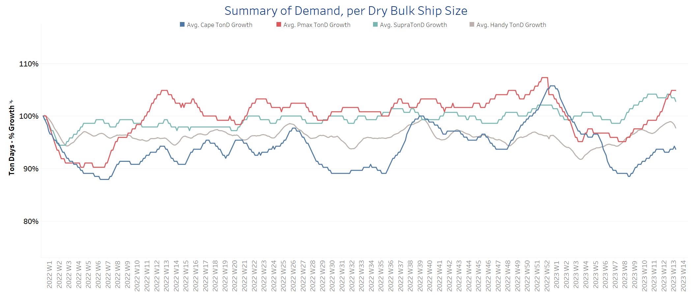
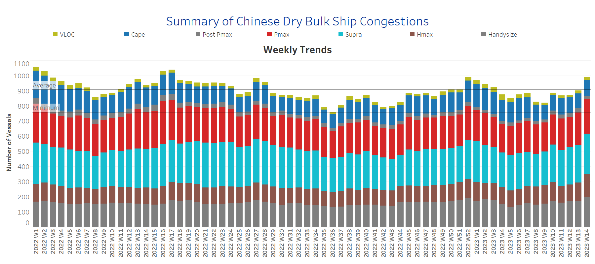

# Signal Dry Bulk Weekly Report

**Date:** April 05, 2023  
**Publisher:** Breakwave Advisors | **Category:** Market Insights  
**Original URL:** [https://www.breakwaveadvisors.com/insights/2023/4/5/signal-dry-bulk-weekly-report](https://www.breakwaveadvisors.com/insights/2023/4/5/signal-dry-bulk-weekly-report)  

---

[

> **Figure 1: Rise in March-April to the Highest Level in Last Two Years**  
> *Rise in March-April to the highest level in last two years, with Surpamax marking a remarkable turnaround*  
> **Interactive Data & Source:** [Signal Ocean Platform](https://go.signalocean.com/e/983831/dry-reports-ton-charts-dry/2nt6kk/311942776?h=WGo_srG_5_TZU4RFO_gL74q4FueMx7m3En4Er4t4UVE) | [Local Asset](file:///C:/Users/Dell/Github/Shipping/corpus/03-breakwave/insights/2023/assets/2023-04-05_signal-dry-bulk-weekly-report_img_1281129_63f2c0ca8a17.png)](https://www.breakwaveadvisors.com/insights/2023/4/5/odzn86c14jl5mxlgrju9q70dtly66k)

## Chart of the Week Dry Bulk: Ton Miles

> **Figure 2: Market Chart 2**  
> **Interactive Data & Source:** [Signal Ocean Platform](https://go.signalocean.com/e/983831/dry-reports-ton-charts-dry/2nt6kk/311942776?h=WGo_srG_5_TZU4RFO_gL74q4FueMx7m3En4Er4t4UVE) | [Local Asset](file:///C:/Users/Dell/Github/Shipping/corpus/03-breakwave/insights/2023/assets/2023-04-05_signal-dry-bulk-weekly-report_img_unnamed-2023-04-05t162414314_d3be54066da0.png)

Data Source: The Signal Ocean Platform, Dry Bulk Demand

In the first week of April, there were signs of firmness in the larger vessel segments, while there was some weakening in Supramax and Handysize vessels. Nonetheless, bulk demand growth in tonne-miles is now at its highest level in two years, with a notable turnaround in Supramax vessels. Using data from Signal Ocean, we can see the trend (left chart above) in total growth in tonne-miles for Capesize, Panamax, Supramax and Handysize this year compared to the previous two years, with a focus on Supramax (right chart). It remains to be seen how Chinese steel demand will weaken in the coming months of the second quarter of this year and whether the impact on ton-miles will lead to slower momentum, while it appears that the extension of the Black Sea grain contract has already led to stronger momentum in Supramax ton-mile growth.

For more information on this week's trends, see the analysis sections below: Freight Market, Supply, Demand and Port Congestion

## Section 1/ Freight -Market Rates ($/T)capesize - Panamax Firmer | Supramax - Handysize Softening

‘The Big Picture’ - Capesize and Panamax Bulkers and Smaller Ship Sizes

> **Figure 3: Market Chart 3**  
> **Interactive Data & Source:** [Signal Ocean Platform](https://www.thesignalgroup.com/signal-ocean-platform) | [Local Asset](file:///C:/Users/Dell/Github/Shipping/corpus/03-breakwave/insights/2023/assets/2023-04-05_signal-dry-bulk-weekly-report_img_unnamed-2023-04-05t162510256_9623921fe2fb.png)

In early April, the strength of recent days in the smaller vessel categories has weakened, while rates for Capesize and Panamax vessels continue to rise.

- **Capesize**vessel freight rates are now at $21/tonne, up nearly $5/tonne from 5 weeks ago.
- **Panamax**vessel freight rates fromtheContinent to the Far East are now just above $38/tonne, while current rates are nearly $7/tonne above the week 7 low.
- **Supramax**freight rates for the Indo-ECI route fell slightly below $12/tonne, with signs of weakening in the first half of April.
- **Handysize**freight rates for the NOPAC Far East route moved slightly below $34/tonne, but were still $4/tonne above the week 7 low, marking six consecutive weeks of significant firming.

## Section 2/ Supply -Ballasters (# Vessels)capesize - Panamax Decreasing | Supramax Increasing

> **Figure 4: Supply Trend Lines for Key Load Areas**  
> **Interactive Data & Source:** [Signal Ocean Platform](https://www.thesignalgroup.com/signal-ocean-platform) | [Local Asset](file:///C:/Users/Dell/Github/Shipping/corpus/03-breakwave/insights/2023/assets/2023-04-05_signal-dry-bulk-weekly-report_img_unnamed-2023-04-05t162610902_7a7c4f0565d6.png)

The number of ballast ships continues to decrease in the Capesize and Panamax segments, while increasing in the smaller ship categories.

- **Capesize**SE Africa: The number of vessels now stands at 70, down 2 from the previous week and 10 below the annual average.​​​​​​
- **Panamax**SE Africa: The number of vessels has fallen to 89, 23 less than three weeks ago, with a tendency to remain below the annual average of 100 in the coming days.
- **Supramax**SE Asia: The number of vessels increased to 107, almost 10 more than a week ago and 20 above the annual average.​
- **Handysize**NOPAC: The number of vessels is now 85, 20% above the annual average and the highest level in the last year.

## Section 3/ Demand -TonDays Increasing

> **Figure 5: TonDays Increasing**  
> **Interactive Data & Source:** [Signal Ocean Platform](https://www.thesignalgroup.com/signal-ocean-platform) | [Local Asset](file:///C:/Users/Dell/Github/Shipping/corpus/03-breakwave/insights/2023/assets/2023-04-05_signal-dry-bulk-weekly-report_img_unnamed-2023-04-05t162652622_5e98d6e14e67.png)

April marks a continued recovery in demand growth in the Panamax segment, and the Supramax segment also gives reason for further optimism, as recent growth appears to be the highest compared to the beginning of the year and last year.

- **Capesize**demand ton-days: The upward trend of the last six weeks continues, but we expect even higher growth rates in the second half of the year.
- **Panamax**demand ton-days: Growth reached its highest level since the first week of this year and is expected to continue as Australian coal shipments to China boost demand.
- **Supramax**demand ton-days: The upward trend in supramax vessel demand is outpacing growth in demand for other vessel categories, signalling an upward cycle for the smaller vessel categories.
- **Handysize**demand ton-days: We continue to see positive signs of stronger momentum, with growth well above the week 6 low and a stronger recovery in the first days of April.

## Section 4/ Port Congestion -No of Vesselsincreasingdry Bulk Ships Congested at Chinese Ports

> **Figure 6: Increasing**  
> **Interactive Data & Source:** [Signal Ocean Platform](https://www.thesignalgroup.com/signal-ocean-platform) | [Local Asset](file:///C:/Users/Dell/Github/Shipping/corpus/03-breakwave/insights/2023/assets/2023-04-05_signal-dry-bulk-weekly-report_img_unnamed-2023-04-05t162748306_cea1eb4d85bb.png)

Congestion continued the strong upward trend from late March, with the Handysize, Supramax, and Panamax segments continuing to lead in the last two weeks of the uptrend, approaching the highs seen in the final weeks of 2022.

- **Capesize:**The number of vessels now stands at 103, up 6 from the last week of March.
- **Panamax:**The number of ships is now at 228, 16 more than the previous week and still too high as we have not seen a value below 190 since the end of the fourth week.
- **Supramax:**The number of ships is now at 266, 17 more than the previous week and 24% more than at the end of week 8.
- **Handysize**: The number of congested ships reached 200, 30 more than a week ago, with signs of a record increase since the end of week 5 (~133 ships).

Data Source:[Signal Ocean Platform](https://www.thesignalgroup.com/signal-ocean-platform)
