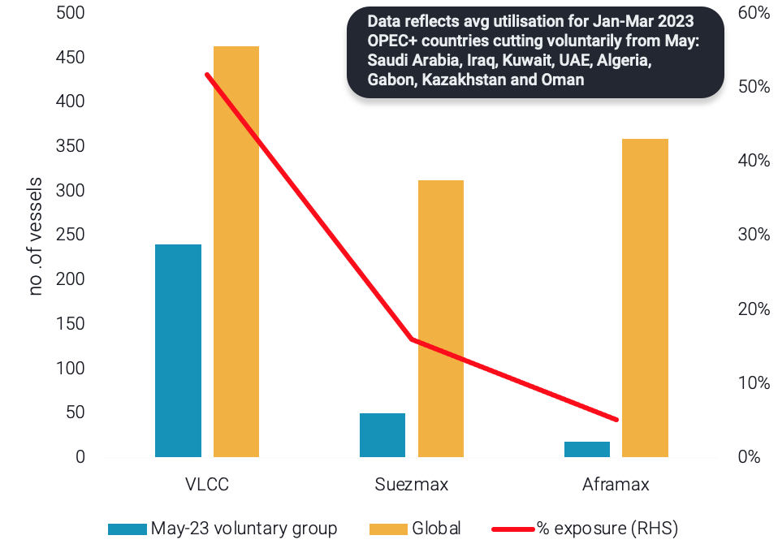
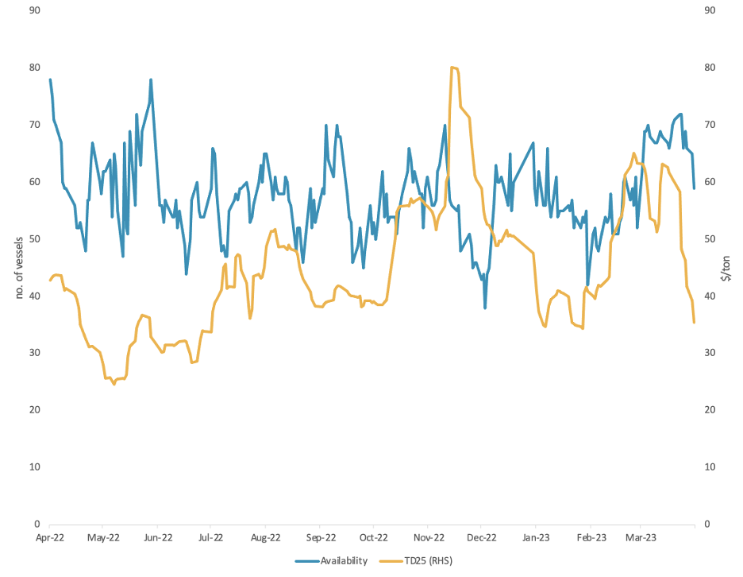

# Vortexa Freight Weekly

**Date:** April 06, 2023  
**Publisher:** Breakwave Advisors | **Category:** Market Insights  
**Original URL:** [https://www.breakwaveadvisors.com/insights/2023/4/6/vortexa-freight-weekly](https://www.breakwaveadvisors.com/insights/2023/4/6/vortexa-freight-weekly)  

---

## OPEC Cuts Expose Vlccs|| USG Dirty Rates Slide

*By*[*Ioannis Papadimitriou*](https://www.linkedin.com/search/results/all/?fetchDeterministicClustersOnly=false&heroEntityKey=urn%3Ali%3Afsd_profile%3AACoAAB3dQrYBbffaDWLWh_dRcHGHYBOwNhhatgs&keywords=ioannis%20papadimitriou&origin=RICH_QUERY_TYPEAHEAD_HISTORY&position=0&searchId=08a77073-ad85-43bf-a10d-45aa504f190b&sid=SG6)

## Analysis / East of Suez / Dirty

**OPEC+ cuts could shape up the VLCC trade, while leaving the rest of the vessel classes unscathed**

> **Figure 1: Tanker Utilisation From OPEC+ Members Involved in May 23 Cuts Vs**  
> *Tanker Utilisation from OPEC+ members involved in May 23 cuts vs. Global Tanker utilisation, split by vessel class*  
> **Interactive Data & Source:** [Vortexa](https://www.vortexa.com//oil-gas-data-traders-analysts-data-scientists?gclid=Cj0KCQjw8_qRBhCXARIsAE2AtRZKOvMnbilZ_6_91d7huSFFy71pWLrnPwGwOHVzXsmsG-1a1mZnQw8aAt89EALw_wcB&hsa_acc=1782073842&hsa_ad=548425387665&hsa_cam=14746637662&hsa_grp=125038601902&hsa_kw=&hsa_mt=&hsa_net=adwords&hsa_src=g&hsa_tgt=dsa-1431852288425&hsa_ver=3&utm_campaign=%5BCD%5D%20-%20DSA%20-%20EMEA&utm_medium=cpc&utm_medium=ppc&utm_source=google&utm_source=adwords&utm_term=) | [Local Asset](file:///C:/Users/Dell/Github/Shipping/corpus/03-breakwave/insights/2023/assets/2023-04-06_vortexa-freight-weekly_img_unnamed-2023-04-06t141853537_2dc74c140758.png)

- OPEC+ led by Saudi Arabia and other members caught the world in surprise by announcing a voluntary cut of around 1.2 million bpd. The voluntary cuts are expected to start in May 2023 and last until the end of the year.
- Looking at the vessel classes which are employed in the 8 countries which imposed the voluntary cuts, it is clear that the greatest exposure is borne by VLCCs. More specifically 52% of the global VLCC utilisation stems from voyages commencing out of these OPEC+ member states. At the other extreme lie Aframax tankers which indicate an utilisation exposure of just 5%.
- Does this mean bad news for VLCC owners? Not necessarily, perhaps the contrary. As the Chinese economy is recovering and crude purchasing ramps up, Middle Eastern spot cargoes could be replaced with barrels from the Atlantic Basin. This in turn will likely trigger longer voyages, effectively tightening the already overstretched VLCC supply further.

## Analysis / West of Suez / Dirty

### USG Rates Slide But OPEC+ Cuts Could Drive a Comeback

> **Figure 2: Us Gulf-to-Europe (Td25) Freight Rates vs Aframax Availability**  
> *US Gulf-to-Europe (TD25) freight rates vs Aframax availability in the US Gulf*  
> **Interactive Data & Source:** [Vortexa](https://www.vortexa.com//oil-gas-data-traders-analysts-data-scientists?gclid=Cj0KCQjw8_qRBhCXARIsAE2AtRZKOvMnbilZ_6_91d7huSFFy71pWLrnPwGwOHVzXsmsG-1a1mZnQw8aAt89EALw_wcB&hsa_acc=1782073842&hsa_ad=548425387665&hsa_cam=14746637662&hsa_grp=125038601902&hsa_kw=&hsa_mt=&hsa_net=adwords&hsa_src=g&hsa_tgt=dsa-1431852288425&hsa_ver=3&utm_campaign=%5BCD%5D%20-%20DSA%20-%20EMEA&utm_medium=cpc&utm_medium=ppc&utm_source=google&utm_source=adwords&utm_term=) | [Local Asset](file:///C:/Users/Dell/Github/Shipping/corpus/03-breakwave/insights/2023/assets/2023-04-06_vortexa-freight-weekly_img_unnamed-2023-04-06t142006666_a58596df5831.png)

- US crude exports reached a dataset high in March, standing at almost 2mbd. Crude tonne-days out of the US Gulf show that most of these volumes have headed towards Europe and Asia, with VLCC tonne-days showing the steepest increase.
- At the same time, onshore crude inventories in the US showed a large draw of 47 million barrels, down over 10% m-o-m. This suggests that March’s level of crude exports is not sustainable, especially with US refinery runs increasing after the spring maintenance period.
- Sharply declining Aframax freight rates from the US Gulf-to-Europe (TD25) as well as falling VLCC rates reflect weakened short term demand for US crude. Additionally, Aframax availability in the region remains at a high level, adding further pressure to TD25. However, in light of OPEC+ supply cuts, demand for US crude could strengthen, providing support to freight rates ex-US Gulf.

Data Source:[Vortexa](https://www.vortexa.com//oil-gas-data-traders-analysts-data-scientists?gclid=Cj0KCQjw8_qRBhCXARIsAE2AtRZKOvMnbilZ_6_91d7huSFFy71pWLrnPwGwOHVzXsmsG-1a1mZnQw8aAt89EALw_wcB&hsa_acc=1782073842&hsa_ad=548425387665&hsa_cam=14746637662&hsa_grp=125038601902&hsa_kw=&hsa_mt=&hsa_net=adwords&hsa_src=g&hsa_tgt=dsa-1431852288425&hsa_ver=3&utm_campaign=%5BCD%5D%20-%20DSA%20-%20EMEA&utm_medium=cpc&utm_medium=ppc&utm_source=google&utm_source=adwords&utm_term=)
