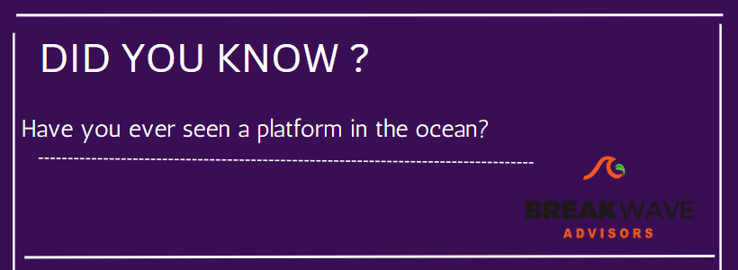
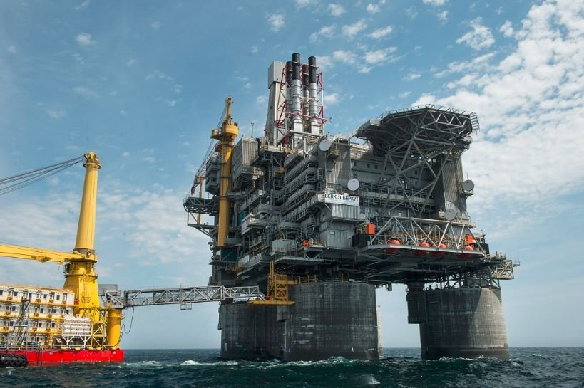
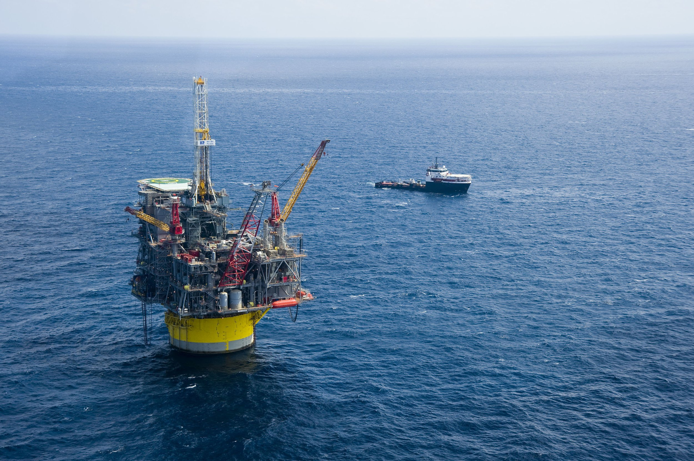
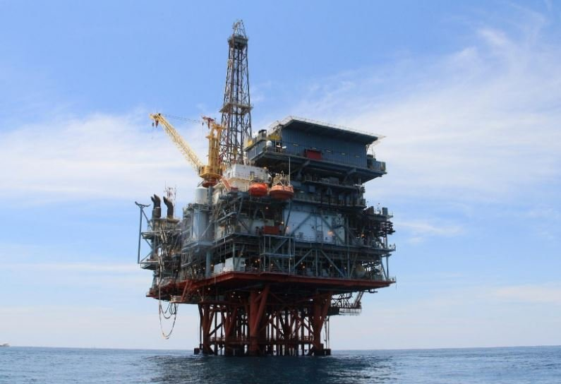
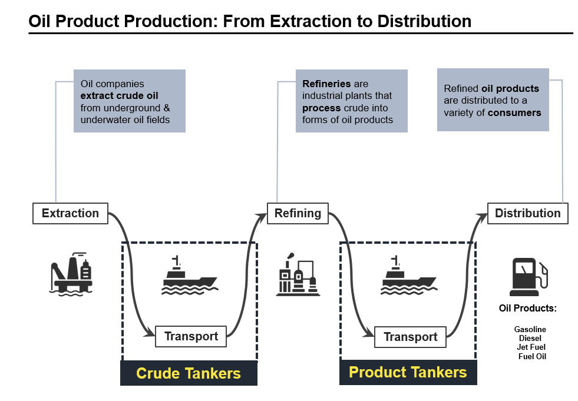

# Did you know?

**Date:** April 07, 2023  
**Publisher:** Breakwave Advisors | **Category:** Market Insights  
**Original URL:** [https://www.breakwaveadvisors.com/insights/2023/4/7/did-you-know](https://www.breakwaveadvisors.com/insights/2023/4/7/did-you-know)  

---

> **Figure 1: 1 (13)**  
> [Local Asset](file:///C:/Users/Dell/Github/Shipping/corpus/03-breakwave/insights/2023/assets/2023-04-07_did-you-know_img_1281329_8c50598b622a.png)

Oil and gas platforms or offshore drilling rigs are constructed for extracting, storing and processing petroleum and natural gas lying beneath the ocean floor.

Fun fact: Most of these platforms are equipped with basic amenities as workers live on these structures to oversee the operations.

### Witch Are 3 of the Biggest Oil Platforms in the World?

## Berkut Oil Rig

Berkut is the biggest platform in the world situated near the Russian coastline facing the Pacific Ocean, near the island of Sakhalin close to the Japanese mainland. It is truly an engineering marvel, weighing about 200,000 tons and 35 m deep from the seafloor. It is estimated that the platform’s maximum oil extraction capacity is 4.5 million tons per year.

> **Figure 2: Berkut Platform**  
> [Local Asset](file:///C:/Users/Dell/Github/Shipping/corpus/03-breakwave/insights/2023/assets/2023-04-07_did-you-know_img_berkut-platform_716a4c30a4d3.jpg)

## Perdido

The second biggest in the world located near the US Gulf of Mexico. It became operational in 2010. The project was quite challenging in terms of geographical restraints since the gulf is ridden with typhoons and hurricanes.

The platform had to be durable to withstand hurricanes and extremely low temperatures. The water depth of the structure from the seabed is around 8000 feet and extracts oil and gas from the Great White, Tobago and Silverfield.

> **Figure 3: Shell Perdido Deepwater Offshore Production Platform (51115227891)**  
> [Local Asset](file:///C:/Users/Dell/Github/Shipping/corpus/03-breakwave/insights/2023/assets/2023-04-07_did-you-know_img_shell-perdido-deepwater-offshore-pro_b0a64b5ebda5.jpg)

## Petronius

The Petronius oil platform is situated in the Gulf of Mexico, close to New Orleans in the US. The construction of this fixed, compliant tower type rig began in 1997 and ended in 2000. It is at an underwater depth of more than 530 meters.

> **Figure 4: Petronius Platform**  
> [Local Asset](file:///C:/Users/Dell/Github/Shipping/corpus/03-breakwave/insights/2023/assets/2023-04-07_did-you-know_img_petronius-platform_b1f6782558dd.jpg)

> **Figure 5: 1 (12)**  
> [Local Asset](file:///C:/Users/Dell/Github/Shipping/corpus/03-breakwave/insights/2023/assets/2023-04-07_did-you-know_img_1281229_3f7755a2e463.png)
