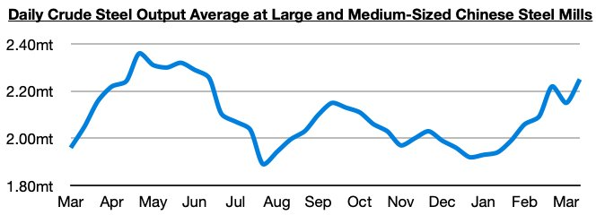

# Ongoing Strength in China

**Date:** April 07, 2023  
**Publisher:** Breakwave Advisors | **Category:** Market Insights  
**Original URL:** [https://www.breakwaveadvisors.com/insights/2023/4/7/ongoing-strength-in-china](https://www.breakwaveadvisors.com/insights/2023/4/7/ongoing-strength-in-china)  

---

[

> **Figure 1: Byjeffrey Landsberg**  
> *ByJeffrey Landsberg*  
> **Interactive Data & Source:** [Linkedin](https://www.linkedin.com/in/jeffrey-landsberg-70ab957/) | [Local Asset](file:///C:/Users/Dell/Github/Shipping/corpus/03-breakwave/insights/2023/assets/2023-04-07_ongoing-strength-in-china_img_1281329_8c50598b622a.png)](https://www.breakwaveadvisors.com/insights/2023/4/7/did-you-know)

Often in our Weekly China Reports last year, we discussed Chinese efforts to end US dollar hegemony. Particularly notable to us last year was when Russian coal sales started to be settled in Chinese yuan even when China was not involved on the import or export side. We discussed this development in our July 4th Weekly China Report, and also discussed a few weeks later in our July 18th report how BHP that month completed its first yuan-based spot trade iron ore sale to Chinese buyers and opened its first a wholly-owned subsidiary Shanghai branch.

Overall, the Chinese government has continued to make significant progress in achieving its longtime goal of ending US dollar hegemony. New more recently has been China and Brazil reaching a deal to trade in their own currencies rather than in the US dollar, and separately China also completing its first ever LNG trade settled in yuan. These have all been historic changes, and as the months and year progress, the world is likely to continue to see the United States lose global influence and China gain influence. While working to continue to end US dollar hegemony, the Chinese government remains likely to continue to do everything in its power to support its economy (and the dry bulk market stands to continue to benefit). It is very unlikely that China will pull back on economic growth at a time when it is making such great progress in achieving its goal of ending US dollar hegemony.

Also of note in China is that PMI (purchasing manager index) data for March was recently released. It came in at a record high. Steel production in China has also climbed to the highest level seen since June. We continue to stress that China is doing very well, and its overall retail and industrial performance are night and day different compared to a year ago and also compared to just a few months ago. China is continuing to decouple from much of the rest of the world.

> **Figure 2: Chart 1 (76)**  
> [Local Asset](file:///C:/Users/Dell/Github/Shipping/corpus/03-breakwave/insights/2023/assets/2023-04-07_ongoing-strength-in-china_img_chart1287629_6cb0ab9aedad.jpg)
