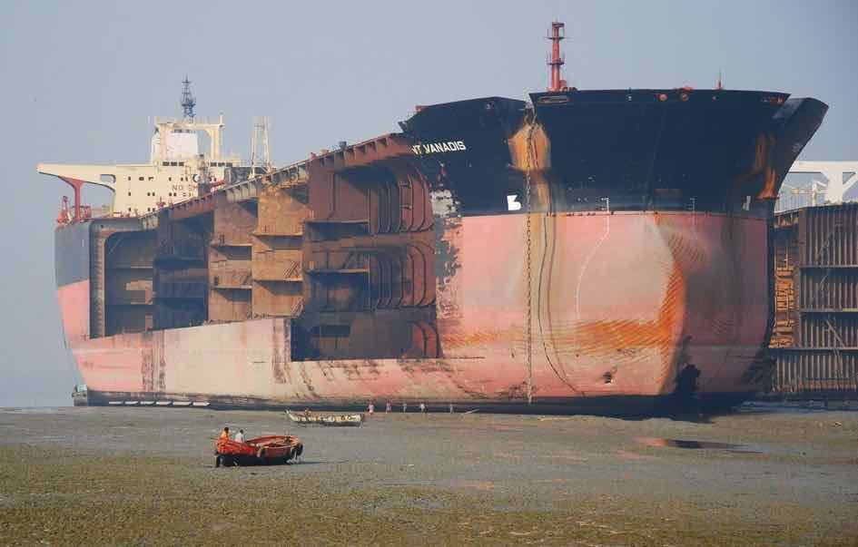
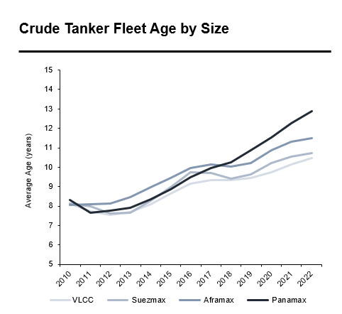

# Did you know?

**Date:** April 10, 2023  
**Publisher:** Breakwave Advisors | **Category:** Market Insights  
**Original URL:** [https://www.breakwaveadvisors.com/insights/2023/4/10/did-you-know](https://www.breakwaveadvisors.com/insights/2023/4/10/did-you-know)  

---

> **Figure 1: 1 (5)**  
> [Local Asset](file:///C:/Users/Dell/Github/Shipping/corpus/03-breakwave/insights/2023/assets/2023-04-10_did-you-know_img_128529_45b76cb7cdd6.png)

> **Figure 2: Dsc 6292b1**  
> [Local Asset](file:///C:/Users/Dell/Github/Shipping/corpus/03-breakwave/insights/2023/assets/2023-04-10_did-you-know_img_dsc-6292b1_a0f30d21aab3.jpg)

Tanker supply fundamentals are impacted by new orders, new deliveries and demolition of ships that are no longer viable to operate.

•**New orders**are placed by shipowners anticipating future rates to exceed a break-even level that is determined by the purchase price of the ship as well as the projected cost to operate it.

•**New deliveries**take place 2-3 years after a ship is ordered.

•**Demolition**of crude tanker is typical after the ship reaches 20-25 years of age, at which point ships are not economical to operate due to the cost maintenance (a full inspection completed every 5 years) to meet environmental and technical requirements.

> **Figure 3: 1 (7)**  
> [Local Asset](file:///C:/Users/Dell/Github/Shipping/corpus/03-breakwave/insights/2023/assets/2023-04-10_did-you-know_img_128729_3222f63e4cc8.png)
