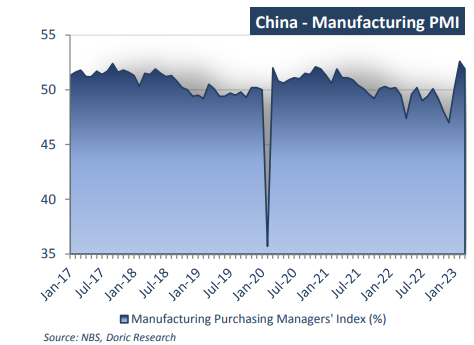
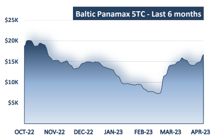
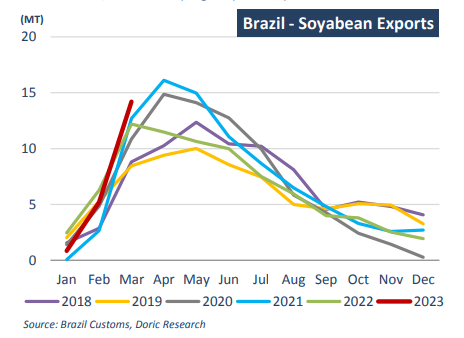

# Doric Weekly Market Insight

**Date:** April 10, 2023  
**Publisher:** Breakwave Advisors | **Category:** Market Insights  
**Original URL:** [https://www.breakwaveadvisors.com/insights/2023/4/10/doric-weekly-market-insight](https://www.breakwaveadvisors.com/insights/2023/4/10/doric-weekly-market-insight)  

---

[

> **Figure 1: Bymichalis Voutsinas**  
> *ByMichalis Voutsinas*  
> **Interactive Data & Source:** [Linkedin](https://www.linkedin.com/in/michalis-voutsinas-587544163/) | [Local Asset](file:///C:/Users/Dell/Github/Shipping/corpus/03-breakwave/insights/2023/assets/2023-04-10_doric-weekly-market-insight_img_128529_45b76cb7cdd6.png)](https://www.breakwaveadvisors.com/insights/2023/4/10/did-you-know)

## “With the Brazilian Soybean's Solid Global Demand and Favorable Competitiveness Due to the Strong Us Dollar, Refinitiv Forecasts 2022/23 Brazilian Soybean Exports at 92.8 Million Tonnes, Considerably Higher Year-on-Year.”

Spot market was a tale of two segments during the fourteenth week, with the gearless ones steaming further north and the geared losing some steam. In fact, reporting solid gains, Baltic Capesize and Panamax indices trended upwards, concluding yesterday at very similar levels of $16,928 and $16,661 daily respectively. Conversely, drifting lower, Baltic Supramax and Handy indices reverted back to mid-March levels of $12,773 and $11,578 daily respectively. A similar contradiction has become apparent on the macro-commodity news with China manufacturing activity softening whilst East Coast South America was setting a rather cheerful tone.

China's extensive manufacturing sector, accounting for a third of the world's second-largest economy, lost momentum in March amid weak export orders. The official Purchasing Manager Index (PMI) of China's manufacturing industry came at 51.9 percent, decreasing by 0.7 percentage points from the eight-month high of the previous month. In reference to the sub-indices, the production index, new order index and supplier delivery time index, they were all lingering higher than the threshold. On the other hand, the raw material inventory index and employee index were balancing lower than the threshold. In particular, the production index lay at 54.6 percent, indicating that manufacturing production activities continued to expand.

The new order index balanced at 53.6 percent, pointing to a continuous increase in manufacturing market demand. In the opposite direction, the raw material inventory index moved down to 48.3 percent, indicating that the inventory of major raw materials in the manufacturing industry was in decline. Although the sustained upturn in demand supported a further increase in purchasing activity, inventories continued to drop as companies maintained a cautious approach to stock building. The latter is also apparent in the spot market of the geared segments, lacking the vividness of the previous couple of years. However, if business confidence regarding the oneyear outlook for output remains positive, imports of raw materials have no other option but to increase accordingly.

> **Figure 2: 1 (2)**  
> **Interactive Data & Source:** [Doric](https://www.doric.gr/) | [Local Asset](file:///C:/Users/Dell/Github/Shipping/corpus/03-breakwave/insights/2023/assets/2023-04-10_doric-weekly-market-insight_img_128229_38b13066c563.png)

Leaving the Chinese colossal manufacturing sector a bit on the background, dry bulk shipping’s eyes were on the staple grain trades this week. The vibrant East Coast South America granary injected optimism in the market along with a plethora of cargoes. Tuning in to that frequency, the Panamax bulker sector reached its highest point in almost six months. With the leading P6 (ECSA rv) trading in the very high teens, increased activity in the centre stage of the Atlantic has had a positive bearing on the Panamax market across the board.

> **Figure 3: 1 (4)**  
> **Interactive Data & Source:** [Doric](https://www.doric.gr/) | [Local Asset](file:///C:/Users/Dell/Github/Shipping/corpus/03-breakwave/insights/2023/assets/2023-04-10_doric-weekly-market-insight_img_128429_e112454fa61a.png)

Historically, March is the highest month for US corn exports. However, US corn exports totalled a preliminary 4.3 million tonnes in the previous month, some 35.7 percent below the three-year average for the month. By contrast, China became the primary destination of Brazilian corn exports by volume, surpassing the traditional importers, according to trade data from the Brazilian government. If United States Department of Agriculture’s estimates are confirmed, Brazil will surpass the US as the world’s largest corn exporter in the 2022-23 marketing year. Looking forward, Brazil's focus is now on soybeans. The main soybean producer shipped 14.2 million tonnes of the high-protein beans in March, 19.3 percent above the five-year average, according to Refinitiv trade flows.

As of April 5, the accumulated 2022/23 Brazilian soybean exports are at 23.5 million tonnes, 6 percent above last year and the highest on record until this date. Additionally, the latest Williams lineup report (released on April 4) shows 12.4 million tonnes of soybeans scheduled to be delivered in April. With the Brazilian soybean's solid global demand and favorable competitiveness due to the strong US dollar, Refinitiv forecasts 2022/23 Brazilian soybean exports at 92.8 million tonnes, considerably higher year-on-year.

> **Figure 4: 1 (3)**  
> **Interactive Data & Source:** [Doric](https://www.doric.gr/) | [Local Asset](file:///C:/Users/Dell/Github/Shipping/corpus/03-breakwave/insights/2023/assets/2023-04-10_doric-weekly-market-insight_img_128329_543d28b8eaad.png)

Setting aside the sterile macros, everyday life of the spot market is heavily affected by local and international Holidays as well. However, eventually Holiday periods will be over paving the way for the underlying dynamics to fully deploy their potential.

Data source:[Doric](https://www.doric.gr/)
