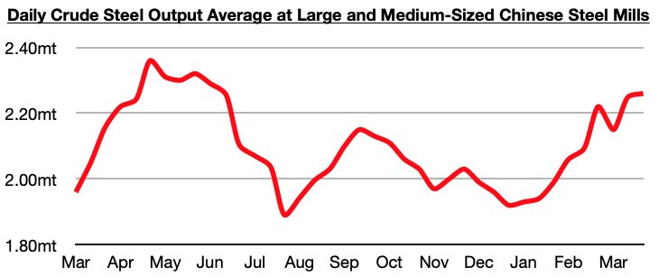
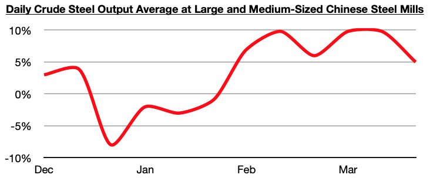

# Steel Production Now Likely Exceeding Demand in China

**Date:** April 12, 2023  
**Publisher:** Breakwave Advisors | **Category:** Market Insights  
**Original URL:** [https://www.breakwaveadvisors.com/insights/2023/4/12/steel-production-now-likely-exceeding-demand-in-china](https://www.breakwaveadvisors.com/insights/2023/4/12/steel-production-now-likely-exceeding-demand-in-china)  

---

*By*[*Jeffrey Landsberg*](https://www.linkedin.com/in/jeffrey-landsberg-70ab957/)

Recent weeks have seen Chinese steel production climb even higher, with last month ending with production at the highest level since June. The most recently released data shows that daily crude steel production at large and medium-sized mills averaged 2.26 million tons during March 21 - 31. This is not only the highest level seen since June, it is also up year-on-year by 5%. Overall, steel production in China has continued to exceed almost all expectations and remains quite impressive, especially considering the great weakness continuing to be seen in much of the rest of the world.

> **Figure 1: Chart 1 (77)**  
> [Local Asset](file:///C:/Users/Dell/Github/Shipping/corpus/03-breakwave/insights/2023/assets/2023-04-12_steel-production-now-likely-exceeding-demand-in-china_img_chart1287729_d71037a6c02b.jpg)

While 5% year-on-year growth is strong growth, it does mark a decline from the 10% year-on-year growth that was previously maintained during the first twenty days of March and during the middle of February. Still, though, it is much better than was seen in late December and at the beginning of this year. December ended with daily crude steel production at large and medium-sized mills down year-on-year by 8% and there was no growth in January.

> **Figure 2: Chart 2 (65)**  
> [Local Asset](file:///C:/Users/Dell/Github/Shipping/corpus/03-breakwave/insights/2023/assets/2023-04-12_steel-production-now-likely-exceeding-demand-in-china_img_chart2286529_f5ee72cc3ba2.jpg)

At present, it does appear that steel production is now exceeding demand. While production has climbed to the highest level seen since June, steel prices in China have fallen during two of the last three weeks. The pace of decline in steel stockpiles in China has also slowed significantly.
