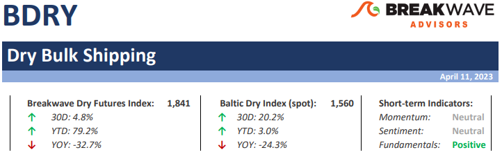

# Weekly Insights Review

**Date:** April 14, 2023  
**Publisher:** Breakwave Advisors | **Category:** Market Insights  
**Original URL:** [https://www.breakwaveadvisors.com/insights/2023/4/14/weekly-insights-review](https://www.breakwaveadvisors.com/insights/2023/4/14/weekly-insights-review)  

---

## Welcome to Our Weekly Insights Review

## Read Here Everything You Need to Know

> **Figure 1: Unsplash Image V7npjmbwyj4**  
> **Interactive Data & Source:** [Breakwave Advisors Market Insights](https://www.breakwaveadvisors.com/insights/2023/4/10/doric-weekly-market-insight) | [Local Asset](file:///C:/Users/Dell/Github/Shipping/corpus/03-breakwave/insights/2023/assets/2023-04-14_weekly-insights-review_img_unsplash-image-v7npjmbwyj4_1556b2473a1d.jpg)

## Doric Weekly Market Insight

“With the Brazilian soybean's solid global demand and favorable competitiveness due to the strong US dollar, Refinitiv forecasts 2022/23 Brazilian soybean exports at 92.8 million tonnes, considerably higher year-on-year.”
[Read More](https://www.breakwaveadvisors.com/insights/2023/4/10/doric-weekly-market-insight)

> **Figure 2: Unsplash Image Lzwwcp1vdbw**  
> **Interactive Data & Source:** [Breakwave Advisors Market Insights](https://www.breakwaveadvisors.com/insights/2023/4/10/breakwave-bi-weekly-dry-bulk-report-april-11-2023) | [Local Asset](file:///C:/Users/Dell/Github/Shipping/corpus/03-breakwave/insights/2023/assets/2023-04-14_weekly-insights-review_img_unsplash-image-lzwwcp1vdbw_6d8e4782f64f.jpg)

## Breakwave Bi-Weekly Dry Bulk Report - April 11, 2023

**Entering Q2 on a high note**– With spot Capesize rates some 6,000 above the level at the same time last year, the outlook seems promising.
[Read More](https://www.breakwaveadvisors.com/insights/2023/4/10/breakwave-bi-weekly-dry-bulk-report-april-11-2023)

> **Figure 3: Db+report+top**  
> **Interactive Data & Source:** [Breakwave Advisors Market Insights](https://www.breakwaveadvisors.com/insights/2023/4/13/shipfix-global-market-update) | [Local Asset](file:///C:/Users/Dell/Github/Shipping/corpus/03-breakwave/insights/2023/assets/2023-04-14_weekly-insights-review_img_db2breport2btop_2f27512f2bfe.png)

## Shipfix - Global Market Update

## Macro/geopolitics, Commodity Markets, Freight and Bunker Markets

Yesterday, the International Monetary Fund shaved off 0.1 per cent from its projection for the year’s economic growth.
[Read More](https://www.breakwaveadvisors.com/insights/2023/4/13/shipfix-global-market-update)

> **Figure 4: Market Chart 4**  
> **Interactive Data & Source:** [Breakwave Advisors Market Insights](https://www.breakwaveadvisors.com/insights/2023/4/11/oil-steady-as-investors-weigh-supply-issues-against-weaker-demand) | [Local Asset](file:///C:/Users/Dell/Github/Shipping/corpus/03-breakwave/insights/2023/assets/2023-04-14_weekly-insights-review_img_unnamed282929_5e61677fd895.jpg)

## Oil Steady As Investors Weigh Supply Issues Against Weaker Demand

## Precious Metals Came Under Pressure As Prospects of Another Rate Hike Increased

There was mixed sentiment in markets with focus shifting towards one more rate hike following the release of strong labour market data on Friday.
[Read More](https://www.breakwaveadvisors.com/insights/2023/4/11/oil-steady-as-investors-weigh-supply-issues-against-weaker-demand)

> **Figure 5: Market Chart 5**  
> **Interactive Data & Source:** [Breakwave Advisors Market Insights](https://www.breakwaveadvisors.com/insights/2023/4/12/steel-production-now-likely-exceeding-demand-in-china) | [Local Asset](file:///C:/Users/Dell/Github/Shipping/corpus/03-breakwave/insights/2023/assets/2023-04-14_weekly-insights-review_img_unnamed283029_5c8f76681601.jpg)

## Steel Production Now Likely Exceeding Demand in China

## Steel Production in China Has Continued to Exceed Almost All Expectations

Recent weeks have seen Chinese steel production climb even higher, with last month ending with production at the highest level since June.
[Read More](https://www.breakwaveadvisors.com/insights/2023/4/12/steel-production-now-likely-exceeding-demand-in-china)

> **Figure 6: Market Chart 6**  
> [Local Asset](file:///C:/Users/Dell/Github/Shipping/corpus/03-breakwave/insights/2023/assets/2023-04-14_weekly-insights-review_img_unnamed283129_c1bee23cc842.jpg)

## Coal India Stockpiles and the Nation's Power Plant Stockpiles Each Continue to Grow

## Month-on-Month and and Year-on-Year Increase

As we discussed in our most recent Weekly Dry Bulk Report, Coal India produced approximately 83.5 million tons of coal last month.
Read More

> **Figure 7: Market Chart 7**  
> [Local Asset](file:///C:/Users/Dell/Github/Shipping/corpus/03-breakwave/insights/2023/assets/2023-04-14_weekly-insights-review_img_unnamed283229_6a477165f8a3.jpg)
