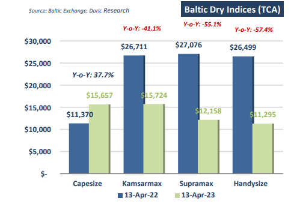
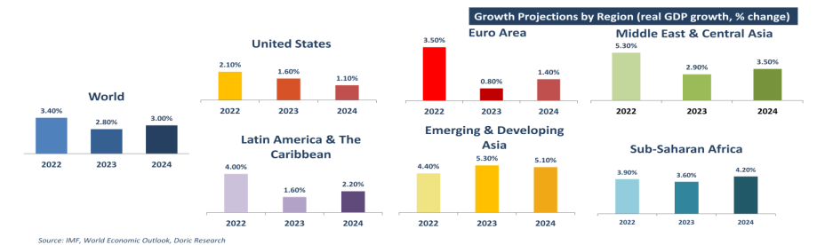

# Doric Weekly Market Insight

**Date:** April 17, 2023  
**Publisher:** Breakwave Advisors | **Category:** Market Insights  
**Original URL:** [https://www.breakwaveadvisors.com/insights/2023/4/17/doric-weekly-market-insight](https://www.breakwaveadvisors.com/insights/2023/4/17/doric-weekly-market-insight)  

---

## “In the Tug-of-War Between Alarming Macro Fundamentals Pulling From One Side and Auspicious Seasonality From the Other, Baltic Indices Need Once Again to Perform a Balancing Act.”

*By*[*Michalis Voutsinas*](https://www.linkedin.com/in/michalis-voutsinas-587544163/)

Following last week’s downward revision of merchandise trade volume growth by the World Trade Organization, the International Monetary Fund lowered its forecast for global economic growth this year to 3.6 percent. Unusually high uncertainty surrounds the aforementioned forecast though, and downside risks to the global outlook dominate – including from a further escalation of the war, stricter sanctions against Russia, a sharper-than-anticipated deceleration in China as a strict zero-Covid strategy is tested by Omicron, and a renewed flare-up of the pandemic should a new, more virulent virus strain emerge." was the opening paragraph of Doric's Weekly Insight this day last year. At that time, Capesizes had yet to wake up from their typical Q1 hibernation, balancing at $11,370 daily. Kamsarmaxes and Supras, on the other hand, were trading in much healthier levels at $26,711 and $27,076 daily respectively. In sync, the star performer of the previous period, Handysize segment, was hovering at a solid $26,499 daily.

> **Figure 1: 1 (8)**  
> **Interactive Data & Source:** [Doric](https://www.doric.gr/) | [Local Asset](file:///C:/Users/Dell/Github/Shipping/corpus/03-breakwave/insights/2023/assets/2023-04-17_doric-weekly-market-insight_img_128829_9f1beb3dfca1.png)

Twelve months later, Capesizes stood $4,000 higher than the aforementioned value, but all other segments are largely lagging previous year’s vivid levels. Although, dry bulk shipping has managed to leave the unprofitable Q1 levels behind, it has yet to surpass last year’s performance. In particular, with a closing of $15,724 and $12,158 daily for the Kamsarmax and Supramax respectively, the mid-sizes are laying today circa 50 percent lower year-on-year. The drop in the Handysize sub-market is even steeper, with the respective Baltic TC index concluding today at $11,295 daily, down 57.4 percent year-on-year. At this crossroads, the global economy is yet again at a moment of high uncertainty, with the cumulative effects of the past three years of adverse shocks, manifesting in unforseen ways.

Against this backdrop, IMF's baseline forecast is for growth to fall from 3.4 percent in 2022 to 2.8 percent in 2023, before settling at 3.0 percent in 2024. Advanced economies are expected to face an especially noticeable slowdown, from 2.7 percent in 2022 to just 1.3 percent in 2023. In a plausible alternative scenario with further financial sector stress, global growth declines to about 2.5 percent in 2023 with advanced economy growth falling below 1 percent. For emerging market and developing economies, prospects are on average stronger than for advanced economies. However, these prospects vary widely across regions. On average, growth is expected to be 3.9 percent in 2023 and to rise to 4.2 percent in 2024. The forecast for 2023 is modestly lower (by 0.1 percentage point) than in the January 2023 World Economic Outlook Update, but materially below the 4.7 percent forecast of January 2022.

IMF’s baseline forecast is for global headline inflation to decline from 8.7 percent in 2022 to 7.0 percent in 2023. Disinflation is expected in all major country groups, with about 76 percent of economies expected to report lower headline inflation figures this year. Initial differences in the level of inflation between advanced economies and emerging market and developing economies are, however, expected to persist. Declining fuel and nonfuel commodity prices as well as the expected cooling effects of monetary tightening on economic activity can be considered as the leading factors for this projected disinflation. At the same time, inflation excluding food and energy is expected to decline much more gradually to 6.2 percent in 2023. Growth in the volume of world trade is expected to drop from 5.1 percent in 2022 to 2.4 percent in 2023, echoing global demand slowdown after two years of rapid catch-up growth from the pandemic recession and the shift in the composition of spending from traded goods back towards services. The lagged effects of US dollar appreciation in 2022, which made traded products more costly for numerous economies given the dollar’s dominant role, are also expected to weigh on trade growth in 2023. Overall, IMF’s outlook is for weaker trade growth compared to the two-pre-pandemic decade average of 4.9 percent.

In the tug-of-war between alarming macro fundamentals pulling from one side and auspicious seasonality from the other, Baltic indices need once again to perform a balancing act. Known as one of the most skilful tightrope artists, Baltic Dry Index is seeking to near the yearning seasonality end, without losing its poise.

> **Figure 2: 1 (9)**  
> **Interactive Data & Source:** [Doric](https://www.doric.gr/) | [Local Asset](file:///C:/Users/Dell/Github/Shipping/corpus/03-breakwave/insights/2023/assets/2023-04-17_doric-weekly-market-insight_img_128929_d4cf03af0755.png)

Data source:[Doric](https://www.doric.gr/)
