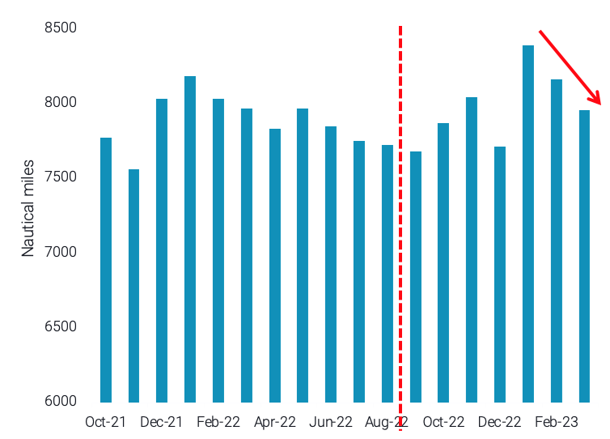
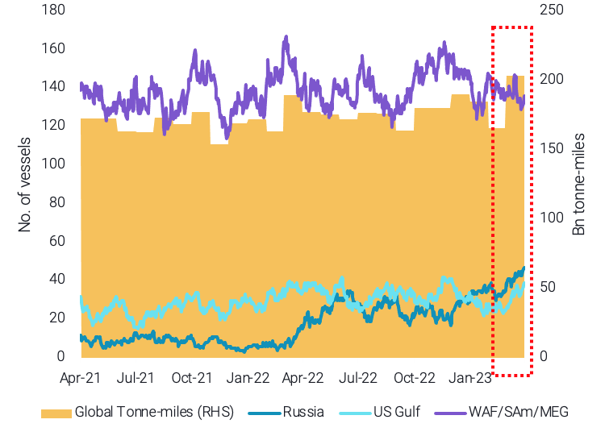

# Vortexa Freight Weekly

**Date:** April 20, 2023  
**Publisher:** Breakwave Advisors | **Category:** Market Insights  
**Original URL:** [https://www.breakwaveadvisors.com/insights/2023/4/20/vortexa-freight-weekly](https://www.breakwaveadvisors.com/insights/2023/4/20/vortexa-freight-weekly)  

---

This week, we focus on the factors cooling the demand for VLCC tankers, and what lies in store for the tanker class in the second half of 2023. In the West, Suezmax tankers have benefitted from high US exports in March, but the sustainability of this is put into question.

By[Dylan Simpson](https://www.linkedin.com/search/results/all/?fetchDeterministicClustersOnly=false&heroEntityKey=urn%3Ali%3Afsd_profile%3AACoAACDtdn0BzHNR8syu_G8WxL-JXL-9PRT5AP4&keywords=dylan%20simpson&origin=RICH_QUERY_SUGGESTION&position=0&searchId=55ecee69-a408-47b2-8686-68f172e21af1&sid=mVl)

### Analysis / East of Suez / Dirty

### VLCC Supply Overstretched But for How Long?

> **Figure 1: VLCC Average Voyage Mileage to East Asia**  
> *VLCC average voyage mileage to East Asia*  
> **Interactive Data & Source:** [Marketingmail Vortexa](https://marketingmail.vortexa.com/ODM3LU1aRS01NzgAAAGLOW6_7JeZlRi2ZHIp59YTX1pJzwP68lbKPrUj4Hia8T-p9yxnqJZXDPvt5SW8Es-29UHsVT4=) | [Local Asset](file:///C:/Users/Dell/Github/Shipping/corpus/03-breakwave/insights/2023/assets/2023-04-20_vortexa-freight-weekly_img_241_16cdd858679b.png)

- Since the end of last summer and the resurgence of China’s purchasing activity, especially from the Atlantic Basin, the VLCC[laden-to-ballast](https://marketingmail.vortexa.com/ODM3LU1aRS01NzgAAAGLOW6_7JeZlRi2ZHIp59YTX1pJzwP68lbKPrUj4Hia8T-p9yxnqJZXDPvt5SW8Es-29UHsVT4=)ratio remains consistently positive. This is mainly attributed to the longer voyages towards East Asia.
- However, the vessel class could face potential headwinds for the remainder of the quarter. Chinese refineries have commenced their maintenance, which will limit crude buying. Additionally, Chinese (and other Asian) independent refineries have increased their exposure on Russian grades, which are transported on Suezmax and Aframax tankers. Finally, voyage mileage towards East Asia on VLCCs has declined for the 2nd consecutive month.
- All these factors point to loosening VLCC supply in the short-term, however, China’s expected comeback to the market in the H2 2023 could once again provide support for VLCCs.

### Analysis / West of Suez / Dirty

### Us Gulf and Russia Keep Suezmaxes Busy

> **Figure 2: Suezmax Utilisation for Selected Origins (Lhs) vs Global Monthly**  
> *Suezmax utilisation for selected origins (LHS) vs global monthly tonne-miles (RHS)*  
> **Interactive Data & Source:** [Marketingmail Vortexa](https://marketingmail.vortexa.com/ODM3LU1aRS01NzgAAAGLOW6_7QDDb3yRVxT556xa5E5_4WQa6JCU4Qgf49PKisqutaXv66CT0AgrrFAPYTG6gefswH4=) | [Local Asset](file:///C:/Users/Dell/Github/Shipping/corpus/03-breakwave/insights/2023/assets/2023-04-20_vortexa-freight-weekly_img_242_b9413b629e94.png)

- [Tonne-miles](https://marketingmail.vortexa.com/ODM3LU1aRS01NzgAAAGLOW6_7QDDb3yRVxT556xa5E5_4WQa6JCU4Qgf49PKisqutaXv66CT0AgrrFAPYTG6gefswH4=)for Suezmax tankers ended in a record high in March showing around a 25% m-o-m increase.[Utilisation for traditional Suezmax markets](https://marketingmail.vortexa.com/ODM3LU1aRS01NzgAAAGLOW6_7e0BrQkXftTR2WbM3iFADm44jr6kWNADkJfkQuDvYuZ6RHoK32AiECYdruxiucyyPWo=)such as out of West Africa, Middle East Gulf, and South America have lost traction since peaking at the start of Q4 2022.

- Nevertheless, record-high US Gulf exports and a[resurgence in employment of Suezmax tankers](https://marketingmail.vortexa.com/ODM3LU1aRS01NzgAAAGLOW6_7ARkOZll4Z4k4juiOtHvl8BhzGu-9xXEU-qMJw-S05PwpbKuOiah1N587qcLqChOXPg=)for Russian grades (towards India and China) have supported demand for this tanker class.
- Looking ahead for the rest of the quarter, this support for Suezmaxes might decline, as global product imports are painting a weaker demand picture at the start of the month. Additionally, US Gulf exports are likely to finish at a lower level in April, while Russia’s seasonal comeback in domestic consumption could further lower crude exports.

Data Source:[Vortexa](https://www.vortexa.com//oil-gas-data-traders-analysts-data-scientists?gclid=Cj0KCQjw8_qRBhCXARIsAE2AtRZKOvMnbilZ_6_91d7huSFFy71pWLrnPwGwOHVzXsmsG-1a1mZnQw8aAt89EALw_wcB&hsa_acc=1782073842&hsa_ad=548425387665&hsa_cam=14746637662&hsa_grp=125038601902&hsa_kw=&hsa_mt=&hsa_net=adwords&hsa_src=g&hsa_tgt=dsa-1431852288425&hsa_ver=3&utm_campaign=%5BCD%5D%20-%20DSA%20-%20EMEA&utm_medium=cpc&utm_medium=ppc&utm_source=google&utm_source=adwords&utm_term=)
