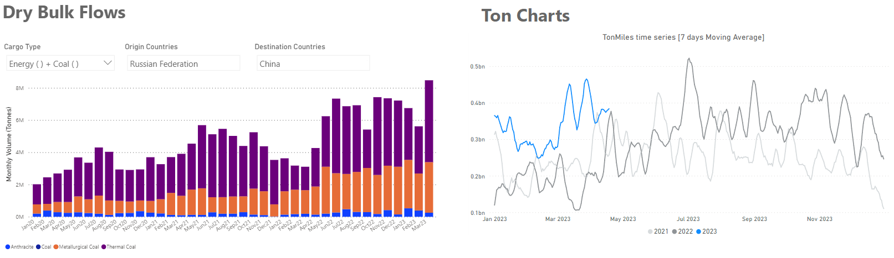
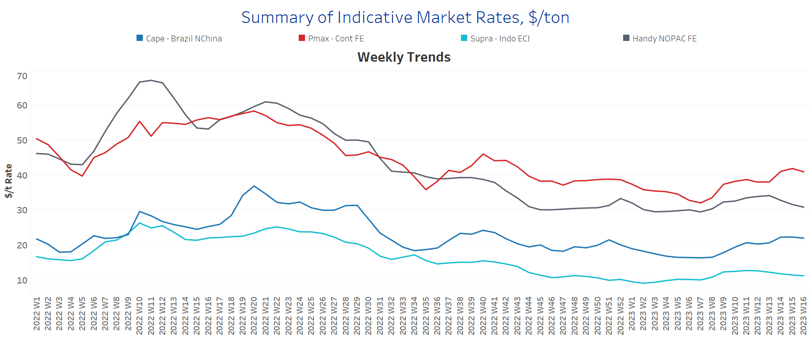
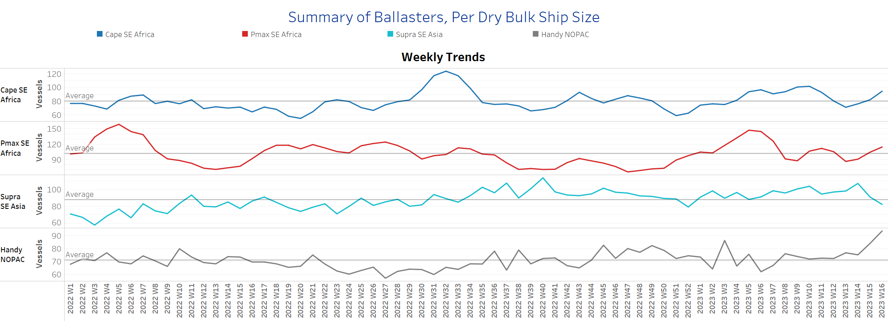
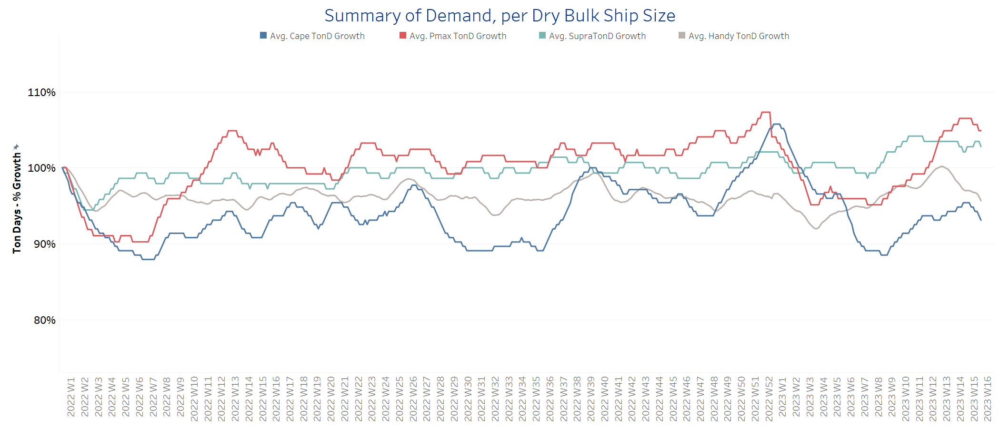
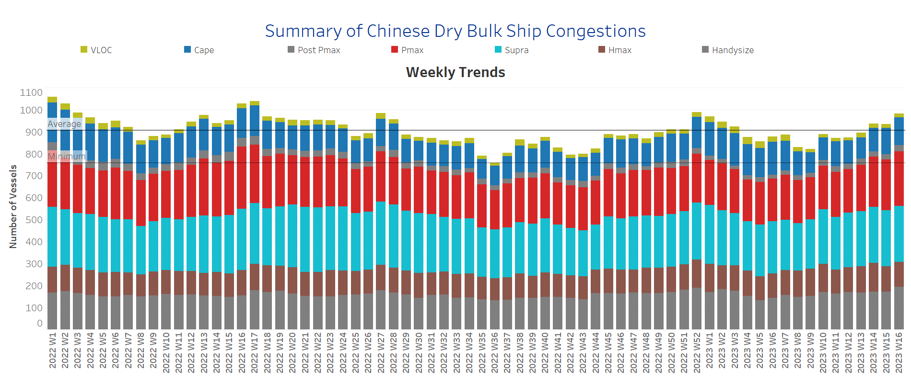

# SIGNAL DRY BULK WEEKLY REPORT

**Date:** April 21, 2023  
**Publisher:** Breakwave Advisors | **Category:** Market Insights  
**Original URL:** [https://www.breakwaveadvisors.com/insights/2023/4/20/signal-dry-bulk-weekly-report](https://www.breakwaveadvisors.com/insights/2023/4/20/signal-dry-bulk-weekly-report)  

---

## Chart of the Week Dry Bulk Flows: Russian Coal to China

*+****170%****YoY Mar23 Vs 22 leads to increase in ton-miles for 2023*

> **Figure 1: 241**  
> **Interactive Data & Source:** [Signal Ocean Platform](https://go.signalocean.com/e/983831/dry-reports-ton-charts-dry/2nvrjr/314567050?h=CvNloWDBSfkRUB7H2iVyie4Jf_FPNUp3r0Kd2JZLW_k) | [Local Asset](file:///C:/Users/Dell/Github/Shipping/corpus/03-breakwave/insights/2023/assets/2023-04-21_signal-dry-bulk-weekly-report_img_241_08becb6af847.png)

Data Source: The Signal Ocean Platform, Dry Bulk Demand & Flows
[Signal Ocean Platform](https://go.signalocean.com/e/983831/dry-reports-ton-charts-dry/2nvrjr/314567050?h=CvNloWDBSfkRUB7H2iVyie4Jf_FPNUp3r0Kd2JZLW_k)-[dynamic/drybulkflows](https://go.signalocean.com/e/983831/dry-dynamic-drybulkflows/2nvrjc/314567050?h=CvNloWDBSfkRUB7H2iVyie4Jf_FPNUp3r0Kd2JZLW_k)

In the third week of April, there is still more momentum in the larger vessel categories, with Russian coal flows to China leading to an increase in ton-miles to higher levels than in the previous two years. As can be seen in the chart above using Signal Ocean data, the volume of Russian coal flows to China in March 2023 is up 170% compared to a similar period last year, while the coming trend appears to be fueling optimism for stronger Chinese coal demand from the Russian Pacific. Meanwhile, the grain segment is filled with Ukrainian doubts about the future of the Black Sea grain trade with Russia, which seems to be blocking the inspection of ships.

In the iron ore market, it is interesting to see that India's iron ore exports almost doubled year-on-year to 11.59 million metric tonnes (mt) in January-March FY23, on the back of pent-up demand from China, the country's top market, and improved supplies following the lifting of export duties in mid-November, data analysed by business line show.

## Section 1/ Freight - Market Rates ($/T)

### Capesize - Panamaxfirmer | Supramax Softening - Handysize Weaker

‘The Big Picture’ - Capesize and Panamax Bulkers and Smaller Ship Sizes

> **Figure 2: 242**  
> **Interactive Data & Source:** [Signal Ocean Platform](https://www.thesignalgroup.com/signal-ocean-platform) | [Local Asset](file:///C:/Users/Dell/Github/Shipping/corpus/03-breakwave/insights/2023/assets/2023-04-21_signal-dry-bulk-weekly-report_img_242_90c101a584f2.png)

In the third week of April, Capesize and Panamax rates continued their upward trend, while Supramax rates softened and Handysize rates showed a downward trend.

- **Capesize**vessel freight rates are now at $22/tonne, up nearly $6/tonne from the week 8 low.
- **Panamax**vessel freight rates fromtheContinent to the Far East are now just above $40/tonne, while current rates are nearly $9/tonne above the week 7 low.
- **Supramax**freight rates for the Indo-ECI route fell slightly to $11/tonne, with signs of weakening toward the end of April.
- **Handysize**freight rates for the NOPAC Far East route fell to $30/tonne, down $4/tonne from three weeks ago, indicating a downward trend in the coming days.

## Section 2/ Supply -Ballasters (# Vessels)

### Capesize-Panamax Increasing | Supramax Decreasing |Handysize Increasing

Supply Trend Lines for Key Load Areas

> **Figure 3: 243**  
> **Interactive Data & Source:** [Signal Ocean Platform](https://www.thesignalgroup.com/signal-ocean-platform) | [Local Asset](file:///C:/Users/Dell/Github/Shipping/corpus/03-breakwave/insights/2023/assets/2023-04-21_signal-dry-bulk-weekly-report_img_243_88e37fa20433.png)

The number of ballast ships increased in the last two weeks of April in the Capesize and Panamax segments, while it increased sharply in the Handysize and decreased only in the Supramax.

- **Capesize**SE Africa: The number of vessels now stands at 94, 23 more than two weeks ago and 14 above the annual average.
- **Panamax**SE Africa: The number of vessels increased to 114, 28 more than two weeks ago, with a tendency to remain above the annual average of 100 in the coming days.
- **Supramax**SE Asia: The number of vessels decreased to 82, almost 9 less than a week ago and 6 below the annual average.
- **Handysize**NOPAC: The number of vessels is now 94, 30% above the annual average and the highest level in the last year.

## Section 3/ Demand -TonDays Decreasing

> **Figure 4: 244**  
> **Interactive Data & Source:** [Signal Ocean Platform](https://www.thesignalgroup.com/signal-ocean-platform) | [Local Asset](file:///C:/Users/Dell/Github/Shipping/corpus/03-breakwave/insights/2023/assets/2023-04-21_signal-dry-bulk-weekly-report_img_244_7b37aa9a547c.png)

In the third week of April, the upward trend in demand observed since the end of March weakened towards the end of the month. However, we continue to see better prospects in the Panamax and Supramax segments as the volume of Russian coal flows to China increases.

- **Capesize**demand ton-days: The upward trend of the first half of April has weakened, with signs of a decline in the remaining days of the month.
- **Panamax**demand ton-days: Growth peaked in the first half of April, with momentum slowing as current levels are the highest since mid-December last year.
- **Supramax**demand ton-days: The upward trend in Supramax demand is now below the growth in Panamax, and it remains to be seen whether there will be a further increase in the last days of April.
- **Handysize**demand ton-days: The current growth is well below the peak of two weeks ago, with future demand prospects uncertain given the threat of further extension of the Black Sea Agreement.

## Section 4/ Port Congestion -No of Vesselsincreasingdry Bulk Ships Congested at Chinese Ports

> **Figure 5: 245**  
> **Interactive Data & Source:** [Signal Ocean Platform](https://www.thesignalgroup.com/signal-ocean-platform) | [Local Asset](file:///C:/Users/Dell/Github/Shipping/corpus/03-breakwave/insights/2023/assets/2023-04-21_signal-dry-bulk-weekly-report_img_245_69ef789d0889.png)

Congestion continued the strong upward trend of the previous weeks of April, with strong increases in the Panamax and Handysize segments.

- **Capesize:**The number of vessels now stands at 126, 8 more than the previous week.
- **Panamax:**The number of ships is now at 249, 17 more than the previous week and still too high as we have not seen a value below 190 since the end of the fourth week.
- **Supramax:**The number of ships is now at 253, down 2 from two weeks ago, and has remained above 250 for the last three weeks.
- **Handysize**: The number of congested ships reached 193, 24 more than a week ago, with signs of a record increase since the end of week 5 (~133 ships).

Data Source:[Signal Ocean Platform](https://www.thesignalgroup.com/signal-ocean-platform)

---

**Tags:** Drybulk, Shipping, Freightrates  
