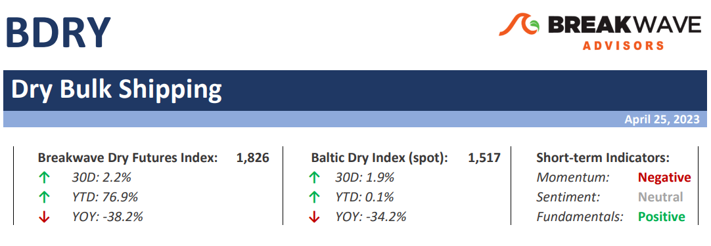
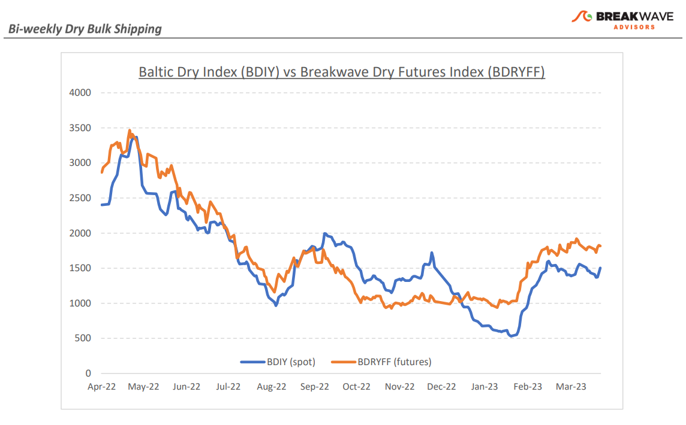
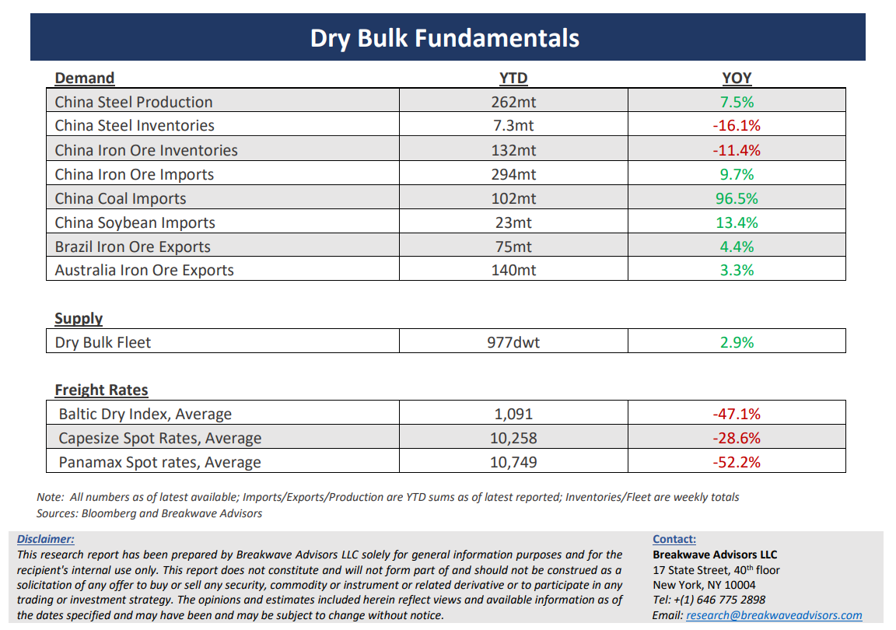

# Breakwave Bi-Weekly Dry Bulk Report - April 25, 2023

**Date:** April 25, 2023  
**Publisher:** Breakwave Advisors | **Category:** Market Insights  
**Original URL:** [https://www.breakwaveadvisors.com/insights/2023/4/24/breakwave-bi-weekly-dry-bulk-report-april-25-2023](https://www.breakwaveadvisors.com/insights/2023/4/24/breakwave-bi-weekly-dry-bulk-report-april-25-2023)  

---

> **Figure 1: Dbreporttop**  
> **Interactive Data & Source:** [Breakwave Advisors Market Insights](https://www.breakwaveadvisors.com/publications) | [Local Asset](file:///C:/Users/Dell/Github/Shipping/corpus/03-breakwave/insights/2023/assets/2023-04-25_breakwave-bi-weekly-dry-bulk-report-april-25-2023_img_dbreporttop_32e500f96340.png)

**•Volatility declines as a wait-and-see approach takes center stage**– The dry bulk market rarely stands still, as by nature it is flooded with volatility, twists and turns, and a highly unpredictable spot market. Yet, the last several weeks have been unusually calm as spot rates have traded in a rather tight range. Both basins demonstrate signs of balance, and although demand for transportation has been gradually increasing with higher indicated iron ore exports from both Brazil and Australia, there have been sufficient ships open to absorb such volumes without any meangiful impact on pricing. As a result, freight futures have been looking for clues outside the traditional spot-focused indictors in order to try and predict the direction of freight rates. One such market is iron ore, where prices have seen some increased volatility, and thus have had an impact on sentiment across freight desks. Over the next few weeks we expect spot rates for Capesizes to increase and although such carry is mostly priced into the futures curve, by mid-May we believe the Capesize sector will be in a position to push even higher as both Australia and Brazil will exporting iron ore at relatively higher rates while West Africa, that has become a very important demand center for Capesizes, will also be aggressively pushing bauxite into the water ahead of the upcoming rain season in late summer. After more than a month of stability, the dry bulk market is once again primed to exhibit its embedded volatility, which we believe is more likely to see higher spot rates from current levels than lower.

**•Iron ore prices collapse under the pressure of regulators, slow recovery in demand**– It was less than a month ago that iron ore prices were hovering above $130/ton as bullish expectations surrounding China’s real estate sector were plentiful while government agencies were communicating their displeasure on a daily basis. However, the lack of any concrete activity out of China’s increasingly important construction market combined with constant pressure by the regulators, have finally taken a toll on prices, with prompt month futures currently standing at just above the $100/ton psychological mark. Yet not much has changed. Although the real estate market in China has probably bottomed, the recovery has not been spectacular. With the first quarter behind us, China’s steel demand seems to be heading for a flattish year, which, although is rather supportive for iron ore imports, it does not indicate any significant squeeze on the demand side. Iron ore import trade tends to be back-end loaded at any given year, and thus iron ore trade volumes should gradually increase as the year progresses, especially from the far-fetched Brazilian miners that add to shipping demand due to the increased distance (versus Australia).

**•Dry bulk focus shifts back to fundamentals**– Following a period of high uncertainty and significant disruptions across the commodity spectrum, the gradual normalization of trade is shifting the market’s attention back to the traditional demand and supply dynamics that have shaped dry bulk profitability for decades. As effective fleet supply growth for the next few years looks marginal, demand will be the main determinant of spot freight rates with China returning back to the driver’s seat as the dominant force of bulk imports and thus shipping demand.

[Learn moreSubscribe: Bi-weekly Dry Bulk Report](https://www.breakwaveadvisors.com/publications)

> **Figure 2: Dbreportchart**  
> [Local Asset](file:///C:/Users/Dell/Github/Shipping/corpus/03-breakwave/insights/2023/assets/2023-04-25_breakwave-bi-weekly-dry-bulk-report-april-25-2023_img_dbreportchart_64fa02c93e04.png)

> **Figure 3: Dbreportbottom**  
> [Local Asset](file:///C:/Users/Dell/Github/Shipping/corpus/03-breakwave/insights/2023/assets/2023-04-25_breakwave-bi-weekly-dry-bulk-report-april-25-2023_img_dbreportbottom_df08b97a0b08.png)
