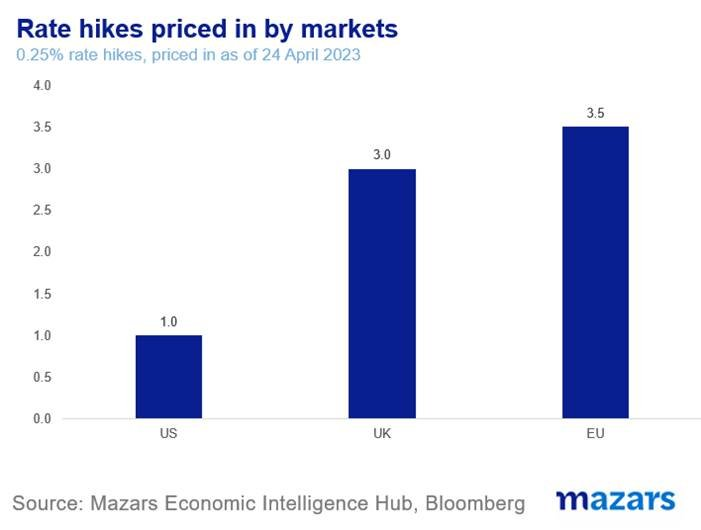
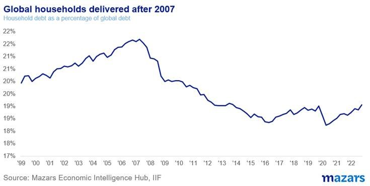
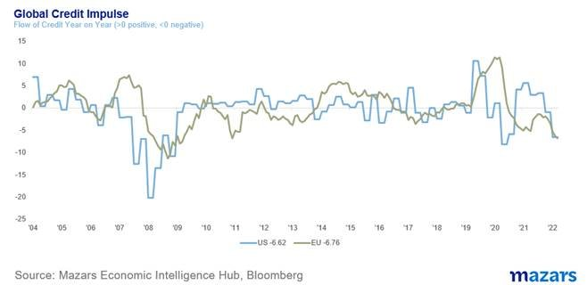
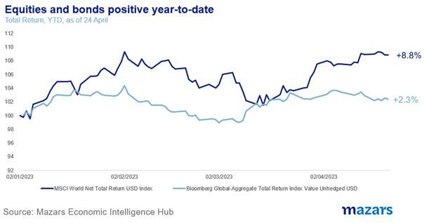
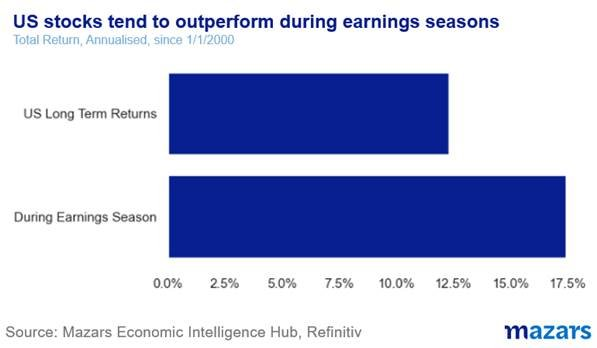

# Mazars Comment: Should stocks be so darn happy?

**Date:** April 25, 2023  
**Publisher:** Breakwave Advisors | **Category:** Market Insights  
**Original URL:** [https://www.breakwaveadvisors.com/insights/2023/4/25/mazars-comment-should-stocks-be-so-darn-happy](https://www.breakwaveadvisors.com/insights/2023/4/25/mazars-comment-should-stocks-be-so-darn-happy)  

---

## Should Stocks Be So Darn Happy?

*By*[*George Lagarias*](https://www.linkedin.com/in/george-lagarias-mba-3baa769/)

*The three things I would tell my clients on a Monday morning:*

1. *Credit conditions are tighter and they are bound to keep tightening for at least a year after rate hikes are done. As such, there’s a****considerable risk build-up****. We spent too many years assuming rates wouldn’t go much higher, and no one was ready for such tightening. Further weaknesses will probably be revealed.*
2. *But this is****not reflected in the movement of risk assets****. Equities are up just south of 10%, bonds are up nearly 3%. This is somewhat to be expected because.*
3. *There’s****nothing wrong with a spot of Bullishness****. Traders and Fast Money need to make profits too. But****longer term investors can’t******afford to ignore******risks****, so their portfolio should be positioned to reflect it.*

In the past few months, we have rung the bell often (perhaps too often) about simmering risks in financial markets as interest rates remain high. The collapse of SVB and Credit Suisse seemed to be one of those watershed moments where it became clear that tightening conditions were claiming their first victims: problematic banks. And it is given that conditions will continue to tighten. Inflation remains too high for comfort (especially in the UK), and interest rates are set to tighten further across developed markets.

> **Figure 1: Market Chart 1**  
> [Local Asset](file:///C:/Users/Dell/Github/Shipping/corpus/03-breakwave/insights/2023/assets/2023-04-25_mazars-comment-should-stocks-be-so-darn-happy_img_image006_785443847776.jpg)

If one considers that policy transmission (the time it takes for a rate decision to have a real economic impact) takes at least eight to ten months, as well as the fact that consumer leverage is not very high (so the pressure from higher rates will be less immense), we are now just experiencing the impact of the first rate hikes that started in the first half of 2022.

> **Figure 2: Market Chart 2**  
> [Local Asset](file:///C:/Users/Dell/Github/Shipping/corpus/03-breakwave/insights/2023/assets/2023-04-25_mazars-comment-should-stocks-be-so-darn-happy_img_image007_a8c25b4a97c5.jpg)

Credit conditions are set to tighten a lot more. Additionally, SVB and Credit Suisse gave a stark warning signal to all banks that it’s time to batten down the hatches and reduce their exposure to potentially damaging loans. All other things being equal, we could be seeing increasingly tighter credit until this time in 2024. Given the current depths of the global credit impulse, it is entirely possible that we will see more casualties from the higher interest rate environment.

> **Figure 3: Market Chart 3**  
> [Local Asset](file:///C:/Users/Dell/Github/Shipping/corpus/03-breakwave/insights/2023/assets/2023-04-25_mazars-comment-should-stocks-be-so-darn-happy_img_image008_a81bdbbadb9f.jpg)

Yet a month after that episode, global equities are near their highest levels in over a year. Bond markets have somewhat come off their seasonal lows (i.e. prices have dropped from their highs), but don’t seem to reflect higher risks.

> **Figure 4: Market Chart 4**  
> [Local Asset](file:///C:/Users/Dell/Github/Shipping/corpus/03-breakwave/insights/2023/assets/2023-04-25_mazars-comment-should-stocks-be-so-darn-happy_img_image009_470f23e6a479.jpg)

We rejoice of course that portfolios make money in these conditions. But to make sure that returns are maintained, we have also taken protective measures by reducing our risk exposure to reflect the fact that we are (probably) not in a bull market.

The question remains, however. All investors see the same thing: Commercial and Residential Real Estate, Private Equity, indebted consumers, companies and nations have only begun climbing a very steep hill. Why is the market not that worried?

Interestingly, for the moment there seems to be more good news than bad.

Let’s start with the good ones.

- **Investors got their “Put”.**The regulator's response to the bank woes last month was immense. The Fed nearly immediately expanded its balance sheet by $300 billion, more than enough to cover all the peripheral banks. That is one-fifth of all the first Quantitative Easing operations in 2009-2010, performed in less than two weeks! The central bank of Switzerland threw in another $100 billion to ensure Credit Suisse’s tie-up with UBS. Central bankers made it clear that they are comfortable fighting inflation and averting financial accidents at the same time, as the tools used are different. Investors, conditioned to be dependent on monetary easing for a generation, may now feel easier taking risks if they know that when financial accidents happen, central banks are still willing to “do whatever it takes”.
- **We are in the middle of an earnings season.**And things aren’t that bad. Companies are still outperforming analyst expectations.

- While we see optimism, perhaps even some unwarranted optimism,. Earnings misses like Tesla last week are still severely punished (stock fell by 13%). Equity valuations are still “fair” even by strict standards like Price-to-Sales. And bond investors are more cheery, as they now see a healthy yield – which they really haven’t experienced in over a decade. Maybe a 3.5% yield when inflation is running at 5% in the US is still losing money, but for a generation of investors used to near-zero yields, it’s still an improvement. Plus, after an “annus horribilis” 2022, bonds are primed for a rebound, even a modest one.

> **Figure 5: We Aren’t Seeing Evidence of Irrational Exuberance**  
> [Local Asset](file:///C:/Users/Dell/Github/Shipping/corpus/03-breakwave/insights/2023/assets/2023-04-25_mazars-comment-should-stocks-be-so-darn-happy_img_image01028129_4bfdbf7c93f5.jpg)

However, there’s also some bad news.

- **This generation of investors, primed by central bank interventions over the years, have essentially been conditioned to be optimistic.**On the one hand, this is good. It skews outcomes upwards. On the other, however, there’s no telling how the “slow money” run by optimist investors may react if a particular crisis seems to be getting out of hand. Bullishness is always welcome. But unless tempered with caution, it tends to amplify risks.
- At some point, we need to let go of the myth of “efficient markets”. Market efficiency is like a pendulum. The higher the policy uncertainty, the lower the efficiency. This happens because**the less we get certainty, the more we need to make up with speculation.**And as different investors have different views, the market’s power to predict any outcome diminishes. To be fair, bond markets tend to be more proactive. But if one looks at how rate expectations have moved over the past two months, and also how bond markets have consistently ignored the Fed’s warning for higher rates last year (a sign that speculation was more potent than clear policy directions) one naturally comes to the conclusion that markets right now are non-directional and not really efficient. And this means that they may not be pricing-in risks correctly.

So no, there’s nothing wrong with a spot of Bullishness. “Fast Money” and traders need to be profitable as well. But they can afford to ignore building risks, as they can very quickly take profit from their positions and hope that when -and if- the markets turn, they will have made more than they stand to lose. But for those investors who are longer-term, the build-up of longer-term risks relating to tighter credit can’t be ignored, even if present market conditions don’t necessarily reflect them. Portfolios and strategies need to be positioned to account for all possible outcomes.
