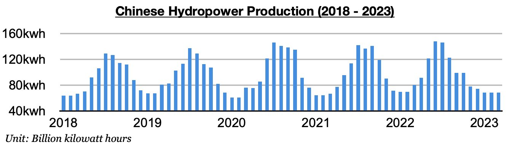
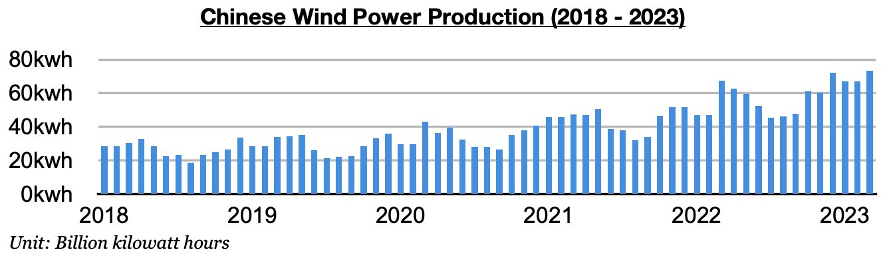
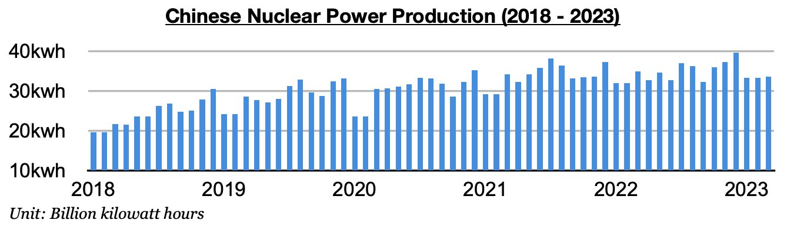
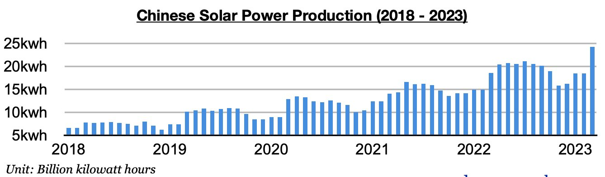

# Mixed Performances in Chinese Renewables Last Month

**Date:** April 27, 2023  
**Publisher:** Breakwave Advisors | **Category:** Market Insights  
**Original URL:** [https://www.breakwaveadvisors.com/insights/2023/4/27/mixed-performances-in-chinese-renewables-last-month](https://www.breakwaveadvisors.com/insights/2023/4/27/mixed-performances-in-chinese-renewables-last-month)  

---

*By*[*Jeffrey Landsberg*](https://www.linkedin.com/in/jeffrey-landsberg-70ab957/)

As we discussed in Commodore's most recent Weekly Dry Bulk Report, China’s hydropower production totaled only 68.4 billion kilowatt hours last month. This is the same amount that was produced in February and is down year-on-year by 12.1 billion kilowatt hours (-15%). This weakness has contributed to significant strength in China's thermal coal burn. Other renewable sources of electricity generation in China have had mixed performances as well.

> **Figure 1: Chart 1 (79)**  
> [Local Asset](file:///C:/Users/Dell/Github/Shipping/corpus/03-breakwave/insights/2023/assets/2023-04-27_mixed-performances-in-chinese-renewables-last-month_img_chart1287929_ea0abf1d1e11.jpg)

Wind power production totaled 73.5 billion kilowatt hours last month. This has marked an increase of 6.6 billion kilowatt hours (10%) from February and is up year-on-year by 6.2 billion kilowatt hours (9%).

> **Figure 2: Chart 2 (67)**  
> [Local Asset](file:///C:/Users/Dell/Github/Shipping/corpus/03-breakwave/insights/2023/assets/2023-04-27_mixed-performances-in-chinese-renewables-last-month_img_chart2286729_382e7a8861d0.jpg)

Nuclear power production totaled 33.6 billion kilowatt hours. This has marked an increase of 200 million kilowatt hours (1%) from February but is down year-on-year by 1.4 billion kilowatt hours (-4%).

> **Figure 3: Chart 3 (47)**  
> [Local Asset](file:///C:/Users/Dell/Github/Shipping/corpus/03-breakwave/insights/2023/assets/2023-04-27_mixed-performances-in-chinese-renewables-last-month_img_chart3284729_5932ece7fc0f.jpg)

Solar power production totaled 24.3 billion kilowatt hours. This has marked an increase of 5.8 billion kilowatt hours (31%) from February and is up year-on-year by 5.7 billion kilowatt hours (31%).

> **Figure 4: Chart 4 (20)**  
> [Local Asset](file:///C:/Users/Dell/Github/Shipping/corpus/03-breakwave/insights/2023/assets/2023-04-27_mixed-performances-in-chinese-renewables-last-month_img_chart4282029_c171cc9c703b.jpg)
