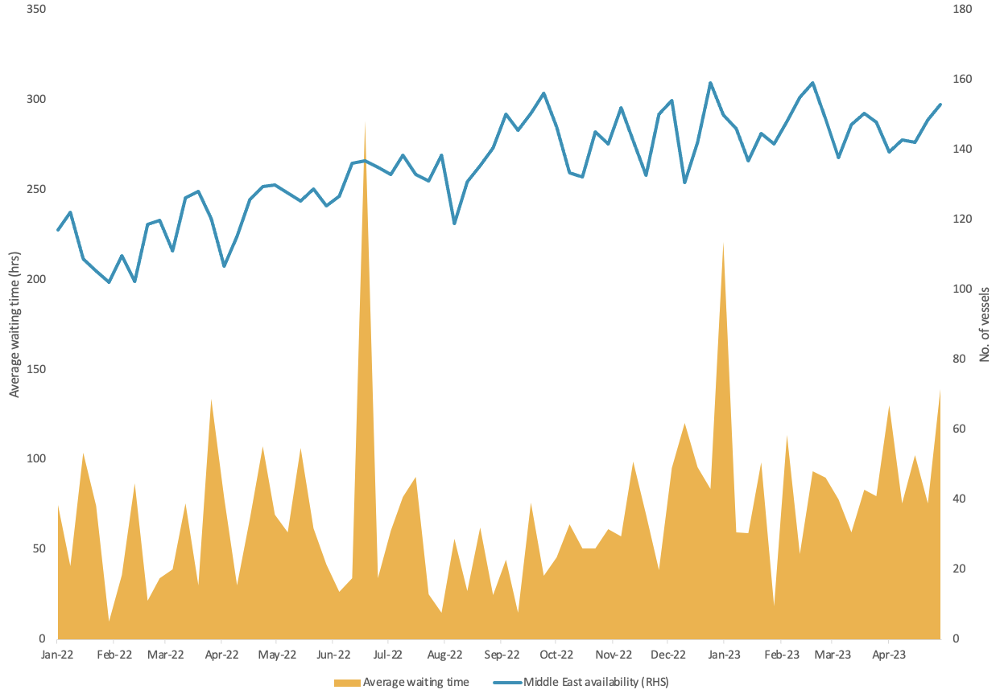
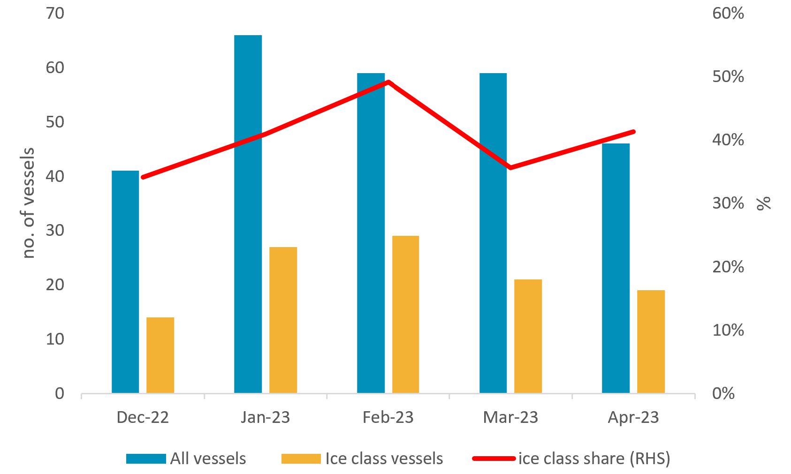

# Vortexa Freight Weekly

**Date:** April 27, 2023  
**Publisher:** Breakwave Advisors | **Category:** Market Insights  
**Original URL:** [https://www.breakwaveadvisors.com/insights/2023/4/26/vortexa-freight-weekly](https://www.breakwaveadvisors.com/insights/2023/4/26/vortexa-freight-weekly)  

---

By[Dylan Simpson](https://www.linkedin.com/search/results/all/?fetchDeterministicClustersOnly=false&heroEntityKey=urn%3Ali%3Afsd_profile%3AACoAACDtdn0BzHNR8syu_G8WxL-JXL-9PRT5AP4&keywords=dylan%20simpson&origin=RICH_QUERY_SUGGESTION&position=0&searchId=55ecee69-a408-47b2-8686-68f172e21af1&sid=mVl)

### Analysis / East of Suez / Dirty

## Flat Demand to Keep VLCC Rates Subdued, But What About Congestion?

> **Figure 1: Weekly VLCC Average Waiting Times in Shandong Province vs VLCC**  
> *Weekly VLCC average waiting times in Shandong Province vs VLCC availability in the Middle East (RHS)*  
> **Interactive Data & Source:** [Marketingmail Vortexa](https://marketingmail.vortexa.com/ODM3LU1aRS01NzgAAAGLXVVK9SpMveHfoDkEEuOMRBU_1mawBoM3vZuHaxKkUjw_J0awJ7VVudjsMCB-iHEd-ftPpMc=) | [Local Asset](file:///C:/Users/Dell/Github/Shipping/corpus/03-breakwave/insights/2023/assets/2023-04-27_vortexa-freight-weekly_img_unnamed-2023-04-27t134401461_946ab48aa976.png)

- Refineries in China (and other Asian countries) have commenced their planned refinery maintenance schedule, and[departures](https://marketingmail.vortexa.com/ODM3LU1aRS01NzgAAAGLXVVK9SpMveHfoDkEEuOMRBU_1mawBoM3vZuHaxKkUjw_J0awJ7VVudjsMCB-iHEd-ftPpMc=)of crude towards China are set to decline for a second month in April and VLCC[tanker demand](https://marketingmail.vortexa.com/ODM3LU1aRS01NzgAAAGLXVVK9liTrwTfwRwKUOZgwYUK4uoILWf1CPV33lW2JosTOuf7rU6VlSW6iO2P-KuIXuW6UnY=)towards China has remained flat.
- This has kept VLCC rates on the decline, despite an uptick in VLCC[congestion](https://marketingmail.vortexa.com/ODM3LU1aRS01NzgAAAGLXVVK9ropiV4aVgWpFQGTK_62td-Xmq0T6LFXl45jZ_U6TBFH_XmkUNAO5mO37n-TOWRhbkY=)in the Shandong Province as authorities carry out lab checks on crude cargoes.
- Looking ahead, Chinese crude demand is likely to remain low until at least H2 this year. This could add to already high[availability](https://marketingmail.vortexa.com/ODM3LU1aRS01NzgAAAGLXVVK9UpY1UsMXCA1cfT6gpGGQKZyUYJZJ1VLHTBsDG_7c9vaqOPZw1UQ9lACNaHB0SgYhbg=)of VLCCs in the Middle East, however, if congestion in China persists, this could tighten VLCC supply in the short term and offer support to rates.

### Analysis / West of Suez / Dirty

## Ice Class Vessels Not Used for Most Baltic Urals Voyages

> **Figure 2: Post-Ban Baltic Urals Voyages by Total Fleet and Ice Class**  
> *Post-ban Baltic Urals voyages by total fleet and ice class capability (LHS) vs. ice class share (RHS)*  
> **Interactive Data & Source:** [Vortexa](https://www.vortexa.com//oil-gas-data-traders-analysts-data-scientists?gclid=Cj0KCQjw8_qRBhCXARIsAE2AtRZKOvMnbilZ_6_91d7huSFFy71pWLrnPwGwOHVzXsmsG-1a1mZnQw8aAt89EALw_wcB&hsa_acc=1782073842&hsa_ad=548425387665&hsa_cam=14746637662&hsa_grp=125038601902&hsa_kw=&hsa_mt=&hsa_net=adwords&hsa_src=g&hsa_tgt=dsa-1431852288425&hsa_ver=3&utm_campaign=%5BCD%5D%20-%20DSA%20-%20EMEA&utm_medium=cpc&utm_medium=ppc&utm_source=google&utm_source=adwords&utm_term=) | [Local Asset](file:///C:/Users/Dell/Github/Shipping/corpus/03-breakwave/insights/2023/assets/2023-04-27_vortexa-freight-weekly_img_unnamed-2023-04-27t134516875_361161a20bcc.png)

- Leading up to the EU ban on Russian crude, there were doubts that Russia would be able to get Urals exports out of the Baltic due to the size of the ice class fleet that was available. A relatively mild winter in the Baltics has meant Urals exports could be carried on vessels without ice class capability, limiting disruption to the market.
- Loading from the Baltics on a non-ice class vessel poses a significant risk to the vessel (particularly in the winter), especially as the fleet engaged in Russian trade is composed of older tankers. Additionally, the inability to find evidence of IGP&I coverage for certain vessels, puts into question the credibility of insurers, further underlying the financial incentive that operators were facing to take these risks.
- Interestingly, 80% of vessels which loaded Urals in the Baltic for STS in Kalamata post-ban are ice class vessels. It is possible that seasonality explains the sharp decline in STS activity. Urals participants could feel that ice class vessels are no longer a necessity as the winter season ends.

Data Source:[Vortexa](https://www.vortexa.com//oil-gas-data-traders-analysts-data-scientists?gclid=Cj0KCQjw8_qRBhCXARIsAE2AtRZKOvMnbilZ_6_91d7huSFFy71pWLrnPwGwOHVzXsmsG-1a1mZnQw8aAt89EALw_wcB&hsa_acc=1782073842&hsa_ad=548425387665&hsa_cam=14746637662&hsa_grp=125038601902&hsa_kw=&hsa_mt=&hsa_net=adwords&hsa_src=g&hsa_tgt=dsa-1431852288425&hsa_ver=3&utm_campaign=%5BCD%5D%20-%20DSA%20-%20EMEA&utm_medium=cpc&utm_medium=ppc&utm_source=google&utm_source=adwords&utm_term=)
