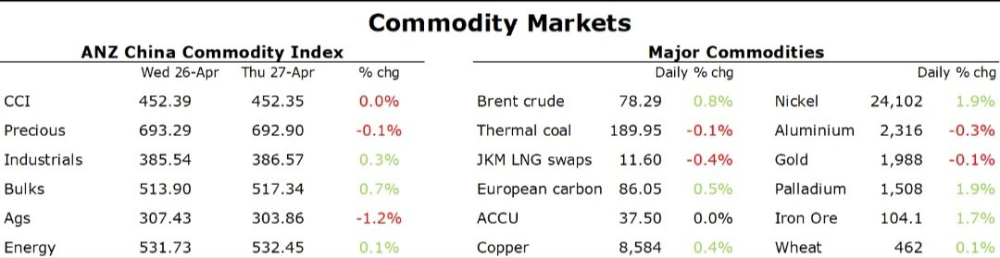

# Lithium rebounds as supply side issues resurface

**Date:** April 28, 2023  
**Publisher:** Breakwave Advisors | **Category:** Market Insights  
**Original URL:** [https://www.breakwaveadvisors.com/insights/2023/4/28/1z1d8wtpl2o9m1tladho5tu8cx6s2y](https://www.breakwaveadvisors.com/insights/2023/4/28/1z1d8wtpl2o9m1tladho5tu8cx6s2y)  

---

*By*[*Daniel Hynes*](https://www.linkedin.com/in/dahynes/)

Despite mixed economic data, a risk-on tone helped stem the selling earlier this week in commodity markets.

> **Figure 1: Screenshot 20230428 122802 Linkedin**  
> [Local Asset](file:///C:/Users/Dell/Github/Shipping/corpus/03-breakwave/insights/2023/assets/2023-04-28_1z1d8wtpl2o9m1tladho5tu8cx6s2y_img_screenshot-20230428-122802-linkedin_1917a13b34a2.jpg)

**Copper**was under pressure earlier in the session following Chinese data showing profits at industrial companies fell 19% in March. This was compounded by reports that Chinese copper processors were planning to reduce production for Q2 2023. This is typically the peak demand season; however, demand has been impacted by a slower than expected recovery after COVID-19 and sluggish export driven demand. A stronger than expected rise in an inflation measure saw concerns of further rate hikes also weigh on sentiment. However, after falling to a four-month low, opportunistic buyers helped push the red metal back into positive territory by the close of the session. This came following reports that MMG’s copper mine in Perty suffered a setback in its efforts to reduce holdings of 115kt of semi-processed metal built up during recent protests. It said it may take until Q4 to ship the stockpiled material.

**Lithium**carbonate prices in China extended recent gains amid rising supply side issues. Prices are down nearly 75% this year as sales of electric vehicles (EV) in China softened. This was exacerbated by concerns around a new wave of supply. However,[**resource nationalism could delay that growth**](../pdfs/2023-04-28_1z1d8wtpl2o9m1tladho5tu8cx6s2y_commodity-call-lithium-supply-risks-_183db89fadf6.pdf). Chile, holder of the world’s largest reserves, has a new policy requiring state involvement for new lithium projects and the use of environmentally friendly processing that is still unproven on a commercial scale. This could delay the delivery of its pipeline of projects.

The uncertain economic backdrop helped push**gold**above USD2,000/oz early in the session. However, high inflation saw expectations of further rate hikes rise, putting downward pressure on the precious metal.

**Crude oil**eked out a small gain following two days of heavy selling amid mixed economic signals. Brent crude has been tracking broader markets in recent sessions, with a slew of economic data creating more uncertainty about the outlook. A war of words broke out between OPEC and the IEA. The producer group said that volatility in oil prices is being driven by calls to halt investment, rather than its production policies. OPEC Secretary-General, Haitham Al-Ghais, said that all data-driven outlooks envisage the need for more oil to fuel global economic growth and prosperity. Earlier this week, IEA Executive Director Fatih Birol warned OPEC efforts to bolster prices could backfire by imperilling the global economy and speeding the transition away from fossil fuels.

**European gas**rallied from a 21-month low after traders assessed the recent selloff as overdone. This buying was sparked by a spate of colder weather, which has curbed injections in storage sites in recent days.**North Asian LNG**prices were relatively unchanged, with top buyers such as Japan, South Korea and China in no rush to secure supply in the spot market.

Data source:[Commodities Wrap](https://www.linkedin.com/newsletters/commodities-wrap-6692196755876012032/?fbclid=IwAR3kiXJqZdxmp9ZcRwBNI7FsBySI-XSC0pfPur1qzjt7OZp7PTE59Tsl1QI)
