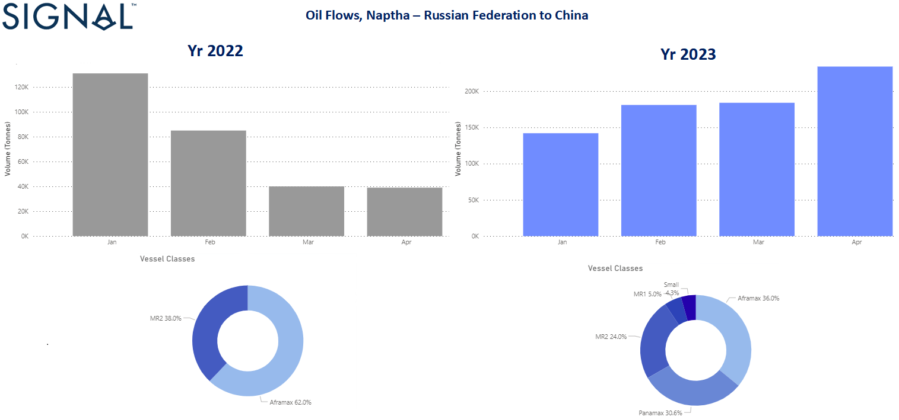
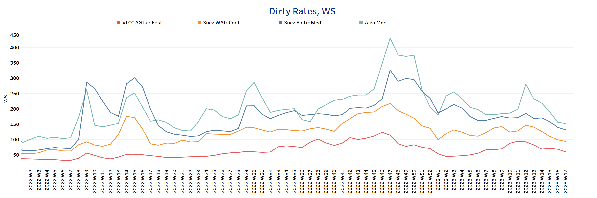
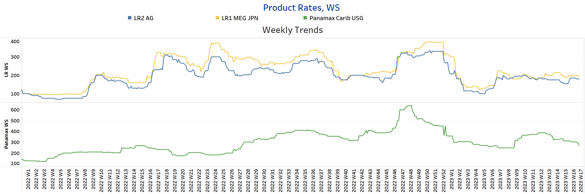
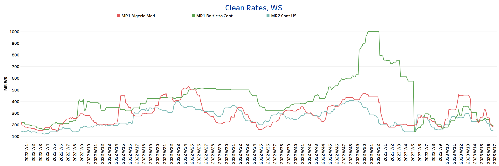
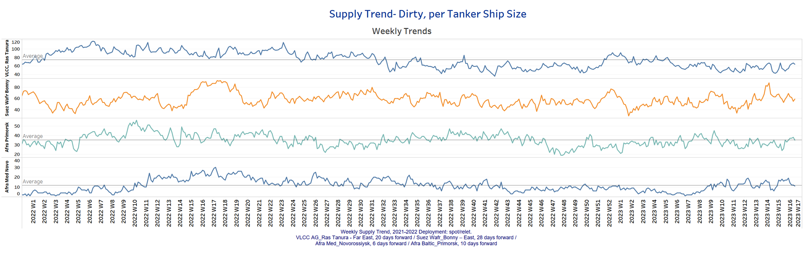
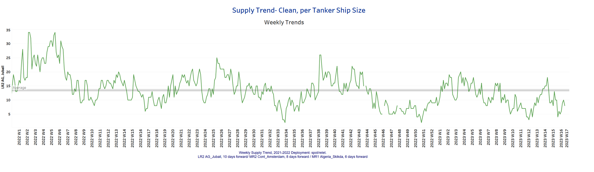
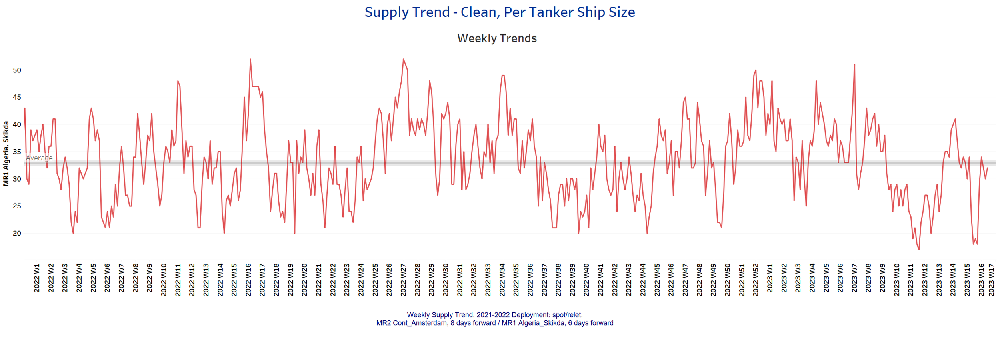
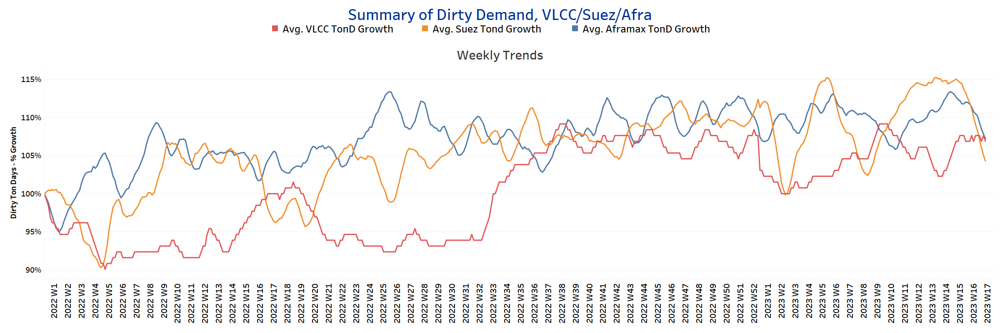
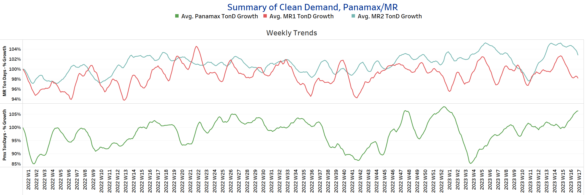

# Signal Tanker Weekly Report

**Date:** April 28, 2023  
**Publisher:** Breakwave Advisors | **Category:** Market Insights  
**Original URL:** [https://www.breakwaveadvisors.com/insights/2023/4/28/signal-tanker-weekly-report](https://www.breakwaveadvisors.com/insights/2023/4/28/signal-tanker-weekly-report)  

---

## Chart of the Week: Naphtha Oil Flows From Russia to China

## Chinese Buy More Russian Naphtha

> **Figure 1: Chinese Buy More Russian Naphtha**  
> **Interactive Data & Source:** [Signal Ocean Platform](https://go.signalocean.com/e/983831/tanker-dynamic-oilflows/2nwl6x/316443720?h=h4nlXFCYO58g2BbEaTm_qN58Ji0F8JTLA91iWL-nbDM) | [Local Asset](file:///C:/Users/Dell/Github/Shipping/corpus/03-breakwave/insights/2023/assets/2023-04-28_signal-tanker-weekly-report_img_unnamed-2023-04-28t154508794_b9b35d4345cc.png)

Crude oil freight rates saw a slowdown in momentum at the end of April, while the clean market continues to drop to lower levels. On the demand side, despite the recent slowdown, the trend in VLCC (ton-days) is promising for freight rate strength. More interesting for the clean segment is the role of Asian countries in Russian naphtha imports. Looking at the first quarter of this year, the increase in Chinese purchases of Russian naphtha is surprisingly higher than in a similar period in 2022. We now see (image above) that China imported almost more than 200k in April, compared to only 40k in the same month last year. Looking at ship size, Panamax size now accounts for almost 30% of the business. In January-April 2022, Aframax vessels accounted for 60% and MR2 vessels 38% compared to 36% and 24%, respectively this year.

In the oil market, we have seen a decline in oil prices that has squeezed the profit margins of major Chinese oil and gas companies. Sinopec reported an 11.8% drop in net profit for the first quarter of 2023, while CNOOC's net profit fell 6.4% year-on-year.

For more information on this week's trends, see the analysis sections below:
Freight Market, Supply and Demand

## Section 1/ Freight - Market Rates (WS)

## ‘Dirty’ VLCC - Suezmax - Aframax- Weaker

> **Figure 2: Dirty**  
> **Interactive Data & Source:** [Signal Ocean Platform](https://www.thesignalgroup.com/signal-ocean-platform) | [Local Asset](file:///C:/Users/Dell/Github/Shipping/corpus/03-breakwave/insights/2023/assets/2023-04-28_signal-tanker-weekly-report_img_unnamed-2023-04-28t154617310_ad817af1ead9.png)

Crude oil freight rate sentiment deteriorated in late April, with the Aframax-Med route showing a sharp decline after peaking in week 13.

- **VLCC**AG-FE freight rates were at WS60, down nearly 8 points from three weeks ago.
- **Suezmax**freight rates from West Africa to continental Europe fell to WS 94, almost 50 points lower than five weeks ago, with a trend of weakness emerging for the next few days.
- **Aframax**Med freight rates remained above WS 150 with similar momentum to the last two weeks.

## ‘Product’ LR2 - LR1 |Steady

> **Figure 3: Steady**  
> **Interactive Data & Source:** [Signal Ocean Platform](https://www.thesignalgroup.com/signal-ocean-platform) | [Local Asset](file:///C:/Users/Dell/Github/Shipping/corpus/03-breakwave/insights/2023/assets/2023-04-28_signal-tanker-weekly-report_img_unnamed-2023-04-28t154717522_5721063ac547.png)

**LR2**AG freight rates an almost steady dynamic over the past six weeks, hovering around WS 180.

- **LR1**MEG -to-Japan freight rates posted a similar momentum to LR2, holding steady around WS 190.

### Product’ Panamax -Weaker

- **Panamax**Carib-to-USG rates have weakened from March highs. Rates are now at WS 270, down 18% from two weeks ago.

## ‘Clean’ MR2 - MR1 - Weaker

> **Figure 4: Clean**  
> **Interactive Data & Source:** [Signal Ocean Platform](https://www.thesignalgroup.com/signal-ocean-platform) | [Local Asset](file:///C:/Users/Dell/Github/Shipping/corpus/03-breakwave/insights/2023/assets/2023-04-28_signal-tanker-weekly-report_img_unnamed-2023-04-28t154832097_5f1110e3f2df.png)

**MR1**rates Algeria-to-Med are now at WS180, almost 60% lower, and Baltic-to-Cont MR1 rates are 40% lower (~ WS195) than in early April.

- **MR2**rates Cont-to-US are now at WS150, indicating weaker momentum in the coming days, and down nearly 50% from early April.

## Section 2/ Supply -(# Vessels)'dirty'supply Trend Lines for Key Load Areasvlcc - Aframax - Suezmaxdecreasing

> **Figure 5: VLCC - Aframax - Suezmax**  
> **Interactive Data & Source:** [Signal Ocean Platform](https://www.thesignalgroup.com/signal-ocean-platform) | [Local Asset](file:///C:/Users/Dell/Github/Shipping/corpus/03-breakwave/insights/2023/assets/2023-04-28_signal-tanker-weekly-report_img_unnamed-2023-04-28t154903110_6b77da601810.png)

Crude oil tanker supply showed a downward trend at the end of April, and there are no signs of a firm increase yet.

- **VLCC Ras Tanura**: The number of vessels is now 64, 10 less than the annual average.
- **Suezmax Wafr Bonny**: The number of vessels now stands at 59, 32% below the week 15 peak.
- **Aframax Primorsk**: The number of vessels is now close to the annual average of 35, with a trend towards a further decrease at the end of April.
- **Aframax Med Novo**: The number of vessels has approached the annual average of 11, with strong volatility in the last four weeks.

## ‘Clean’ Supply Trend Lines for Key Load Areas |LR2| Increasing

> **Figure 6: Market Chart 6**  
> **Interactive Data & Source:** [Signal Ocean Platform](https://www.thesignalgroup.com/signal-ocean-platform) | [Local Asset](file:///C:/Users/Dell/Github/Shipping/corpus/03-breakwave/insights/2023/assets/2023-04-28_signal-tanker-weekly-report_img_unnamed-2023-04-28t154927755_a542e106099d.png)

## ‘Clean’ Supply Trend Lines for Key Load Areas |MR1| Increasing

> **Figure 7: Market Chart 7**  
> **Interactive Data & Source:** [Signal Ocean Platform](https://www.thesignalgroup.com/signal-ocean-platform) | [Local Asset](file:///C:/Users/Dell/Github/Shipping/corpus/03-breakwave/insights/2023/assets/2023-04-28_signal-tanker-weekly-report_img_unnamed-2023-04-28t155008659_098bb99cd790.png)

**Clean LR2 AG Jubail:**The number of vessels held at a level of about 8, with a downward trend below the annual average of 13 in the last three weeks.

- **Clean MR1 Algeria Skikda:**The number of vessels increased to over 30, 3 less than the annual average, with a tendency for a further increase in early May.

## Section 3 - Demand - Ton Days

## ‘Dirty’ |VLCC - Increasing | Suezmax - Aframax -Decreasing

> **Figure 8: Decreasing**  
> **Interactive Data & Source:** [Signal Ocean Platform](https://www.thesignalgroup.com/signal-ocean-platform) | [Local Asset](file:///C:/Users/Dell/Github/Shipping/corpus/03-breakwave/insights/2023/assets/2023-04-28_signal-tanker-weekly-report_img_unnamed-2023-04-28t155055449_695ee8132f8a.png)

## ‘Clean’ |Panamax - Increasing | MR2 - MR1 -Decreasing

> **Figure 9: Market Chart 9**  
> **Interactive Data & Source:** [Signal Ocean Platform](https://www.thesignalgroup.com/signal-ocean-platform) | [Local Asset](file:///C:/Users/Dell/Github/Shipping/corpus/03-breakwave/insights/2023/assets/2023-04-28_signal-tanker-weekly-report_img_unnamed-2023-04-28t155117008_2c5f501a0634.png)

- demand ton-days: Strength in the VLCC segment continues in April, while momentum in the Suezmax and Aframax segments slows.

- demand ton-days / Panamax demand: A positive trend is emerging in the last three weeks, with signs of a growth spike similar to earlier in the year.
- MR: MR growth showed a downward trend until the end of April, while it remains to be seen if there will be stronger growth in the first days of May.

Data Source:[Signal Ocean Platform](https://www.thesignalgroup.com/signal-ocean-platform)
