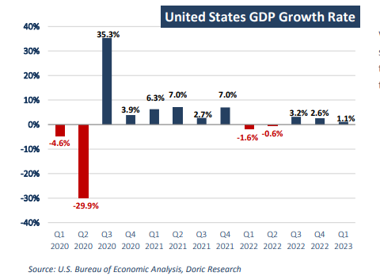
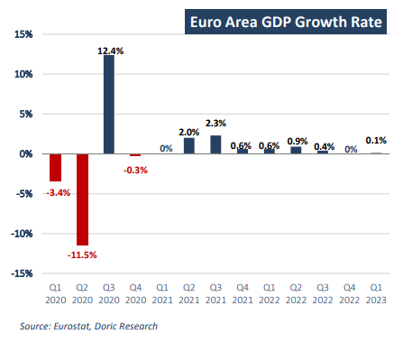

# Doric Weekly Market Insight

**Date:** May 02, 2023  
**Publisher:** Breakwave Advisors | **Category:** Market Insights  
**Original URL:** [https://www.breakwaveadvisors.com/insights/2023/5/2/doric-weekly-market-insight](https://www.breakwaveadvisors.com/insights/2023/5/2/doric-weekly-market-insight)  

---

## “With Western Economies Lacking Vividness, Baltic Indices Haven't Yet Set a Clear Course and Continued Trading Within a Very Narrow Range the Last Couple of Months, with the Local Peaks and Troughs Being Less Than Three Thousand Dollars Apart.”

*By*[*Michalis Voutsinas*](https://www.linkedin.com/in/michalis-voutsinas-587544163/)

Following last week's upbeat Chinese GDP data, economists are optimistic about Beijing hitting its full-year growth target of 5 percent in 2023. The higher-than-expected growth rate in the first quarter was partly driven by a rebound in consumption, with official data showing retail sales gathering momentum. In fact, retail sales in March rose a forecast-beating 10.6 percent, closing in on a two-year high. Additionally, China recorded robust export growth in March, backing up Beijing’s pledge to shore up trade to support the overall economic recovery. In fact, exports significantly beat expectations and rose by 14.8 percent from a year earlier to US$315.59 billion, ending a run of five consecutive months of decline. Much of this growth was driven by exports to Russia and shipments to the Association of Southeast Asian Nations (Asean). Another driver of the aforementioned jump was more likely related to exporters rushing to fulfil a backlog of orders that had been disrupted by the pandemic during past months. However, analysts remain cautious about the sustainability of this trend as sluggish external demand paired with geopolitical factors could challenge China's trade development.

In particular, the US economy expanded by an annualized 1.1 percent in Q1 2023, softening from a 2.6 percent expansion in the previous quarter. Missing market expectations of a 2 percent growth, the first quarter’s growth pace was the weakest since Q2 2022. Compared to the fourth quarter, the deceleration in real GDP in the first three months of the current year primarily reflected a downturn in private inventory investment and a slowdown in nonresidential fixed investment. These movements were partly offset by an acceleration in consumer spending, an upturn in exports, and a smaller decrease in residential fixed investment. The upsurge in consumer spending reflected increases in both goods and services. Within goods, the leading contributor was motor vehicles and parts. Within services, the increase was led by health care and food services and accommodations. Within federal government spending, the increase was led by nondefense spending. Within nonresidential fixed investment, increases in structures and intellectual property products were partly offset by a decrease in equipment. The decrease in private inventory investment was led by wholesale trade (notably, machinery, equipment, and supplies) and manufacturing (led by other transportation equipment as well as petroleum and coal products). Within residential fixed investment, the leading contributor to the decrease was new single-family construction.

> **Figure 1: 1 (2)**  
> **Interactive Data & Source:** [Doric](https://www.doric.gr/) | [Local Asset](file:///C:/Users/Dell/Github/Shipping/corpus/03-breakwave/insights/2023/assets/2023-05-02_doric-weekly-market-insight_img_128229_963e14e43394.png)

Other major western economies have also showed signs of ebbing momentum. The euro zone expanded only marginally in the first three months of 2023 at a rate lower than market expectations. Gross domestic product of the bloc grew by 0.1 percent in the first quarter, below expectations in a Reuters poll for 0.2 percent growth. Amongst the bloc's largest economies, Germany registered no growth in the first quarter, while the economies of France, Italy, and Spain expanded by more than expected. Remaining stuck in the mud, the German economy stagnated in the first quarter, as a decline in government and household consumption was balanced out by an increase in exports and capital investment. In spite of a series of strikes against the government's pension reform bill, French economy grew slightly by 0.2 percent in the first quarter. Supported by household consumption, the second largest economy of the euro zone managed to overcome the flat fourth quarter of last year. In tandem, Italy's economy grew by 0.5 percent in the first quarter from the previous three months, after a slight contraction at the end of last year. Surging inflation due to high energy costs and rising food prices following Russia's invasion of Ukraine, waning confidence and increased interest rates have had a bearing on the single currency economy.

> **Figure 2: 1 (3)**  
> **Interactive Data & Source:** [Doric](https://www.doric.gr/) | [Local Asset](file:///C:/Users/Dell/Github/Shipping/corpus/03-breakwave/insights/2023/assets/2023-05-02_doric-weekly-market-insight_img_128329_8b55036932a5.png)

With western economies lacking vividness, Baltic indices haven't yet set a clear course and continued trading within a very narrow range the last couple of months, with the local peaks and troughs being less than three thousand dollars apart – with the exception of Capesizes.

Data source:[Doric](https://www.doric.gr/)
