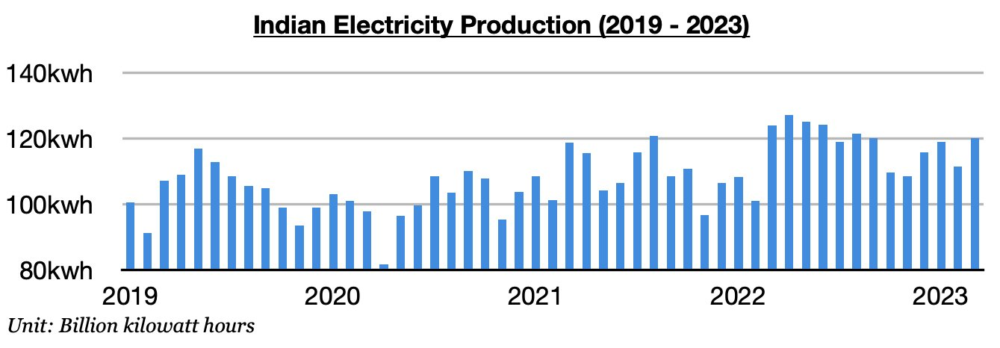
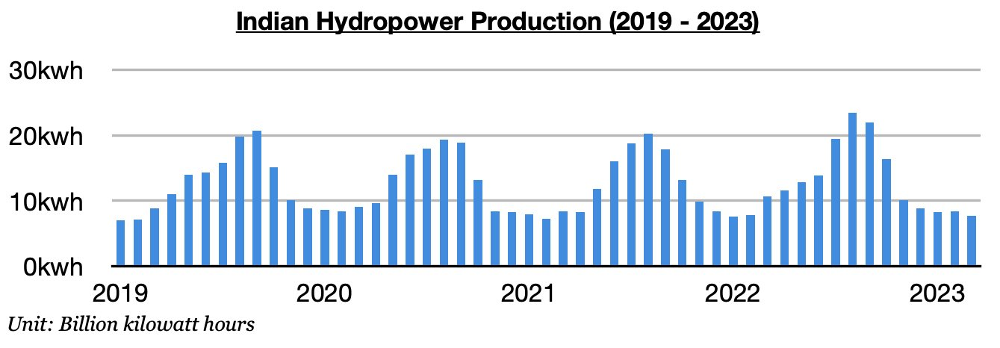
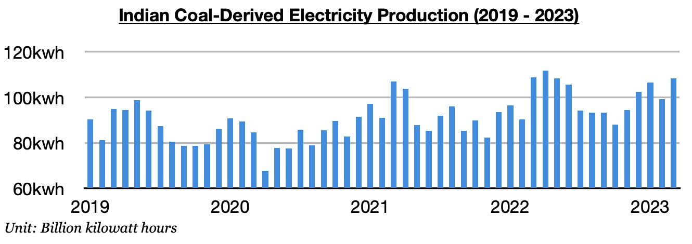

# Contraction in India's Electricity Production

**Date:** May 03, 2023  
**Publisher:** Breakwave Advisors | **Category:** Market Insights  
**Original URL:** [https://www.breakwaveadvisors.com/insights/2023/5/2/contraction-in-indias-electricity-production](https://www.breakwaveadvisors.com/insights/2023/5/2/contraction-in-indias-electricity-production)  

---

*By*[*Jeffrey Landsberg*](https://www.linkedin.com/in/jeffrey-landsberg-70ab957/)

India produced approximately 120.1 billion kilowatt hours of electricity last month, which is up month-on-month by 8.4 billion kilowatt hours (8%) but down year-on-year by 3.8 billion kilowatt hours (-3%). It is normal for production to rise on a month-on-month basis in March. More significant is the year-on-year contraction. While India’s electricity production previously increased on a year-on-year basis during eleven of the prior twelve months, electricity production last month was significantly affected by a contraction in hydropower production.

> **Figure 1: Chart 1 (80)**  
> [Local Asset](file:///C:/Users/Dell/Github/Shipping/corpus/03-breakwave/insights/2023/assets/2023-05-03_contraction-in-indias-electricity-production_img_chart1288029_1b796d6896cb.jpg)

Hydropower output totaled approximately 7.7 billion kilowatt hours. This is down month-on-month by 700,000 kilowatt hours (-8%) and is down year-on-year by 2.9 billion kilowatt hours (-27%). This has marked the largest year-on-year contraction seen this decade.

> **Figure 2: Chart 2 (68)**  
> [Local Asset](file:///C:/Users/Dell/Github/Shipping/corpus/03-breakwave/insights/2023/assets/2023-05-03_contraction-in-indias-electricity-production_img_chart2286829_6cee529f61d8.jpg)

Coal-derived electricity generation totaled approximately 108.3 billion kilowatt hours. This is up month-on-month by 9.1 billion kilowatt hours (9%) but is down year-on-year by 400 million kilowatt hours. The contraction is a surprise and we will be monitoring this market closely. Previously, coal derived-electricity generation increased on a year-on-year basis during ten of the prior twelve months.

> **Figure 3: Chart 3 (48)**  
> [Local Asset](file:///C:/Users/Dell/Github/Shipping/corpus/03-breakwave/insights/2023/assets/2023-05-03_contraction-in-indias-electricity-production_img_chart3284829_9bde84c59f0c.jpg)
