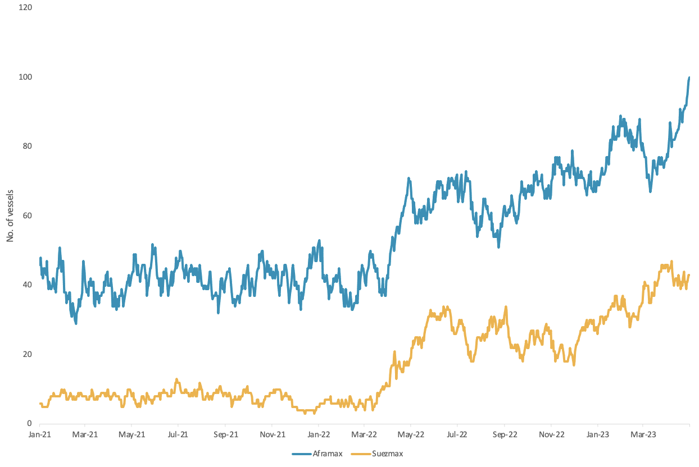
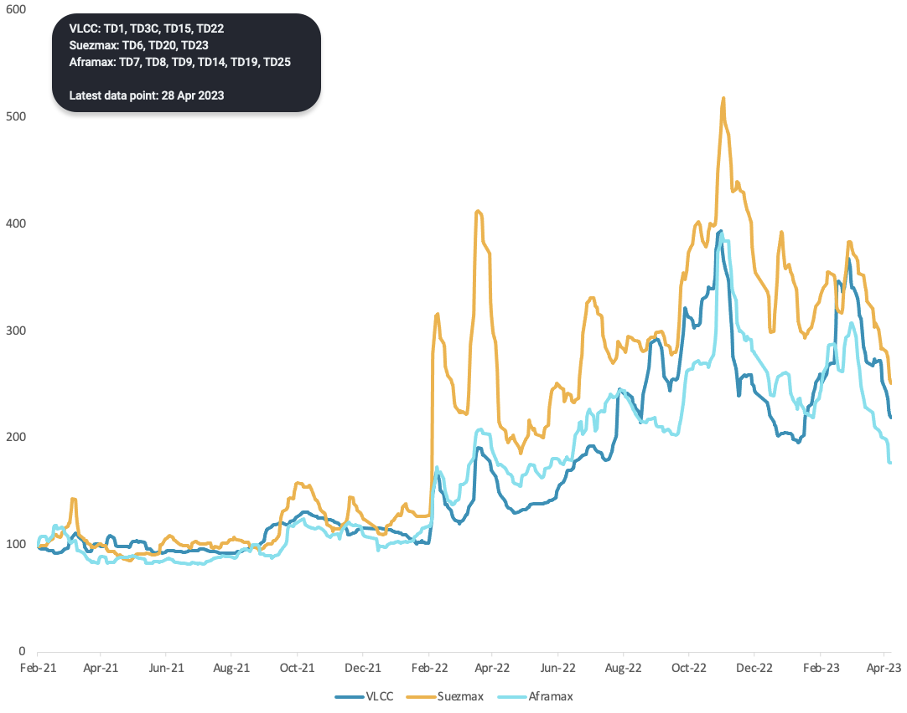

# Vortexa Freight Weekly

**Date:** May 04, 2023  
**Publisher:** Breakwave Advisors | **Category:** Market Insights  
**Original URL:** [https://www.breakwaveadvisors.com/insights/2023/5/4/vortexa-freight-weekly](https://www.breakwaveadvisors.com/insights/2023/5/4/vortexa-freight-weekly)  

---

By[Dylan Simpson](https://www.linkedin.com/search/results/all/?fetchDeterministicClustersOnly=false&heroEntityKey=urn%3Ali%3Afsd_profile%3AACoAACDtdn0BzHNR8syu_G8WxL-JXL-9PRT5AP4&keywords=dylan%20simpson&origin=RICH_QUERY_SUGGESTION&position=0&searchId=55ecee69-a408-47b2-8686-68f172e21af1&sid=mVl)

### Analysis / East of Suez / Dirty

### Aframaxes Leave Suezmaxes in the Dust Ex-Russia

> **Figure 1: Crude Utilisation Out of Russia per Vessel Class**  
> *Crude utilisation out of Russia per vessel class*  
> **Interactive Data & Source:** [Marketingmail Vortexa](https://marketingmail.vortexa.com/ODM3LU1aRS01NzgAAAGLgYL5n1ZYlu7oCJ3IOfjskIOMB-kwZnVZdLf8bVn-bBXX3pAziy1VSzjS2AGPm0Xr7D--GYM=) | [Local Asset](file:///C:/Users/Dell/Github/Shipping/corpus/03-breakwave/insights/2023/assets/2023-05-04_vortexa-freight-weekly_img_unnamed-2023-05-04t110454954_5122b3429391.png)

- Russian[exports](https://marketingmail.vortexa.com/ODM3LU1aRS01NzgAAAGLgYL5n1ZYlu7oCJ3IOfjskIOMB-kwZnVZdLf8bVn-bBXX3pAziy1VSzjS2AGPm0Xr7D--GYM=)ended April almost 10% up m-o-m, mostly headed towards India and East Asia. At the same time, crude[tonne-miles](https://marketingmail.vortexa.com/ODM3LU1aRS01NzgAAAGLgYL5oLFTvrLHY_UCBhUsBYT3lIJKuYHALPMz26Kg_oWiIrDwTZ8-3ATsRU-yFnEuyvDXO5Q=)out of Russia continue to breach record highs.
- Aframax tankers have mostly benefited from this, with the majority of flows originating out of the Baltic. At the same time, the market share of Russian crude coming out of the Black Sea has remained flat despite the geographical advantage of sending cargoes to Asia from the Black Sea.
- The lack of export growth out of the Black sea indicates that Russia’s capacity for rerouting crude volumes to the Black Sea is limited, forcing volumes to continue moving out of the Baltic. This will support Aframax demand going forward, as Suezmaxes cannot load in the Baltic due to port restrictions.

### Analysis / West of Suez / Dirty

**Crude tanker indices are hitting 7-month lows, pointing to a cooldown in seaborne crude volumes**

> **Figure 2: Vortexa Crude Tanker Index per Vessel Class**  
> *Vortexa crude tanker index per vessel class*  
> **Interactive Data & Source:** [Marketingmail Vortexa](https://marketingmail.vortexa.com/ODM3LU1aRS01NzgAAAGLgYL5oN2K81XOWMWj-ox1rRgdqOtJkEteRAR6-kzVq0iB-TMhkI9gAW2FD8Bg1kYe1lTZPeM=) | [Local Asset](file:///C:/Users/Dell/Github/Shipping/corpus/03-breakwave/insights/2023/assets/2023-05-04_vortexa-freight-weekly_img_unnamed-2023-05-04t154611621_7fade00c0eaf.png)

- Crude tanker indices are following a downward trajectory for more than a month, across the main tanker segments. Modest availability figures in main producing regions such as the US Gulf and West Africa are signalling that the declining rates are a product of weaker trade fundamentals.
- More importantly at these record-high exports coming out of main producing regions (Russia, US Gulf) seen recently are likely unsustainable and will lead to lower crude loadings in the next month. Despite the comeback of refineries post-maintenance season, purchasing activity appears to be limited pointing to softer product demand amid inventory drawdowns as reflected from the weaker CPP rates.
- At the same time,[increasing VLCC availability in the Middle East Gulf](https://marketingmail.vortexa.com/ODM3LU1aRS01NzgAAAGLgYL5oN2K81XOWMWj-ox1rRgdqOtJkEteRAR6-kzVq0iB-TMhkI9gAW2FD8Bg1kYe1lTZPeM=)likely points towards lower cargo enquiries. This will likely lead to the lower export levels of OPEC+ members, as production cuts take effect from May, adding pressure to the supply side and further limiting trade demand.

Data Source:[Vortexa](https://www.vortexa.com//oil-gas-data-traders-analysts-data-scientists?gclid=Cj0KCQjw8_qRBhCXARIsAE2AtRZKOvMnbilZ_6_91d7huSFFy71pWLrnPwGwOHVzXsmsG-1a1mZnQw8aAt89EALw_wcB&hsa_acc=1782073842&hsa_ad=548425387665&hsa_cam=14746637662&hsa_grp=125038601902&hsa_kw=&hsa_mt=&hsa_net=adwords&hsa_src=g&hsa_tgt=dsa-1431852288425&hsa_ver=3&utm_campaign=%5BCD%5D%20-%20DSA%20-%20EMEA&utm_medium=cpc&utm_medium=ppc&utm_source=google&utm_source=adwords&utm_term=)
