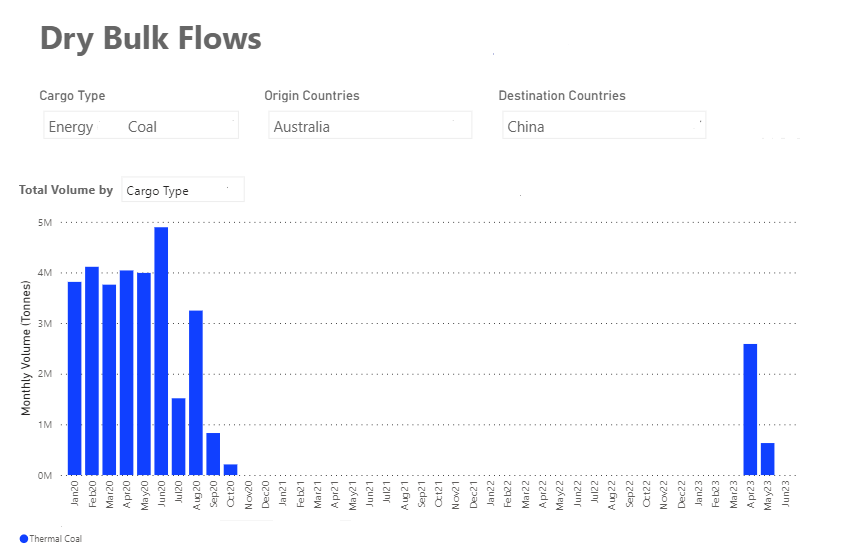
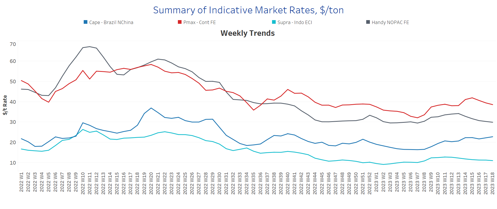
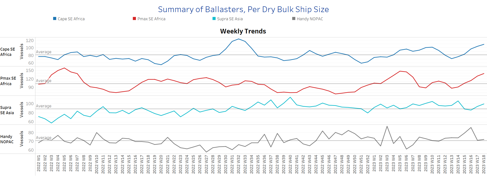
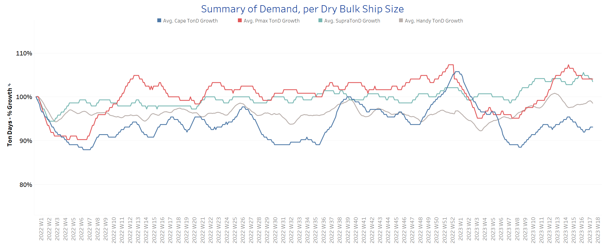
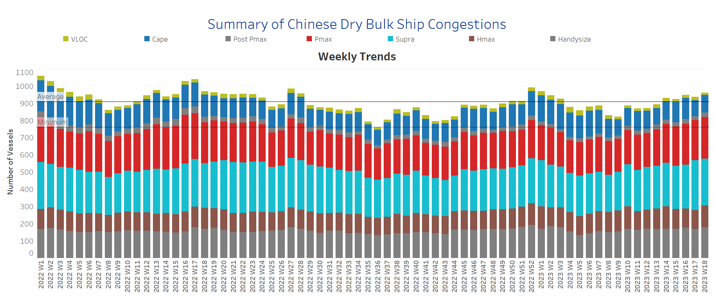

# Signal Dry Bulk Weekly Report

**Date:** May 05, 2023  
**Publisher:** Breakwave Advisors | **Category:** Market Insights  
**Original URL:** [https://www.breakwaveadvisors.com/insights/2023/5/5/signal-dry-bulk-weekly-report](https://www.breakwaveadvisors.com/insights/2023/5/5/signal-dry-bulk-weekly-report)  

---

## Chart of the Week Dry Bulk: Coal From Australia to China

> **Figure 1: Rise in April to the Highest Level Since September 2020**  
> **Interactive Data & Source:** [Signal Ocean Platform](https://go.signalocean.com/e/983831/amic-drybulkflows-downloadable/2nx3wq/316996770?h=RaNuUW8OGTfivQSRIogdgYVb-BuD99yF7jGZQQooM4o) | [Local Asset](file:///C:/Users/Dell/Github/Shipping/corpus/03-breakwave/insights/2023/assets/2023-05-05_signal-dry-bulk-weekly-report_img_unnamed-2023-05-05t141409935_1408b6dea34a.png)

​​​Data Source: The Signal Ocean Platform, Dry Bulk Flows

In the first days of May, we have seen that the Capesize freight market momentum is still solid, while there are signs of a slowdown in Panamax. It is interesting to note that the Chinese (see picture above) have stepped up their Australian thermal coal imports again after the lifting of the ban, which will eventually have a positive impact on Panamax rates. April was the first month of the highest Chinese thermal coal imports from Australia, with the trend of increased purchases continuing in the second quarter.

In the grain segment, we expect further shortages in commodity flows following the European Commission's recent ban on imports of Ukrainian wheat, corn, rapeseed and sunflower into Bulgaria, Hungary, Poland, Romania and Slovakia until June 5. However, imports of all products from Ukraine, including wheat, corn, rapeseed and sunflower, to the rest of the European Union countries will continue without restrictions.

For more information on this week's trends, see the analysis sections below:

Freight Market, Supply, Demand and Port Congestion

## Section 1/ Freight -Market Rates ($/T)

### Capesize - Firmer | Panamax-Weaker | Supramax - Handysizesoftening

‘The Big Picture’ - Capesize and Panamax Bulkers and Smaller Ship Sizes

> **Figure 2: Market Chart 2**  
> **Interactive Data & Source:** [Signal Ocean Platform](https://www.thesignalgroup.com/signal-ocean-platform) | [Local Asset](file:///C:/Users/Dell/Github/Shipping/corpus/03-breakwave/insights/2023/assets/2023-05-05_signal-dry-bulk-weekly-report_img_unnamed-2023-05-05t141610404_ec81ab7630c3.png)

In early May, the Capesize segment saw stronger momentum, while rates for Panamax vessels were gradually revised downward, and the strength of recent days in the smaller vessel categories has waned.

- **Capesize**vessel freight rates are now close to $23/tonne, surpassing the recent peak of week 14.
- **Panamax**vessel freight rates fromtheContinent to the Far East are now just over $38/tonne, while current rates are nearly $3/tonne lower than three weeks ago.
- **Supramax**freight rates for the Indo-ECI route fell below $11/tonne, with signs of weakening in the first half of May.
- **Handysize**freight rates for the NOPAC Far East route moved slightly below $30/tonne, down $4/tonne from the previous week, with the trend continuing downward.

## Section 2/ Supply -Ballasters (# Vessels)

### Capesize-Panamax-Supramax Increasing |Handysize Steady

> **Figure 3: Supply Trend Lines for Key Load Areas**  
> **Interactive Data & Source:** [Signal Ocean Platform](https://www.thesignalgroup.com/signal-ocean-platform) | [Local Asset](file:///C:/Users/Dell/Github/Shipping/corpus/03-breakwave/insights/2023/assets/2023-05-05_signal-dry-bulk-weekly-report_img_unnamed-2023-05-05t141710169_5d329dbe131c.png)

The number of ballast vessels has continued to increase in the major vessel categories as May shows an upward trend after the record low in week 13. The recent increase in the Capesize and Panamax segments appears to be higher than the recent highs recorded in Week 5.

- **Capesize**SE Africa: The number of vessels is now 109, 53% above where it was five weeks ago and 29 above the average for the year.
- **Panamax**SE Africa: The number of vessels has increased to 139, 53 more than five weeks ago and 36 more than the average for the year.
- **Supramax**SE Asia: The number of vessels increased to 99, nearly 13 more than two weeks ago and 10 above the annual average.
- **Handysize**NOPAC: The number of vessels is now 72, nearly the same as the average for the year and 11 more than the low in week 6.

## Section 3/ Demand -TonDays Softening

> **Figure 4: TonDays Softening**  
> **Interactive Data & Source:** [Signal Ocean Platform](https://www.thesignalgroup.com/signal-ocean-platform) | [Local Asset](file:///C:/Users/Dell/Github/Shipping/corpus/03-breakwave/insights/2023/assets/2023-05-05_signal-dry-bulk-weekly-report_img_unnamed-2023-05-05t141735902_d861c615bf20.png)

In May, the upward trend observed at the end of April weakened, but demand still appears high compared to the lows recorded in week 7.​​​

- ​**Capesize**demand ton-days: A gradual downward trend has been observed since the highs of week 15, with early signs of stronger momentum in the coming days.
- **Panamax**demand ton-days: Growth seems to have stabilised for the last three consecutive weeks, giving hope for similar growth in the first half of May.
- **Supramax**demand ton-days: The upward trend in Supramax vessel demand is now no longer outpacing demand growth in the Panamax segment, suggesting a downward cycle in the smaller vessel categories.
- **Handysize**demand ton-days: There are signs of stronger momentum after the lows of four weeks ago, and it seems that a downward correction is not imminent.

## Section 4/ Port Congestion -No of Vesselsincreasingdry Bulk Ships Congested at Chinese Ports

> **Figure 5: Increasing**  
> **Interactive Data & Source:** [Signal Ocean Platform](https://www.thesignalgroup.com/signal-ocean-platform) | [Local Asset](file:///C:/Users/Dell/Github/Shipping/corpus/03-breakwave/insights/2023/assets/2023-05-05_signal-dry-bulk-weekly-report_img_unnamed-2023-05-05t141949827_cf689ad2d5b4.png)

Congestion continued the strong upward trend seen at the end of April, with increases in the Capesize, Panamax and Handysize segments.

- **Capesize:**The number of vessels now stands at 103, 9 more than the last week of April.
- **Panamax:**The number of ships is now at 241, 8 more than the previous week and still too high as we have not seen a value below 190 since the end of the fourth week.
- **Supramax:**The number of ships is now at 271, down 17 from the previous week and up 26% from the end of week 8.
- **Handysize**: The number of congested ships increased to 179, up 9 from the previous week, with a steady increase since the end of week five (~133 ships).

Data Source:[Signal Ocean Platform](https://www.thesignalgroup.com/signal-ocean-platform)
