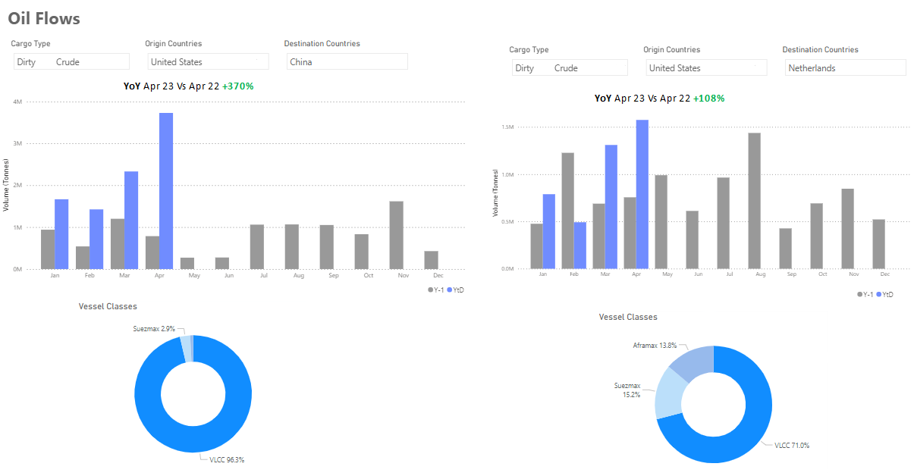
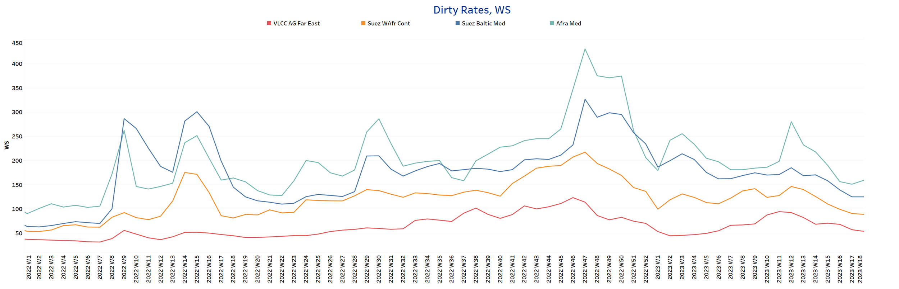
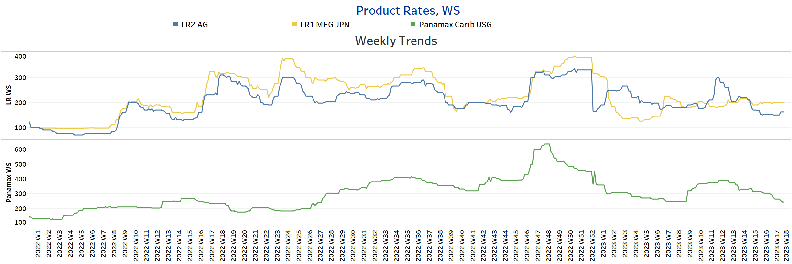
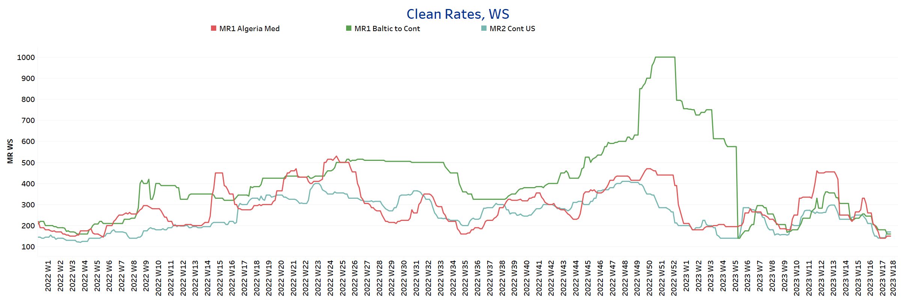
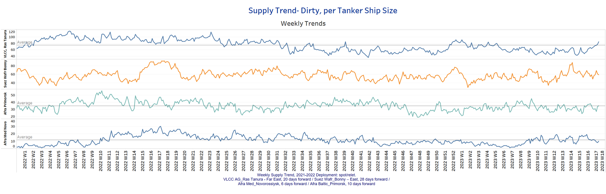
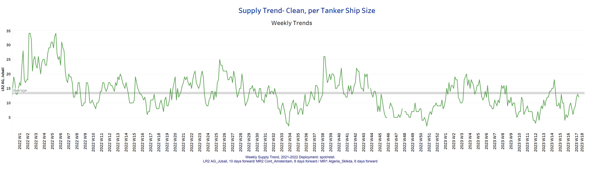
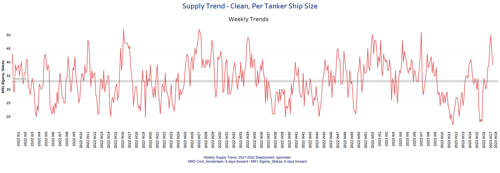
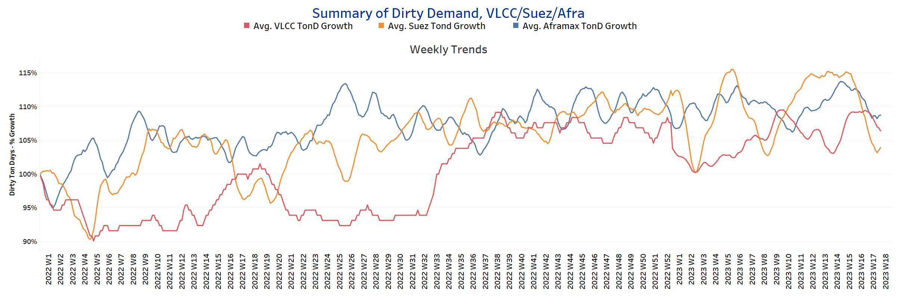
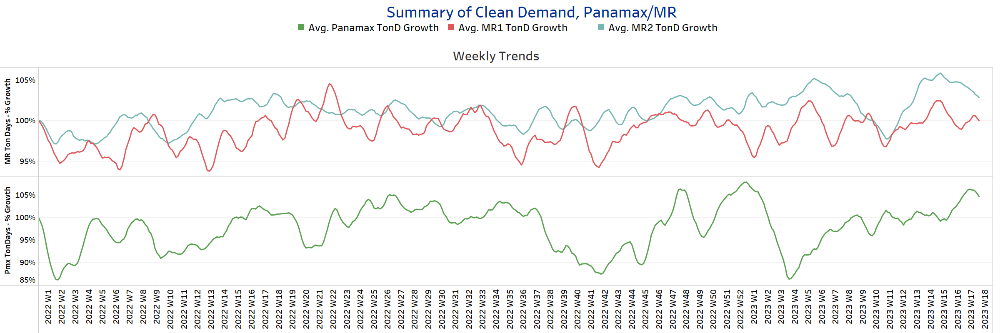

# Signal Tanker Weekly Report

**Date:** May 05, 2023  
**Publisher:** Breakwave Advisors | **Category:** Market Insights  
**Original URL:** [https://www.breakwaveadvisors.com/insights/2023/5/5/signal-tanker-weekly-report](https://www.breakwaveadvisors.com/insights/2023/5/5/signal-tanker-weekly-report)  

---

## Chart of the Week: Oil Flows From Russia to China

> **Figure 1: U.s. Exporting More Crude Oil to Europe and Asia**  
> **Interactive Data & Source:** [Signal Ocean Platform](https://go.signalocean.com/e/983831/tanker-dynamic-oilflows/2nx8z1/317215611?h=nNocUOz2mXDw2txUlBCg7f_WiEnAJWTC3iAZPojkgkQ) | [Local Asset](file:///C:/Users/Dell/Github/Shipping/corpus/03-breakwave/insights/2023/assets/2023-05-05_signal-tanker-weekly-report_img_unnamed-2023-05-05t140020117_e4511a0d99fc.png)

Data Source: The Signal Ocean Platform- Oil Flows

Crude oil freight rates have lost momentum since the end of April, but demand from Asian countries continues unabated as the Chinese increasingly source oil from the U.S. (see image above). April ended with a 370% increase in Chinese crude oil flows from the US compared to April last year, while the second quarter of the year will end with a spectacular increase in monthly crude oil imports. In parallel, the US has already started exporting more to the Netherlands, where monthly crude oil imports will increase by 100% in April 2022. In China, 96% of crude oil trade is handled by VLCC tankers, while the share of VLCC in the Netherlands is 70%.

In the oil market, the monthly volume of oil shipments to China will remain excessive, while the Netherlands will increase its dependence on the US. As for oil prices, they are falling despite OPEC + production cuts and Russia's war in Ukraine due to economic fears in the US and China. The IMF said in its latest economic forecasts that Saudi Arabia needs an oil price of $80.90 per barrel to balance its budget this year. Reuters news agency reported that oil prices fell 9% this week, while seemingly finding stable momentum on Thursday when ECB announced its decision to slow interest rate hikes in the fight against inflation.

For more information on this week's trends, see the analysis sections below:
Freight Market, Supply and Demand

## Section 1/ Freight - Market Rates (WS)

## ‘Dirty’ VLCC - Suezmax - Aframax- Weaker

> **Figure 2: Dirty**  
> **Interactive Data & Source:** [Signal Ocean Platform](https://www.thesignalgroup.com/signal-ocean-platform) | [Local Asset](file:///C:/Users/Dell/Github/Shipping/corpus/03-breakwave/insights/2023/assets/2023-05-05_signal-tanker-weekly-report_img_unnamed-2023-05-05t140126546_a07c8b3c4120.png)

Crude oil freight rate sentiment weakened in early May, with the Aframax-Med route experiencing a slight upward correction over the past two weeks.

- **VLCC**AG-FE freight rates were at WS54, down nearly 14 points from the recent peak two weeks ago.
- **Suezmax**freight rates from West Africa to continental Europe fell to WS 89, almost 57 points lower than four weeks ago, with a trend of weakness emerging for the next few days.
- **Aframax**Med freight rates remained above WS 155 with similar momentum over the last three weeks.

## ‘Product’ LR2 - LR1 -Steady

> **Figure 3: Steady**  
> **Interactive Data & Source:** [Signal Ocean Platform](https://www.thesignalgroup.com/signal-ocean-platform) | [Local Asset](file:///C:/Users/Dell/Github/Shipping/corpus/03-breakwave/insights/2023/assets/2023-05-05_signal-tanker-weekly-report_img_unnamed-2023-05-05t140159683_b8b458f4aa67.png)

- **LR2**AG freight rates hovered around WS 160, 10 points higher than a week ago.

- **LR1**MEG -to-Japan freight rates recorded firm momentum, consistently hovering around WS 200 for the last three consecutive weeks.

## Product’ Panamax -Weaker

- **Panamax**Carib-to-USG rates have weakened further since late April. Rates are now at WS 240, 39% below the recent peak in weeks 12 and 13.

## ‘Clean’ MR2 - MR1 - Weaker

> **Figure 4: Clean**  
> **Interactive Data & Source:** [Signal Ocean Platform](https://www.thesignalgroup.com/signal-ocean-platform) | [Local Asset](file:///C:/Users/Dell/Github/Shipping/corpus/03-breakwave/insights/2023/assets/2023-05-05_signal-tanker-weekly-report_img_unnamed-2023-05-05t140250602_ec44b15dbcd3.png)

- **MR1**rates Algeria-to-Med are now at WS150, almost 50% lower than mid-April, and Baltic-to-Cont MR1 rates are at ~ WS160, with stronger weakening dynamics since early April.

- **MR2**rates Cont-to-US are now at WS170, indicating similar dynamics to late April and down nearly 50% from early April.

## Section 2/ Supply -(# Vessels)'dirty'supply Trend Lines for Key Load Areasvlcc Increasing | Aframax - Suezmaxdecreasing

> **Figure 5: VLCC Increasing | Aframax - Suezmax**  
> **Interactive Data & Source:** [Signal Ocean Platform](https://www.thesignalgroup.com/signal-ocean-platform) | [Local Asset](file:///C:/Users/Dell/Github/Shipping/corpus/03-breakwave/insights/2023/assets/2023-05-05_signal-tanker-weekly-report_img_unnamed-2023-05-05t140423220_d62ac41c5a4f.png)

Crude oil tanker supply showed a downward trend in early May, with signs of upward movement in VLCC.

- **VLCC Ras Tanura**: The number of vessels is now 85, 10 more than the annual average.
- **Suezmax Wafr Bonny**: The number of vessels now stands at 59, 32% below the week 15 peak.
- **Aframax Primorsk**: The number of vessels has remained close to the annual average of 35 in the last three weeks, with a tendency of an increase in the coming days.
- **Aframax Med Novo**: The number of vessels has fallen slightly below the annual average of 11, with a strong downward trend in the last two weeks.

## ‘Clean’ Supply Trend Lines for Key Load Areas |LR2| Increasing

> **Figure 6: Market Chart 6**  
> **Interactive Data & Source:** [Signal Ocean Platform](https://www.thesignalgroup.com/signal-ocean-platform) | [Local Asset](file:///C:/Users/Dell/Github/Shipping/corpus/03-breakwave/insights/2023/assets/2023-05-05_signal-tanker-weekly-report_img_unnamed-2023-05-05t140452277_75cb4c6c4519.png)

## ‘Clean’ Supply Trend Lines for Key Load Areas |MR1| Decreasing

> **Figure 7: Market Chart 7**  
> **Interactive Data & Source:** [Signal Ocean Platform](https://www.thesignalgroup.com/signal-ocean-platform) | [Local Asset](file:///C:/Users/Dell/Github/Shipping/corpus/03-breakwave/insights/2023/assets/2023-05-05_signal-tanker-weekly-report_img_unnamed-2023-05-05t140550188_1104c65f37db.png)

- **Clean LR2 AG Jubail:**The number of vessels has approached the annual average of 14 after two weeks of being below the annual trend.

- **Clean MR1 Algeria Skikda:**The number of vessels decreased to 39, 6 more than the annual average, with a trend of further decrease in the second week of May.

## Section 3 - Demand - Ton Days

## ‘Dirty’ |VLCC - Suezmax - Aframax -Decreasing

> **Figure 8: Decreasing**  
> **Interactive Data & Source:** [Signal Ocean Platform](https://www.thesignalgroup.com/signal-ocean-platform) | [Local Asset](file:///C:/Users/Dell/Github/Shipping/corpus/03-breakwave/insights/2023/assets/2023-05-05_signal-tanker-weekly-report_img_unnamed-2023-05-05t140632762_3cb7ae1a2814.png)

## ‘Clean’ |Panamax - Increasing | MR2 - MR1 -Decreasing

> **Figure 9: Market Chart 9**  
> **Interactive Data & Source:** [Signal Ocean Platform](https://www.thesignalgroup.com/signal-ocean-platform) | [Local Asset](file:///C:/Users/Dell/Github/Shipping/corpus/03-breakwave/insights/2023/assets/2023-05-05_signal-tanker-weekly-report_img_unnamed-2023-05-05t140713283_9038676b48f1.png)

- demand ton-days: The strength observed at the end of Apil has now weakened with the stronger downward correction in Suezmax.

- demand ton-days / Panamax demand: A positive trend continues in the last three weeks, with signs of a growth spurt similar to that seen earlier in the year.
- MR: MR2 growth has maintained a downward trend from late April, while there appears to be momentum for a slight upward trend in MR1.

Data Source:[Signal Ocean Platform](https://www.thesignalgroup.com/signal-ocean-platform)
