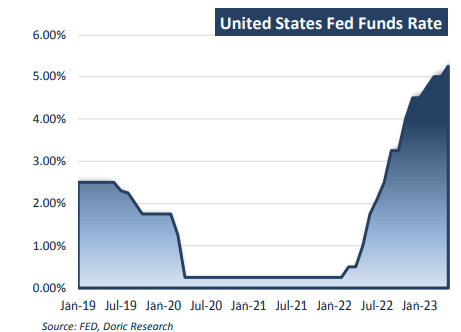
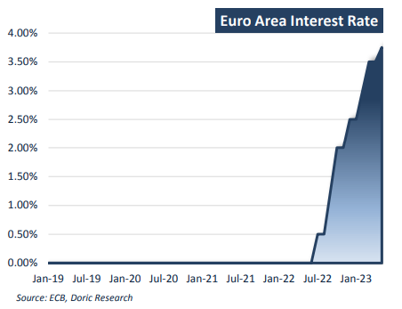

# Doric Weekly Market Insight

**Date:** May 08, 2023  
**Publisher:** Breakwave Advisors | **Category:** Market Insights  
**Original URL:** [https://www.breakwaveadvisors.com/insights/2023/5/8/doric-weekly-market-insight](https://www.breakwaveadvisors.com/insights/2023/5/8/doric-weekly-market-insight)  

---

## “With Monetary Tightening in the Spotlight, Baltic Indices Found the Perfect Excuse to Hide Behind Various Public Holidays Around the Globe, Effectively Taking a Step Back and Reconsidering Their Courses. in This Unprophetic Week, the Leading Baltic Dry Index Concluded Today at 1558 Points, a Mere 18 Points Lower Than Last Friday’s Closing.”

*By*[*Michalis Voutsinas*](https://www.linkedin.com/in/michalis-voutsinas-587544163/)

The first trading week of May a year ago was a rather choppy one, with Federal Reserve making headlines. In fact, Fed raised the target for the Fed Funds Rate by half a point to 0.75-1 percent - aiming to tackle soaring inflation. It was the first time in 22 years that the central bank had hiked rates up this much. In his post-meeting press conference, Fed Chairman Jerome Powell stressed that additional half-percentage-point rate hikes would be on the table for the next few meetings, after acknowledging that inflation is much too high.

Twelve months later, Fed's historic monetary tightening campaign remains strong with another interest rate increase this week. The Federal Reserve raised its benchmark interest rate by another quarter of a percentage point on Wednesday. In what was its 10th consecutive increase in just over a year, the Federal Open Market Committee’s latest increase brought the Federal Funds Rate to a new target range of 5 percent to 5.25 percent, the highest since 2007.

> **Figure 1: 1 (2)**  
> **Interactive Data & Source:** [Doric](https://www.doric.gr/) | [Local Asset](file:///C:/Users/Dell/Github/Shipping/corpus/03-breakwave/insights/2023/assets/2023-05-08_doric-weekly-market-insight_img_128229_3bd5de2e43d7.png)

Since the Fed started its tightening cycle, price increases in the US have shown signs of moderation. Inflation in the US cooled to the lowest point in almost two years in March as year-over-year price increases reached 5 percent. The aforementioned levels were the lowest published since May 2021. Although the latest reading of US inflation is considerably higher than Fed's target of 2 percent, a discussion for an upcoming pause in rate hikes has started. The postmeeting statement re-emphasized central bank’s commitment to bring down inflation, but did not include the notation that “some additional policy firming may be appropriate,” which was included in its prior release. With regard to this topic, Fed Chair Jerome Powell said that the central bank would “approach that question at the June meeting.” He further added that “People did talk about pausing, but not so much at this meeting. There’s a sense that we’re much closer to the end of this than to the beginning,”

Across the pond, the inflation outlook continues to be too high for too long. Annual inflation in the eurozone rose to 7 percent in April, according to the European Union’s statistics agency, the first increase after five consecutive monthly declines. Food and drink prices keep climbing, but the pace of the increase slowed to 13.6 percent in April from 15.5 percent in March, according to the Eurostat. Energy prices increased 2.5 percent after falling 0.9 percent in March.

Headline inflation has declined over recent months, but underlying price pressure remains strong, according to the European Central Bank. In light of the ongoing high inflationary pressures, the Governing Council this week decided to raise the three key ECB interest rates by 25 basis points. Having raised rates by the most in its 25-year history, the ECB’s main deposit rate came at 3.25 percent. Christine Lagarde, ECB president, signalled the decision to increase its benchmark deposit rate further, but at a slower pace. “We have more ground to cover and we are not pausing, that is extremely clear,” she said.

> **Figure 2: 1 (3)**  
> **Interactive Data & Source:** [Doric](https://www.doric.gr/) | [Local Asset](file:///C:/Users/Dell/Github/Shipping/corpus/03-breakwave/insights/2023/assets/2023-05-08_doric-weekly-market-insight_img_128329_0f64c2d6f28a.png)

Whilst the officially declared war against inflation kept going in both banks of the Atlantic, the United Nations food agency's world price index rose in April for the first time in a year. The Food and Agriculture Organization's (FAO) price index, which tracks the most globally traded food commodities, averaged 127.2 points last month against 126.5 for March, the agency said on Friday. At that level, the Index was 19.7 percent below its level in April 2022, but still 5.2 percent higher than in April 2021. "As economies recover from significant slowdowns, demand will increase, exerting upward pressure on food prices," said FAO Chief Economist Maximo Torero. Against this backdrop, Baltic indices found the perfect excuse to hide behind various public holidays around the globe, effectively taking a step back and reconsidering their courses. In this unprophetic week, the leading Baltic Dry Index concluded today at 1558 points, a mere 18 points lower than last Friday’s closing.

Data source:[Doric](https://www.doric.gr/)
