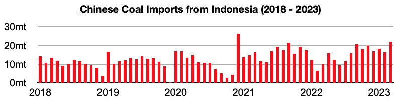
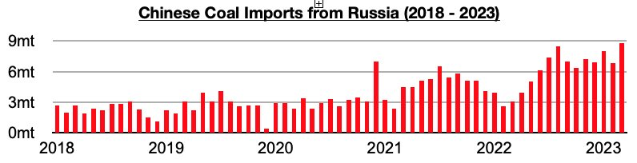

# Surge in China's Coal Imports From Indonesia and Russia

**Date:** May 10, 2023  
**Publisher:** Breakwave Advisors | **Category:** Market Insights  
**Original URL:** [https://www.breakwaveadvisors.com/insights/2023/5/9/surge-in-chinas-coal-imports-from-indonesia-and-russia](https://www.breakwaveadvisors.com/insights/2023/5/9/surge-in-chinas-coal-imports-from-indonesia-and-russia)  

---

*By*[*Jeffrey Landsberg*](https://www.linkedin.com/in/jeffrey-landsberg-70ab957/)

Coal imports from Indonesia have remained China’s primary source of imported coal. The most recently released data shows that Imports from Indonesia totaled 22 million tons in March. This is up from February by 5.5 million tons (33%) and up year-on-year by 12 million tons (120%). This marks the largest amount imported from Indonesia since December 2020.

> **Figure 1: Chart 1 (74)**  
> [Local Asset](file:///C:/Users/Dell/Github/Shipping/corpus/03-breakwave/insights/2023/assets/2023-05-10_surge-in-chinas-coal-imports-from-indonesia-and-russia_img_chart1287429_84aaf0dd0d6f.jpg)

Imports from Russia also continue to drastically increase. Imports from Russia totaled 8.8 million tons in March. This is up from February by 2 million tons (29%) and up year-on-year by 5.7 million tons (184%). This has also marked the largest amount ever imported from Russia.

> **Figure 2: Chart 2 (63)**  
> [Local Asset](file:///C:/Users/Dell/Github/Shipping/corpus/03-breakwave/insights/2023/assets/2023-05-10_surge-in-chinas-coal-imports-from-indonesia-and-russia_img_chart2286329_8a2240b4f460.jpg)

As we discussed in Commodore's client reports right before the war in Ukraine started last year, Russia and China signed a landmark coal cooperation agreement. Since then, Russia very quickly has become China’s second largest source of coal imports. Almost a quarter of China’s coal imports last year came from Russia and new monthly import records continue to be set.
