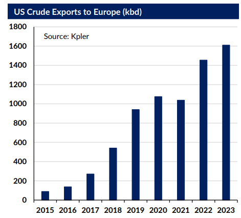

# Gibson's Tanker Market Report

**Date:** May 10, 2023  
**Publisher:** Breakwave Advisors | **Category:** Market Insights  
**Original URL:** [https://www.breakwaveadvisors.com/insights/2023/5/10/w39j986q4kre31g4xmstm4qxj7kw4j](https://www.breakwaveadvisors.com/insights/2023/5/10/w39j986q4kre31g4xmstm4qxj7kw4j)  

---

## A Sign of the Times

North Sea Brent, the main global benchmark for crude oil pricing is moving with the times to reflect new market realities. Originally based on North Sea production since the 1970s, questions have arisen in recent years over the benchmark’s viability for pricing oil contracts, given the declining output of Brent and other North Sea grades with the implications this could have for trading liquidity. Brent has now been thrown a lifeline with the inclusion of US WTI crude into the dated Brent basket which should in theory alleviate concerns about volumes by significantly increasing the quantity of delivered crude into the North Sea basin, providing a liquidity boost going forward.

> **Figure 1: 1 (5)**  
> **Interactive Data & Source:** [Gibsons Co](https://www.gibsons.co.uk/market-reports) | [Local Asset](file:///C:/Users/Dell/Github/Shipping/corpus/03-breakwave/insights/2023/assets/2023-05-10_w39j986q4kre31g4xmstm4qxj7kw4j_img_128529_d288d67d3dd1.png)

However, this could provide an interesting development for the crude tanker market, given there is an important freight element to this new liquidity. In the new Brent price assessment only Aframax cargoes of 700kbbls will be included, this may provide some support to Atlantic Aframax tankers loading out of the US as traders look to move cargos consistent with the updated pricing framework. Kpler data shows that since 2021, US crude volumes to Europe carried on Aframaxes increased modestly from 844 kbd to 894 kbd in 2022 but this has since weakened in 2023 as barrels have shifted onto larger Suezmax and VLCCs This means the pricing framework may require some adjustment going forward to reflect this shift up to larger cargo sizes.

This too may improve chartering appetite for transatlantic VLCCs and Suezmaxes out of the US going forward as economies of scale mean a cargo of 2 million or 1 million barrels on a VLCC or Suezmax respectively should be cheaper than a 700kbbls Aframax cargo, which should be more appealing for traders given the underlying economics and the ability to sell WTI into Europe. However, this will also depend on fluctuations within the individual tanker segments in terms of freight rates and which provides the best value on a $/bbl basis and how this plays out in terms of market practice remains to be seen. In addition, Aframaxes may be preferred over larger vessels due to the cost and complexity of lightering and STS operations off Europe, but this will likely be price driven.

In terms of overall timing, this comes as the US increasingly exports more cargo to Europe to replace lost Russian crude barrels following the December 5th import ban and as such this should be welcome news for European buyers of WTI. Fundamentally, Europe needs crude, both from within the region and from strategic partners such as the US to secure oil supply security. In terms of the tanker market, the inclusion of WTI into Brent pricing should help to support the Atlantic Aframax market through a base of demand but this will depend on the ability of such trade volumes to be maintained as well as the trajectory of European decarbonisation and the implications for regional oil demand.

Data source:[Gibson Shipbrokers](https://www.gibsons.co.uk/market-reports)
