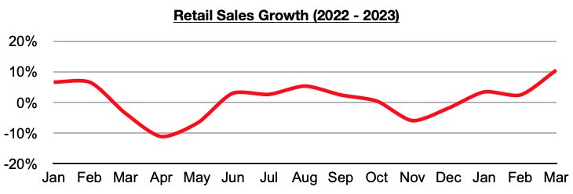
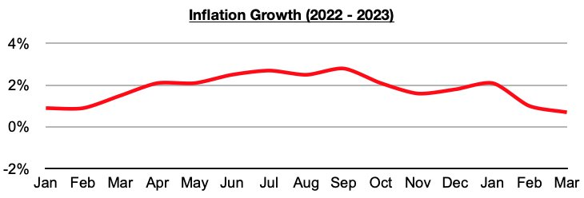

# Retail Sale Growth in China Has Been Exceeding Inflation

**Date:** May 11, 2023  
**Publisher:** Breakwave Advisors | **Category:** Market Insights  
**Original URL:** [https://www.breakwaveadvisors.com/insights/2023/5/11/retail-sale-growth-in-china-has-been-exceeding-inflation](https://www.breakwaveadvisors.com/insights/2023/5/11/retail-sale-growth-in-china-has-been-exceeding-inflation)  

---

*By*[*Jeffrey Landsberg*](https://www.linkedin.com/in/jeffrey-landsberg-70ab957/)

In Commodore Research's Weekly China Reports this year, we have continued to stress how one major change in China in recent months has been that consumer spending growth has reverted back to exceeding inflation. The same cannot be said in many other major economies. Most recently, China's retail sales in March grew year-on-year by 10.6%.

> **Figure 1: Chart 1 (75)**  
> [Local Asset](file:///C:/Users/Dell/Github/Shipping/corpus/03-breakwave/insights/2023/assets/2023-05-11_retail-sale-growth-in-china-has-been-exceeding-inflation_img_chart1287529_0c71661c90f9.jpg)

In comparison, inflation in March grew year-on-year by only 0.7%. Overall, both China’s consumer sector and industrial sector continue to improve dramatically this year, while much of the rest of the world continues to experience great weakness in their own industrial and consumer sectors as we have continued to discuss in Commodore's Weekly Dry Bulk Reports.

> **Figure 2: Chart 2 (64)**  
> [Local Asset](file:///C:/Users/Dell/Github/Shipping/corpus/03-breakwave/insights/2023/assets/2023-05-11_retail-sale-growth-in-china-has-been-exceeding-inflation_img_chart2286429_74f8e0d6c569.jpg)

Among the specific retail categories that Commodore monitors, of note is that consumer electronics / appliance sales continue to contract, and both furniture and clothing sales continue to grow. Consumer electronics / appliance sales contracted on a year-on-year basis in March by 4%. Consumer electronics / appliance sales have contracted for seven straight months. Furniture sales grew year-on-year by 6%. Furniture sales have grown on a year-on-year basis for three straight months. Clothing sales (which includes garments, footwear, hats, and knitwear) grew year-on-year by 21%. Clothing sales have also grown on a year-on-year basis for three straight months.
