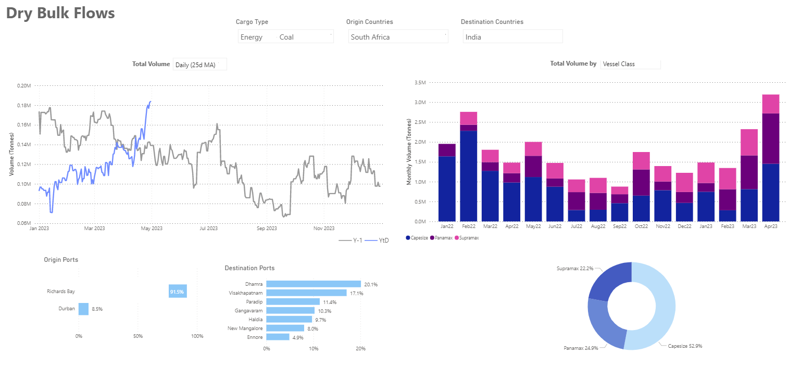
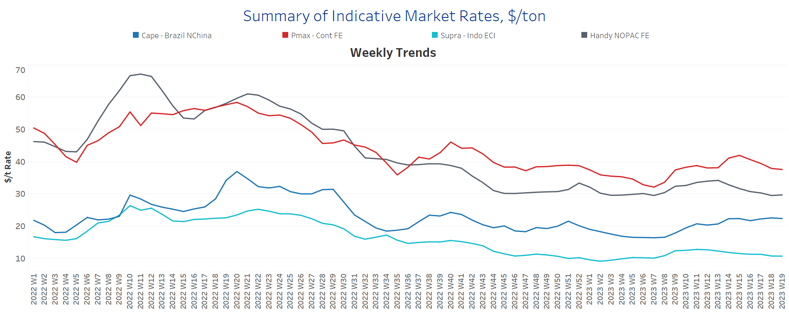
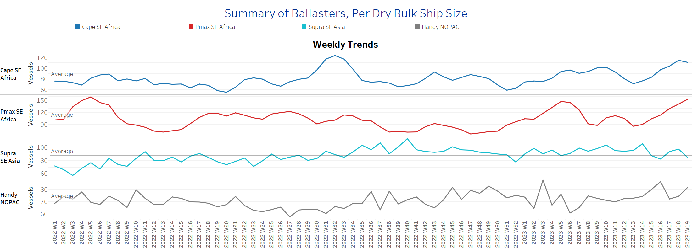
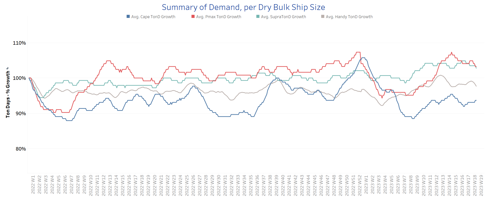
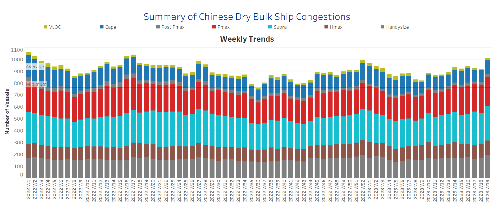

# Signal Dry Bulk Weekly Report

**Date:** May 11, 2023  
**Publisher:** Breakwave Advisors | **Category:** Market Insights  
**Original URL:** [https://www.breakwaveadvisors.com/insights/2023/5/11/signal-dry-bulk-weekly-report](https://www.breakwaveadvisors.com/insights/2023/5/11/signal-dry-bulk-weekly-report)  

---

## Chart of the Week Dry Bulk: South African Coal to India

*Rise in April to the highest level in a year, with Dharma the top destination port*

> **Figure 1: Market Chart 1**  
> **Interactive Data & Source:** [Signal Ocean Platform](https://go.signalocean.com/e/983831/amic-drybulkflows-downloadable/2nxs9j/318228156?h=tvCjPtFa1TyZ3zwi3M09OjbqdQVP3ptBWqufiBTbdnM) | [Local Asset](file:///C:/Users/Dell/Github/Shipping/corpus/03-breakwave/insights/2023/assets/2023-05-11_signal-dry-bulk-weekly-report_img_unnamed-2023-05-11t114744350_8e75df027a17.png)

Data Source: The Signal Ocean Platform, Dry Bulk Flows
[Signal Ocean Platform](https://go.signalocean.com/e/983831/amic-drybulkflows-downloadable/2nxs9j/318228156?h=tvCjPtFa1TyZ3zwi3M09OjbqdQVP3ptBWqufiBTbdnM)

In the second week of May, we saw weaker dynamics in freight rates, with the Capesize segment registering some firmness. Interestingly, the Indian economy is seeing strong South African coal imports, with the Capesize segment gaining strength in this type of trade, with recent weekly volumes reaching their highest levels in the last year. (See chart of 25-day moving average above left). In the previous month, the Capesize and Panamax segments reached peak levels in shipments of South African coal for the Indian economy.

In the grain segment, the freight market is still uncertain whether the Black Sea Grain Initiative will be extended beyond May 18. However, Ukraine's agriculture minister said the country has alternative grain transportation options if the agreement is not extended on May 18. Reuters news agency reports that Moscow has threatened to terminate the initiative on May 18 unless a number of demands to remove barriers to Russian grain and fertiliser exports are met.

For more information on this week's trends, see the analysis sections below:
Freight Market, Supply, Demand and Port Congestion

## Section 1/ Freight -Market Rates ($/T)

### Capesize -Firmer | Panamax - Supramax - Handysize Weaker

‘The Big Picture’ - Capesize and Panamax Bulkers and Smaller Ship Sizes

> **Figure 2: Market Chart 2**  
> **Interactive Data & Source:** [Signal Ocean Platform](https://www.thesignalgroup.com/signal-ocean-platform) | [Local Asset](file:///C:/Users/Dell/Github/Shipping/corpus/03-breakwave/insights/2023/assets/2023-05-11_signal-dry-bulk-weekly-report_img_unnamed-2023-05-11t114845380_5cd78340c2e4.png)

In the second half of May, the Capesize segment continued the stronger momentum of the previous week, while rates for other vessel size classes showed a weaker outlook.

- **Capesize**vessel freight rates are now at $22/tonne, up $7/tonne from week 8.
- **Panamax**vessel freight rates fromtheContinent to the Far East fell to $37/tonne, while current rates are nearly $5/tonne lower than four weeks ago.
- **Supramax**freight rates for the Indo-ECI route remained at levels below $11/tonne, with signs of weakening in the second half of May.
- **Handysize**freight rates for the NOPAC Far East route remained below $30/tonne, with the downward trend continuing over the past four weeks.

## Section 2/ Supply -Ballasters (# Vessels)

### Capesize-Panamax - Handysize Increasing | Supramax Decreasing

> **Figure 3: Supply Trend Lines for Key Load Areas**  
> **Interactive Data & Source:** [Signal Ocean Platform](https://www.thesignalgroup.com/signal-ocean-platform) | [Local Asset](file:///C:/Users/Dell/Github/Shipping/corpus/03-breakwave/insights/2023/assets/2023-05-11_signal-dry-bulk-weekly-report_img_unnamed-2023-05-11t115202046_3cb20377b4ec.png)

The number of ballast ships has continued to increase in the Capesize, Panamax and Handysize segments, while there are signs of a decline in Supramax.

- **Capesize**SE Africa: The number of vessels now stands at 111, 55% higher than six weeks ago and 30 above the annual average.
- **Panamax**SE Africa: The number of vessels has increased to 150, 65 more than five weeks ago and 50 more than the annual average.
- **Supramax**SE Asia: The number of vessels is down to 85, nearly 3 less than the annual average.
- **Handysize**NOPAC: The number of vessels is now at 82, almost 10 more than two weeks ago and 20 more than the low in week 6.

## Section 3/ Demand -TonDays Softening

> **Figure 4: TonDays Softening**  
> **Interactive Data & Source:** [Signal Ocean Platform](https://www.thesignalgroup.com/signal-ocean-platform) | [Local Asset](file:///C:/Users/Dell/Github/Shipping/corpus/03-breakwave/insights/2023/assets/2023-05-11_signal-dry-bulk-weekly-report_img_unnamed-2023-05-11t115542457_82df6c2a0ba8.png)

In the second week of May, the weakening of demand dynamics continues, with signs of a firmer trend in Capesize.

- **Capesize**demand ton-days: A gradual upward trend was observed in the second week of May, after a low was recorded in week 16.
- **Panamax**demand ton-days: Growth has steadily slowed in May, and there are signs of a similar trend in the remaining days of the current month.
- **Supramax**demand ton-days: The upward trend in demand for Supramax vessels has been steadily weakening, but the level is still above the lows of three weeks ago. It appears that the recent increase is counteracting a further decline.
- **Handysize**demand ton-days: There are signs of a downward correction, but current growth has not yet shown a sharp decline.

## Section 4/ Port Congestion -No of Vesselsincreasingdry Bulk Ships Congested at Chinese Ports

> **Figure 5: Increasing**  
> **Interactive Data & Source:** [Signal Ocean Platform](https://www.thesignalgroup.com/signal-ocean-platform) | [Local Asset](file:///C:/Users/Dell/Github/Shipping/corpus/03-breakwave/insights/2023/assets/2023-05-11_signal-dry-bulk-weekly-report_img_unnamed-2023-05-11t115704304_aea050a4eb66.png)

Congestion increased due to the upward trend in all ship size categories. The second week of May developed with a surprising upward trend at similar levels to the second week of this year.

- **Capesize:**The number of vessels now stands at 118, 18 more than the first week of May.
- **Panamax:**The number of ships is now at 248, 11 more than the previous week and still too high as we have not seen a value below 190 since the end of the fourth week.
- **Supramax:**The number of ships is now at 287, 30 more than the previous week and 35% more than at the end of week 8.
- **Handysize**: The number of congested ships has increased to 194, 22 more than the previous week, and there has been a steady increase since the end of week five (~133 ships).

Data Source:[Signal Ocean Platform](https://www.thesignalgroup.com/signal-ocean-platform)
