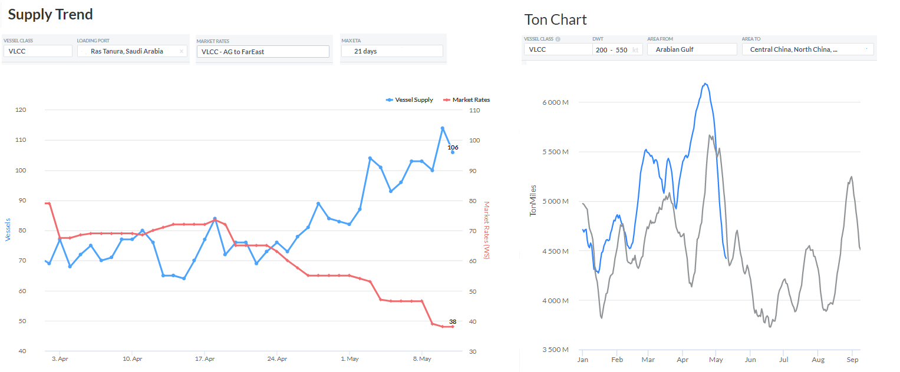
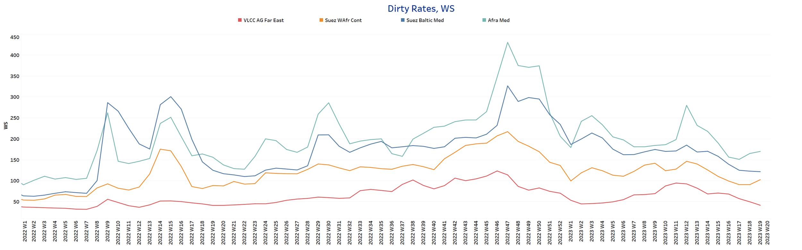
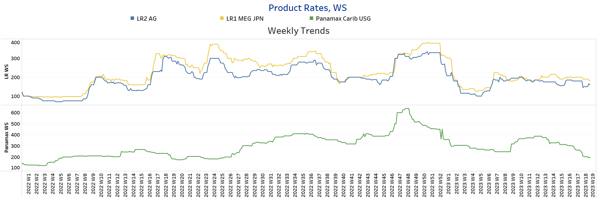
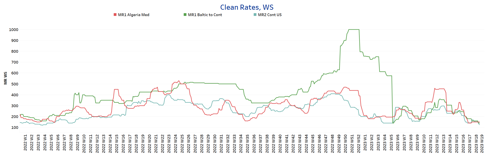
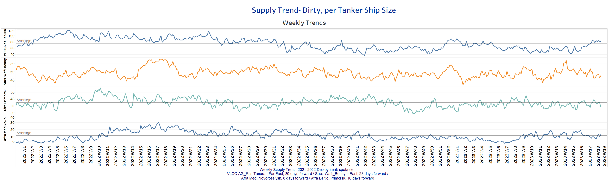
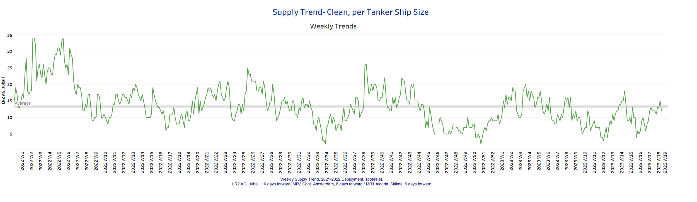
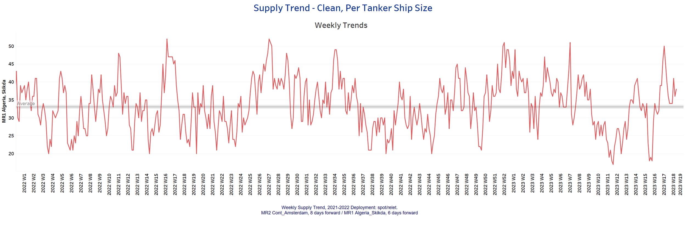
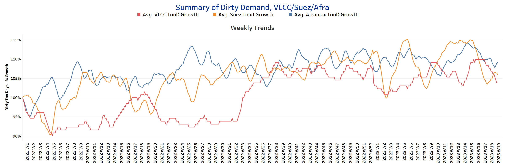
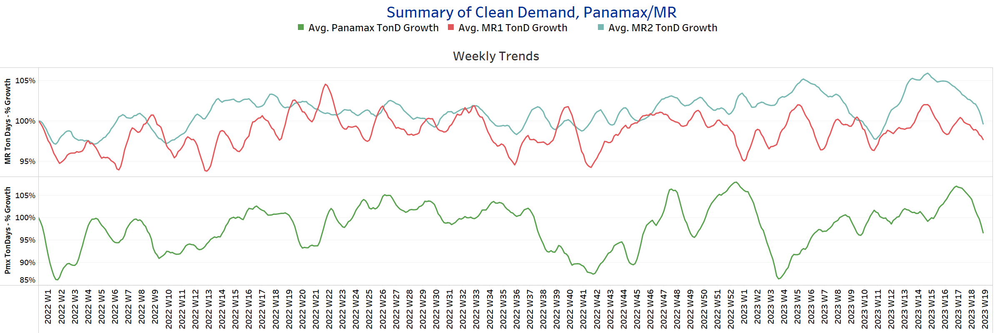

# Signal Tanker Weekly Report

**Date:** May 12, 2023  
**Publisher:** Breakwave Advisors | **Category:** Market Insights  
**Original URL:** [https://www.breakwaveadvisors.com/insights/2023/5/12/signal-tanker-weekly-report](https://www.breakwaveadvisors.com/insights/2023/5/12/signal-tanker-weekly-report)  

---

## Chart of the Week: VLCC AG-Fe Supply - Demand

*Number of ships at Ras Tanura port of loading increases as demand ton-miles drops to FE*

> **Figure 1: Market Chart 1**  
> **Interactive Data & Source:** [Signal Ocean Platform](https://go.signalocean.com/e/983831/tanker-reports-historicaltl/2nxx2t/318438471?h=iE-9c3fddzTNyk9GXeEOH8rtwBgseygv3M9OZzjfK0M) | [Local Asset](file:///C:/Users/Dell/Github/Shipping/corpus/03-breakwave/insights/2023/assets/2023-05-12_signal-tanker-weekly-report_img_unnamed-2023-05-12t114902050_c6d2e52bba79.png)

Data Source: The Signal Ocean Platform- Supply / Demand Ton Charts

[Signal Ocean Platform](https://go.signalocean.com/e/983831/tanker-reports-toncharts-trade/2nxx2x/318438471?h=iE-9c3fddzTNyk9GXeEOH8rtwBgseygv3M9OZzjfK0M)

Freight rates for VLCC crude oil tankers continued to weaken in the second week of May, with the number of vessels at the Ras Tanura port of loading rising to a surprising level (left chart above) and reaching a high of more than 100 while ton-miles demanded from AG to China for VLCC tankers is at a lower level than the same period last year. (right chart above).

In the oil market, the economic recession and rising oil inventories in the U.S. are weighing on price sentiment. Oilprice.com reported that Brent crude traded down 1.86% on the day to $76.00 per barrel, with a loss of $1.44, while West Texas Intermediate traded down 2.13% on the day to $72.14 per barrel, with a loss of $1.57. Meanwhile, Energy Information Administration (EIA) data showed a higher-than-expected build in crude oil inventories, suggesting weaker refining operations. On Wednesday, the EIA reported an inventory build of 3 million barrels for the week ending May 5.

For more information on this week's trends, see the analysis sections below:
Freight Market, Supply and Demand

## Section 1/ Freight - Market Rates (WS)

## ‘Dirty’ VLCC - Weaker | Suezmax - Aframax - Firmer

> **Figure 2: Dirty**  
> **Interactive Data & Source:** [Signal Ocean Platform](https://www.thesignalgroup.com/signal-ocean-platform) | [Local Asset](file:///C:/Users/Dell/Github/Shipping/corpus/03-breakwave/insights/2023/assets/2023-05-12_signal-tanker-weekly-report_img_unnamed-2023-05-12t114949429_431c9b5ba92f.png)

Sentiment on VLCC crude oil freight rates weakened in the second week of May, with the Aframax Med route experiencing an upward correction in the last three weeks.

- **VLCC AG-FE**freight rates were at WS42, nearly 30 points below the recent peak in week 16.
- **Suezmax**freight rates from West Africa to continental Europe rose to WS 103, up 13 points from two weeks ago, with a trend toward firmness in the coming days.
- **Aframax**Med freight rates rose surprisingly rose to WS 170, up 20 points from two weeks ago, with a firming trend in the next four weeks.

## ‘Product’ LR2 - Firmer | LR1 - Softening

> **Figure 3: Product**  
> **Interactive Data & Source:** [Signal Ocean Platform](https://www.thesignalgroup.com/signal-ocean-platform) | [Local Asset](file:///C:/Users/Dell/Github/Shipping/corpus/03-breakwave/insights/2023/assets/2023-05-12_signal-tanker-weekly-report_img_unnamed-2023-05-12t115039146_918659e672b3.png)

- **LR2**AG freight rates hovered around WS 160, 10 points higher than the previous week.

- **LR1**MEG -to-Japan freight rates eased to WS 180, 20 points lower than the previous week.

## Product’ Panamax -Weaker

- **Panamax**Carib-to-USG rates have weakened further since late April. Rates are now at WS 190, down 50% from the recent peak in weeks 12 and 13.

## ‘Clean’ MR2 - MR1 - Weaker

> **Figure 4: Clean**  
> **Interactive Data & Source:** [Signal Ocean Platform](https://www.thesignalgroup.com/signal-ocean-platform) | [Local Asset](file:///C:/Users/Dell/Github/Shipping/corpus/03-breakwave/insights/2023/assets/2023-05-12_signal-tanker-weekly-report_img_unnamed-2023-05-12t115129738_d3e709a228de.png)

- **MR1**rates Algeria-to-Med rates remained at WS150, almost 50% lower than mid-April, and Baltic-to-Cont MR1 rates fell to ~ WS140, 20 points lower than the previous week.

- **MR2**rates Cont-to-US are now at WS125, indicating decreasing trend dynamics, down nearly 60% from early April.

## Section 2/ Supply -(# Vessels)'dirty'supply Trend Lines for Key Load Areasvlcc Increasing | Aframax - Suezmaxdecreasing

> **Figure 5: VLCC Increasing | Aframax - Suezmax**  
> **Interactive Data & Source:** [Signal Ocean Platform](https://www.thesignalgroup.com/signal-ocean-platform) | [Local Asset](file:///C:/Users/Dell/Github/Shipping/corpus/03-breakwave/insights/2023/assets/2023-05-12_signal-tanker-weekly-report_img_unnamed-2023-05-12t115213728_e40250084a14.png)

The supply of VLCC crude oil tankers showed an upward trend in the first half of May, while the other crude oil tanker classes showed a downward trend.

- **VLCC Ras Tanura**: The number of vessels is now 81, 7 more than the annual average.
- **Suezmax Wafr Bonny**: The number of vessels now stands at 51, 40% below the week 15 peak.
- **Aframax Primorsk**: The number of ships fell to 29, 6 below the annual average, with a tendency to fall in the coming days.
- **Aframax Med Novo**: The number of vessels moved almost to the annual average of 11, with a strong downward trend in the last three weeks.

## ‘Clean’ Supply Trend Lines for Key Load Areas |LR2| Increasing

> **Figure 6: Market Chart 6**  
> **Interactive Data & Source:** [Signal Ocean Platform](https://www.thesignalgroup.com/signal-ocean-platform) | [Local Asset](file:///C:/Users/Dell/Github/Shipping/corpus/03-breakwave/insights/2023/assets/2023-05-12_signal-tanker-weekly-report_img_unnamed-2023-05-12t115252342_63a301b9da9e.png)

## ‘Clean’ Supply Trend Lines for Key Load Areas |MR1| Decreasing

> **Figure 7: Market Chart 7**  
> **Interactive Data & Source:** [Signal Ocean Platform](https://www.thesignalgroup.com/signal-ocean-platform) | [Local Asset](file:///C:/Users/Dell/Github/Shipping/corpus/03-breakwave/insights/2023/assets/2023-05-12_signal-tanker-weekly-report_img_unnamed-2023-05-12t115324599_9676e866a019.png)

- **Clean LR2 AG Jubail:**The number of vessels continues to increase and tends to fall below the annual average of 14 after three consecutive weeks of increase.

- **Clean MR1 Algeria Skikda:**The number of vessels decreased to 38, 12 less than the previous week, with a trend of further decrease in the third week of May.

## Section 3 - Demand - Ton Days

## ‘Dirty’ |VLCC - Decreasing | Suezmax - Aframax -Increasing

> **Figure 8: Increasing**  
> **Interactive Data & Source:** [Signal Ocean Platform](https://www.thesignalgroup.com/signal-ocean-platform) | [Local Asset](file:///C:/Users/Dell/Github/Shipping/corpus/03-breakwave/insights/2023/assets/2023-05-12_signal-tanker-weekly-report_img_unnamed-2023-05-12t125528609_d6c9ff60d9b1.png)

## ‘Clean’ |Panamax - MR2 - MR1 -Decreasing

> **Figure 9: Decreasing**  
> **Interactive Data & Source:** [Signal Ocean Platform](https://www.thesignalgroup.com/signal-ocean-platform) | [Local Asset](file:///C:/Users/Dell/Github/Shipping/corpus/03-breakwave/insights/2023/assets/2023-05-12_signal-tanker-weekly-report_img_unnamed-2023-05-12t125612929_7cf821ec492f.png)

- demand ton-days: VLCC demand continued to weaken, while the Suezmax and Aframax segments continued to experience an upswing.

- demand ton-days / Panamax demand: The previous week's high was eroded by a sharp downward correction in the second week of May, and there is uncertainty about a recovery in the coming days.
- MR: MR demand growth remained bearish over the past three weeks, although there were signs of a slight upward trend in MR1 at the end of the previous week.

Data Source:[Signal Ocean Platform](https://www.thesignalgroup.com/signal-ocean-platform)
