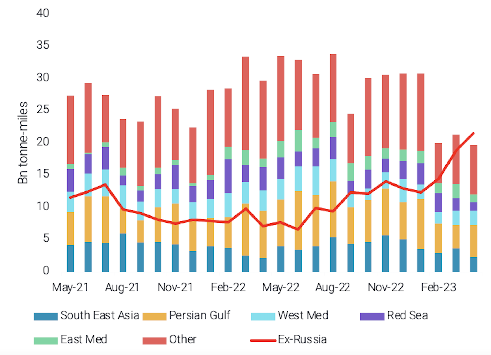
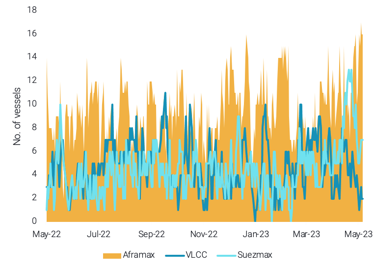

# Vortexa Freight Weekly

**Date:** May 12, 2023  
**Publisher:** Breakwave Advisors | **Category:** Market Insights  
**Original URL:** [https://www.breakwaveadvisors.com/insights/2023/5/11/vortexa-freight-weekly](https://www.breakwaveadvisors.com/insights/2023/5/11/vortexa-freight-weekly)  

---

*By*[*Ioannis Papadimitriou*](https://www.linkedin.com/search/results/all/?fetchDeterministicClustersOnly=true&heroEntityKey=urn%3Ali%3Afsd_profile%3AACoAAB3dQrYBbffaDWLWh_dRcHGHYBOwNhhatgs&keywords=ioannis%20papadimitriou&origin=RICH_QUERY_SUGGESTION&position=0&searchId=97ad9be2-e1ca-433d-9387-9339f78b324f&sid=my8)

### Analysis / East of Suez / Dirty

## Fuel Oil Freight Rates Remain Subdued As Tonne-Miles Ex-Russia Surpass Rest of World in April

> **Figure 1: Aframax Dpp Tonne-Miles: Global by Origin Region (Excl**  
> *Aframax DPP tonne-miles: Global by origin region (excl. Russia) vs ex-Russia*  
> **Interactive Data & Source:** [Marketingmail Vortexa](https://marketingmail.vortexa.com/ODM3LU1aRS01NzgAAAGLpMp4ESflt4SCLZvNHbkVGS4hmAf0o0v3X3lil6q6k1T36RaHIofBhB-MX8qnpKhuD8b0GXE=) | [Local Asset](file:///C:/Users/Dell/Github/Shipping/corpus/03-breakwave/insights/2023/assets/2023-05-12_vortexa-freight-weekly_img_unnamed-2023-05-11t120401851_86c0a74a9dff.png)

- While DPP imports into China have[equalled an all-time high in April](https://marketingmail.vortexa.com/ODM3LU1aRS01NzgAAAGLpMp4ESflt4SCLZvNHbkVGS4hmAf0o0v3X3lil6q6k1T36RaHIofBhB-MX8qnpKhuD8b0GXE=), this has not been reflected on the shipping market. DPP Aframax freight rates for the Middle East-to-East Asia ([TD8](https://marketingmail.vortexa.com/ODM3LU1aRS01NzgAAAGLpMp4Eq3NP64wpy65rB26thLIylCod5e5yW13CeunNJnEMbFdX0b7LnRyVnUkugD0wVx1AAE=)) route have dropped by 20% m-o-m.
- The reason for the disconnect between TD8 and Chinese imports is driven by the fact that these imports are satisfied by Russian fuel oil barrels towards China and as a result, the transport is operated by the “grey” fleet, leaving mainstream fleet demand stagnant.[Aframax DPP tonne-mile demand for routes not originating in Russia](https://marketingmail.vortexa.com/ODM3LU1aRS01NzgAAAGLpMp4ElEXwjH1wP_s_JelIxLQzzUDej9EqKHgPiZ9tM79tWvgK-NCZcpo8jj-JApLTMruM6g=)has fallen by almost 60% since January (pre- EU products ban) levels. On the other hand,[Aframax DPP tonne-miles ex-Russia have increased by 42%](https://marketingmail.vortexa.com/ODM3LU1aRS01NzgAAAGLpMp4EZmBuO8acBFvBwBi0NTRKifDY0GoJqVefzGWo42VMIvdNQLFwidHqZyc69BJeeVWkzw=)for the same period.
- Chinese discounted fuel oil imports from Russia will continue to remain strong as they are profitable for refiners without crude quotas. On the other hand any excess barrel sourcing from the Middle East will not provide support on TD8, as[Aframax availability is increasing](https://marketingmail.vortexa.com/ODM3LU1aRS01NzgAAAGLpMp4EZ4aY8qiP3fhoa5n2ZQ_Yn4H7clkI2Qi78KqvYCc1d-YePUroC6uQwzA14aBrW7DmEo=)in the region.

### Analysis / West of Suez / Dirty

## Aframax Prevalence in the Us Gulf Could Signal a Drop in Us Exports

> **Figure 2: Crude Tanker Prompt Ballasters to Load in Padd 3 by Vessel Class**  
> *Crude tanker prompt ballasters to load in PADD 3 by vessel class*  
> **Interactive Data & Source:** [Marketingmail Vortexa](https://marketingmail.vortexa.com/ODM3LU1aRS01NzgAAAGLpMp4EkBVoJ-040UP4058878-WODydL0Vzu67aI-ID1Jn9VrOmwT7bfK_cvVoXqoKGl9F_84=) | [Local Asset](file:///C:/Users/Dell/Github/Shipping/corpus/03-breakwave/insights/2023/assets/2023-05-12_vortexa-freight-weekly_img_unnamed-2023-05-11t120509992_7c70898b030c.png)

- The share of European crude imports stemming from North America continues to climb according to[preliminary data in May](https://marketingmail.vortexa.com/ODM3LU1aRS01NzgAAAGLpMp4EkBVoJ-040UP4058878-WODydL0Vzu67aI-ID1Jn9VrOmwT7bfK_cvVoXqoKGl9F_84=), almost reaching 40%. This ties in well with the fact that the US[sustained record crude exports](https://marketingmail.vortexa.com/ODM3LU1aRS01NzgAAAGLpMp4EYVAbIRX46d91lY4nhYD9q0ArsXvmdtgZ8zWK7t83kcS3-k11dcvVld5-pKoURpTwT4=)out of PADD 3 in April. The question is whether these exports can be sustained.
- As mentioned in the previous issue, current crude freight rates pose an overall bearish demand signal in the crude market with the only exception being[TD25](https://marketingmail.vortexa.com/ODM3LU1aRS01NzgAAAGLpMp4EdbMUy13IPB5OF0nPsEBsGd0bWvoWRL3wHDzRaXFFEMuIcZzxUFmRaLV3mbRZxJi-kY=)USG-to-Europe Aframax rates which still show some resistance. This is reflected when looking at prompt ballasters to load in PADD 3 where[Aframax](https://marketingmail.vortexa.com/ODM3LU1aRS01NzgAAAGLpMp4ESsBdbp4qHmgIoiTXrn3K5OgT0AfNgGE0ahLSQcfrEqlQOLsmZD_z8K4jM6zDSkQ9vs=)prevail at the expense of Suezmax and VLCCs.
- On the one hand, this displays an increase in demand for smaller parcelling requirements, which could point to an overall reduction in PADD 3 exports. On the other hand the WTI pricing inclusion in Brent is assessed in Aframax parcelling sizes, thus the incentive to trade on Aframaxes has increased, providing support for TD25 rates.

Data Source:[Vortexa](https://www.vortexa.com//oil-gas-data-traders-analysts-data-scientists?gclid=Cj0KCQjw8_qRBhCXARIsAE2AtRZKOvMnbilZ_6_91d7huSFFy71pWLrnPwGwOHVzXsmsG-1a1mZnQw8aAt89EALw_wcB&hsa_acc=1782073842&hsa_ad=548425387665&hsa_cam=14746637662&hsa_grp=125038601902&hsa_kw=&hsa_mt=&hsa_net=adwords&hsa_src=g&hsa_tgt=dsa-1431852288425&hsa_ver=3&utm_campaign=%5BCD%5D%20-%20DSA%20-%20EMEA&utm_medium=cpc&utm_medium=ppc&utm_source=google&utm_source=adwords&utm_term=)
