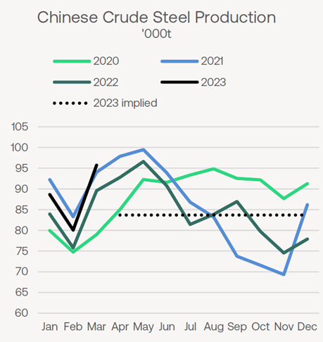
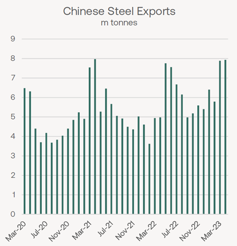
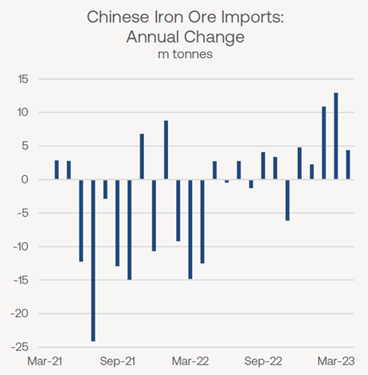

# Braemar Weekly Dry Market Report

**Date:** May 15, 2023  
**Publisher:** Breakwave Advisors | **Category:** Market Insights  
**Original URL:** [https://www.breakwaveadvisors.com/insights/2023/5/15/braemar-weekly-dry-market-report](https://www.breakwaveadvisors.com/insights/2023/5/15/braemar-weekly-dry-market-report)  

---

## The Big Picture: China’s Import Demand in 2023

*By*[*Derek Langston*](https://www.linkedin.com/in/derek-langston-ab74a81ab/)

## Steel, Coal and Grain Sectors in Focus

*Chinese apparent steel consumption in Q1 was “better than expected” in the words of the chief economist at the China Iron and Steel Association (CISA). A sharp 6.1% jump in crude steel production was, however, followed by a retreat in steel prices.*

*In an echo of steel sector controls from mid-2021, a proposed cap on steel output for the rest of the year was reported last month.*

We discuss the implications.

Chinese media outlet Caixin was among those reporting that China’s steel production is to be limited to below or at the 2022 total of 1,018m tonnes this year, but adding that the cap may be reviewed in the second half of the year. As often the case with such reports, no official policy document has yet surfaced.

> **Figure 1: Market Chart 1**  
> [Local Asset](file:///C:/Users/Dell/Github/Shipping/corpus/03-breakwave/insights/2023/assets/2023-05-15_braemar-weekly-dry-market-report_img_image00128529_d5e46ff10551.png)

The chart above highlights the implied monthly average for the rest of the year (dashed line), were the cap to be implemented in full for the duration of 2023.

With worldsteel reporting 264.4m tonnes of production in Q1 (providing a monthly average of 88.1m tonnes), the implied monthly average of around 83.7m tonnes for April-December inclusive**would equate to a –5% drop**between the two. At time of writing, official data for April have yet to be released, but daily output data from CISA already indicate a slowing from March levels already under way late in the month.

### How Seriously Should These Reports Be Taken?

Two developments suggest they should. Firstly, steel is not the only sector to have production controls imposed in Q2. Despite the arrival of the peak construction season in China, cement output in provinces such as Hebei and Sichuan is being staggered due to soft demand, according to Shanghai Metals Market.

As China is a very small net exporter of cement, these measures do not have much of a direct impact on trade flows, nonetheless, they do signal near-term weakness in industrial demand.

Secondly, the example of 2021 (shown by the blue line on the chart, left) is still fresh in the mind. From July onwards, anti-pollution controls on steel production against a background of sliding demand combined to push monthly output down from June’s peak close to 100m tonnes to below 70m tonnes by November.

> **Figure 2: Market Chart 2**  
> [Local Asset](file:///C:/Users/Dell/Github/Shipping/corpus/03-breakwave/insights/2023/assets/2023-05-15_braemar-weekly-dry-market-report_img_image00228229_80f67981a35a.png)

Although we do not anticipate a repeat of that magnitude this year, with March and April being some of the highest months for finished steel exports in recent years, it could be that this action is designed to prevent an excess of steel supply (and also pollution).**China’s steel export surge is now slowing**thanks to slumping overseas demand and sliding prices.

While the immediate-term outlook for China’s steel may be softer, future support for steel mill margins from supply-side discipline (and, potentially, a reduction in input costs)during a review in the second half of the year, judging by Caixin’s earlier report, and create scope for annual growth in iron ore imports.

> **Figure 3: Would Result in Production Curbs Being Eased**  
> [Local Asset](file:///C:/Users/Dell/Github/Shipping/corpus/03-breakwave/insights/2023/assets/2023-05-15_braemar-weekly-dry-market-report_img_image00328129_42f2d418a451.png)

Iron ore imports have performed well in the first four months of the year, benefitting from improved international supply from Australia, Brazil and Canada. Customs data confirm imports of 385m tonnes, marking a yearly gain of 30m tonnes, though still short of the 2020 peak (see chart below for the YoY growth trend). Perhaps significantly, April was a comparatively low month for imports, marking a ten-month low of 90.4m tonnes, as benchmark iron ore prices slid during the month.

**Coal market dynamics in China**can at times appear bewildering, thanks to the interplay of industrial demand, power markets, domestic production, inventory levels, competition from other fuel types, import opportunities and so on.

Recent months have seen extraordinarily high volumes of coal imported into China. April’s total of 40.7m tonnes (including lignite) recorded by customs follows an even higher March, with both months more than double the year-ago levels.

However, these figures need to be qualified: overland movements from Mongolia in April (included in grand total) leapt by around 4m tonnes YoY to 5.3m tonnes.

Furthermore, the massive inflow of coal from all sources has pushed stockpiles higher, while any industrial underperformance in the immediate term is another trade negative. This suggests some resistance to further coal buying in the interlude before the next demand upturn during summer.

To the detriment of hydropower (and implied benefit of coal burn), above-average temperatures have been forecast in key hydro-generating areas this summer.

From a shipping perspective, the threat to coal import demand from the national drive to lift domestic mining has been offset by further safety-related measures. A risk of landslides following fatalities in February has prompted authorities in Inner Mongolia to stop production of 32 coal mines with a combined annual capacity of 26.6m tonnes/year, newswires reported this month. Licences for an additional 23.6m tonnes/year of new capacity have been withdrawn.

**China’s influence in seaborne grain trades**has extended far beyond its well-established position as the world’s leading soybean importer (at 96.0m tonnes, according to the US Department of Agriculture) in recent years. As we reported on 18 April, China has emerged as the world’s largest wheat importer in the 2022/23 trade year (12.0m tonnes), as well as maintaining its status as the largest importer of coarse grain (with 32.3m tonnes) despite some retreat from the 2021/22 peak.

Chinese media reported last month that the country’s so-called“ anti-dumping” tariffs of 80.5% on Australian barley imports may soon end, thanks to (1) lobbying from China’s Alcoholic Drinks Association, plus (2) a temporary suspension of Australia’s WTO case against China. If the barley ban is repealed, imports into China from Australia can be expected to rise.
