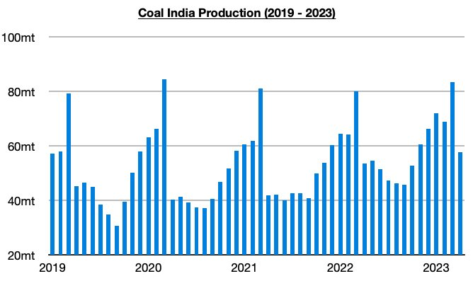
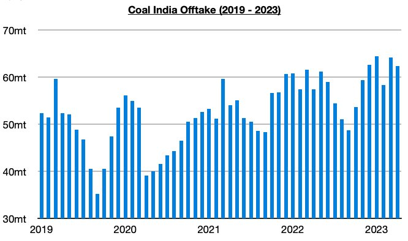
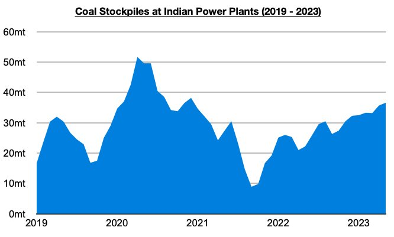

# Ongoing Growth in Coal India's Production

**Date:** May 16, 2023  
**Publisher:** Breakwave Advisors | **Category:** Market Insights  
**Original URL:** [https://www.breakwaveadvisors.com/insights/2023/5/16/ongoing-growth-in-coal-indias-production](https://www.breakwaveadvisors.com/insights/2023/5/16/ongoing-growth-in-coal-indias-production)  

---

*By*[*Jeffrey Landsberg*](https://www.linkedin.com/in/jeffrey-landsberg-70ab957/)

Coal India produced approximately 57.6 million tons of coal last month, which marks a month-on-month decline of 25.9 million tons (-31%) but a year-on-year increase of 4.1 million tons (8%). As we have discussed in Commodore's Weekly Dry Bulk Reports, Coal India’s production peaks in March of every year and a month-on-month plummet in April is normal. More noteworthy is that production has now increased on a year-on-year basis during twenty-three of the last twenty-four months.

> **Figure 1: Chart 1 (80)**  
> [Local Asset](file:///C:/Users/Dell/Github/Shipping/corpus/03-breakwave/insights/2023/assets/2023-05-16_ongoing-growth-in-coal-indias-production_img_chart1288029_340e0ca005ec.jpg)

Offtake (amount sent to customers) totaled 62.4 million tons last month, which marks a month-on-month decline of 1.8 million tons (-3%) but a year-on-year increase of 4.9 million tons (9%). Offtake has now increased on a year-on-year basis during twenty-five of the last twenty-six months, and last month also saw offtake finally exceeded production. The previous five months all saw offtake fall short of production.

> **Figure 2: Chart 2 (68)**  
> [Local Asset](file:///C:/Users/Dell/Github/Shipping/corpus/03-breakwave/insights/2023/assets/2023-05-16_ongoing-growth-in-coal-indias-production_img_chart2286829_8ff3b96d62a0.jpg)

Coal India’s stockpiles now stand at approximately 65 million tons. Also of note is that coal stockpiles at the nation's power plants now stand at pproximately 36.5 million tons.

> **Figure 3: Chart 3 (45)**  
> [Local Asset](file:///C:/Users/Dell/Github/Shipping/corpus/03-breakwave/insights/2023/assets/2023-05-16_ongoing-growth-in-coal-indias-production_img_chart3284529_30a9c55cc128.jpg)
