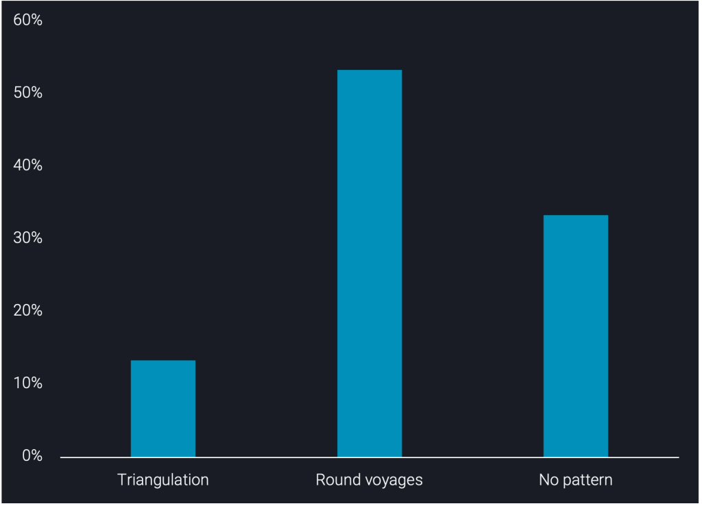
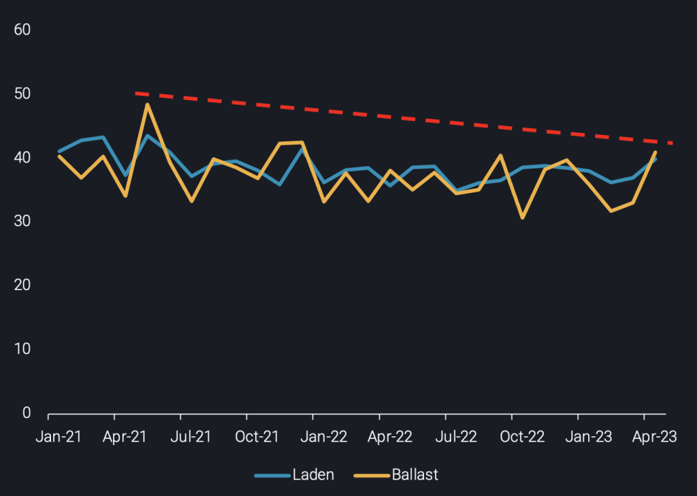
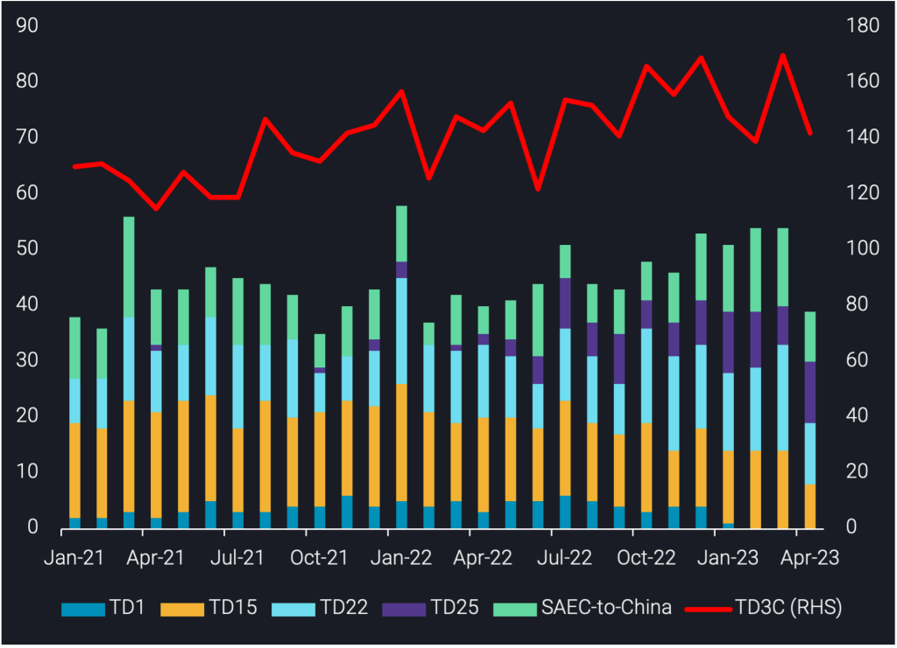

# Are VLCCs making use of triangulation patterns in the oil market?

**Date:** May 17, 2023  
**Publisher:** Breakwave Advisors | **Category:** Market Insights  
**Original URL:** [https://www.breakwaveadvisors.com/insights/2023/5/17/are-vlccs-making-use-of-triangulation-patterns-in-the-oil-market](https://www.breakwaveadvisors.com/insights/2023/5/17/are-vlccs-making-use-of-triangulation-patterns-in-the-oil-market)  

---

## VLCC Demand Has Grown in the Last Few Months. in This Insight, We Investigate Whether This Has Sparked a Change in VLCC Tanker Behaviour, or If Traditional Round Voyages Have Prevailed in a High Demand Environment.

*By*[*Dylan Simpson*](https://www.linkedin.com/search/results/all/?fetchDeterministicClustersOnly=false&heroEntityKey=urn%3Ali%3Afsd_profile%3AACoAACDtdn0BzHNR8syu_G8WxL-JXL-9PRT5AP4&keywords=dylan%20simpson&origin=RICH_QUERY_SUGGESTION&position=0&searchId=55ecee69-a408-47b2-8686-68f172e21af1&sid=mVl)

Since the Russian invasion of Ukraine, VLCC activity in the West of Suez has been on the rise. This increase includes flows on existing routes such as TD22 (US Gulf-to-China) as well as an introduction of VLCCs on the previously Afra/Suezmax-dominated route, TD25 (US Gulf-to-Europe). We were curious as to whether this increase in VLCC employment would cause a shift in VLCC behaviour away from traditional round voyages towards more efficient patterns such as triangulation (2 laden legs and 1 ballast leg, which is usually the shortest leg).

### VLCC Patterns Unveiled

The VLCC routes we investigated consisted of the main VLCC routes, namely: TD1 (Middle East-to-US Gulf), TD3C (Middle East-to-China), TD15 (West Africa-to-China), TD22 (US Gulf-to-China), South America East Coast-to-China as well as TD25 (US Gulf-to-Europe) which is mainly operated by Afra/Suezmax tankers, but has seen increased VLCC activity.

> **Figure 1: Proportion of Cases Displaying Various Behaviour Types**  
> *Proportion of cases displaying various behaviour types*  
> **Interactive Data & Source:** [Vortexa](https://www.vortexa.com/product-api-and-sdk/) | [Local Asset](file:///C:/Users/Dell/Github/Shipping/corpus/03-breakwave/insights/2023/assets/2023-05-17_are-vlccs-making-use-of-triangulation-patterns-in-the-oil-market_img_chart1-1-1024x739_f8e2697a6732.png)

According to data from our[Freight API/SDK](https://www.vortexa.com/product-api-and-sdk/), VLCCs operating on TD1 and TD3C tend to perform round voyages, with ballasters very rarely heading to destinations other than the Middle East. This pattern persists today (particularly on TD3C), despite the trade shifts that have occurred due to Russia-related reshuffling. Additionally, the newfound VLCC activity on TD25 has turned out to be largely made up of round voyages between the US and Europe. That said, we did pick up some signs of triangulation on other routes.

VLCCs discharging on TD15, TD22 and South America East Coast-to-China tend to ballast to a mixture of destinations, with round voyages being rare given the longer mileage of these routes. This indicates that triangulation could be occurring, since the origin of these routes was often not the most frequent destination for ballasters. Indeed, our investigation uncovered some triangulation patterns, including:

- US Gulf-to-China (laden), China-to-Middle East (ballast), Middle East-to-US Gulf (laden) and repeat

1. South America East Coast-to-China (laden), China-to-Middle East (ballast), Middle East-to-South America East Coast (laden) and repeat. In two cases, we found that this pattern has persisted since 2021 for a single vessel.

Although we found these triangulation patterns, they were very rare, and were often replaced by round voyages eventually. This indicates that triangulation patterns can be difficult to implement in a market with a high degree of seasonality. Specifically, most of the triangulation patterns we found were abandoned for round voyages on TD3C in recent months, which suggests that triangulation activity has not increased within the VLCC segment. It is still most common for VLCCs to perform round voyages, with triangulation even being less common than opportunistic behaviour with no discernable pattern (neither triangulation nor round voyages).

> **Figure 2: VLCC Voyage Durations (Days) per Voyage Status**  
> *VLCC voyage durations (days) per voyage status*  
> **Interactive Data & Source:** [Analytics Vortexa](https://analytics.vortexa.com/?dateRange=2021-01-01T00%3A00%3A00.000Z__2023-05-07T23%3A59%3A59.999Z&latestProducts=%5B%2254af755a090118dcf9b0724c9a4e9f14745c26165385ffa7f1445bc768f06f11%22%5D&page=FleetUtilisation&primaryChartView1=line&primaryChartView3=bar&primarySplitProperty2=origin_shipping_region&primaryTimeSeries1=utilisation&primaryTimeSeries2=tonne-miles&primaryTimeSeries3=tonne-days&secondaryTimeSeries1=hide&tabId=46d966b9-07a9-4569-a584-3fc8a0c9aaf5&v=3&vesselClasses=%5B%22vlcc_plus%22%5D&voyageStatus=%5B%22laden%22%5D) | [Local Asset](file:///C:/Users/Dell/Github/Shipping/corpus/03-breakwave/insights/2023/assets/2023-05-17_are-vlccs-making-use-of-triangulation-patterns-in-the-oil-market_img_chart2-1-1024x730_0a65f5687462.png)

As a result of their preference for round voyages, VLCCs across the globe seem to be splitting laden and ballast time down the middle, which is evident in laden and ballast voyage duration being very similar. The slight downward trend in durations (see chart above) can likely be attributed to the increasing tendency of vessels to operate round voyages on TD3C, which has seen a steadily increasing number of completed voyages since H2 of 2022 (see chart below).

> **Figure 3: Monthly Number of Completed VLCC Voyages per Route (No**  
> *Monthly number of completed VLCC voyages per route (no. of voyages)*  
> **Interactive Data & Source:** [Analytics Vortexa](https://analytics.vortexa.com/?dateRange=2021-01-01T00%3A00%3A00.000Z__2023-05-07T23%3A59%3A59.999Z&latestProducts=%5B%2254af755a090118dcf9b0724c9a4e9f14745c26165385ffa7f1445bc768f06f11%22%5D&page=FleetUtilisation&primaryChartView1=line&primaryChartView3=bar&primarySplitProperty2=origin_shipping_region&primaryTimeSeries1=utilisation&primaryTimeSeries2=tonne-miles&primaryTimeSeries3=tonne-days&secondaryTimeSeries1=hide&tabId=46d966b9-07a9-4569-a584-3fc8a0c9aaf5&v=3&vesselClasses=%5B%22vlcc_plus%22%5D&voyageStatus=%5B%22laden%22%5D) | [Local Asset](file:///C:/Users/Dell/Github/Shipping/corpus/03-breakwave/insights/2023/assets/2023-05-17_are-vlccs-making-use-of-triangulation-patterns-in-the-oil-market_img_chart3-1024x741_e5e46329dab9.png)

### Will Triangulation Behaviour Increase?

In recent months, with VLCC tanker demand growing, a 50/50 split between laden and ballast time was seemingly efficient enough to keep tankers profitable. However, crude demand may subside amid refinery maintenance in East Asia (mostly expected until June) and reports of refinery run cuts in South Korea (Argus). As a result of this, as well as OPEC+ export cuts, the recent growth in[VLCC tanker demand](https://analytics.vortexa.com/?dateRange=2021-01-01T00%3A00%3A00.000Z__2023-05-07T23%3A59%3A59.999Z&latestProducts=%5B%2254af755a090118dcf9b0724c9a4e9f14745c26165385ffa7f1445bc768f06f11%22%5D&page=FleetUtilisation&primaryChartView1=line&primaryChartView3=bar&primarySplitProperty2=origin_shipping_region&primaryTimeSeries1=utilisation&primaryTimeSeries2=tonne-miles&primaryTimeSeries3=tonne-days&secondaryTimeSeries1=hide&tabId=46d966b9-07a9-4569-a584-3fc8a0c9aaf5&v=3&vesselClasses=%5B%22vlcc_plus%22%5D&voyageStatus=%5B%22laden%22%5D)is likely to slow, given the VLCC segment’s exposure to the Asian crude market. Additionally, of the few triangulation patterns we found, a key piece of the puzzle was a long laden leg towards East Asia. If flows towards Asia decline, triangulation may become more difficult to implement (and less frequent) in the months ahead. This will make it more difficult for VLCC owners to optimise profitability in a low demand environment.

Data Source:[Vortexa](https://www.vortexa.com//oil-gas-data-traders-analysts-data-scientists?gclid=Cj0KCQjw8_qRBhCXARIsAE2AtRZKOvMnbilZ_6_91d7huSFFy71pWLrnPwGwOHVzXsmsG-1a1mZnQw8aAt89EALw_wcB&hsa_acc=1782073842&hsa_ad=548425387665&hsa_cam=14746637662&hsa_grp=125038601902&hsa_kw=&hsa_mt=&hsa_net=adwords&hsa_src=g&hsa_tgt=dsa-1431852288425&hsa_ver=3&utm_campaign=%5BCD%5D%20-%20DSA%20-%20EMEA&utm_medium=cpc&utm_medium=ppc&utm_source=google&utm_source=adwords&utm_term=)
