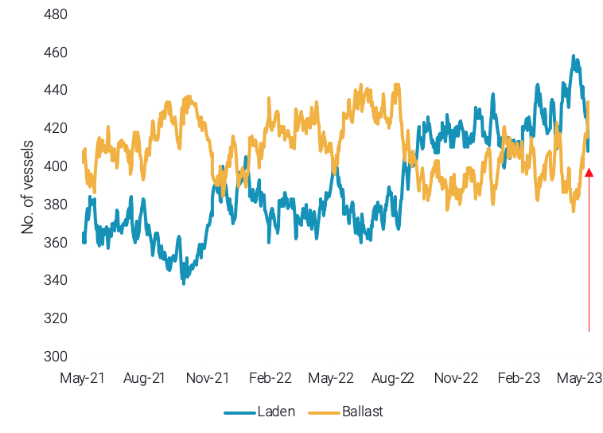
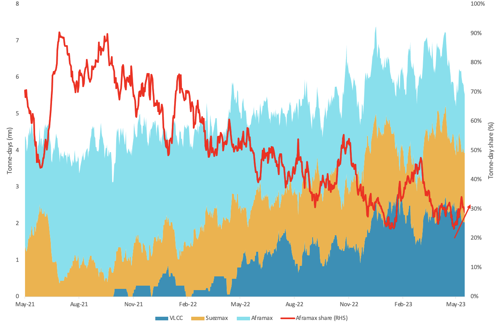

# Vortexa Freight Weekly

**Date:** May 18, 2023  
**Publisher:** Breakwave Advisors | **Category:** Market Insights  
**Original URL:** [https://www.breakwaveadvisors.com/insights/2023/5/18/3andlzzzbqrbf3xlxvs231z4kj8knb](https://www.breakwaveadvisors.com/insights/2023/5/18/3andlzzzbqrbf3xlxvs231z4kj8knb)  

---

*By*[*Ioannis Papadimitriou*](https://www.linkedin.com/search/results/all/?fetchDeterministicClustersOnly=true&heroEntityKey=urn%3Ali%3Afsd_profile%3AACoAAB3dQrYBbffaDWLWh_dRcHGHYBOwNhhatgs&keywords=ioannis%20papadimitriou&origin=RICH_QUERY_SUGGESTION&position=0&searchId=97ad9be2-e1ca-433d-9387-9339f78b324f&sid=my8)

### Analysis / East of Suez / Dirty

## Limited Availability Stabilised VLCC Rates, But Current Trade Demand Fears Questions Upside Potential

> **Figure 1: VLCC Utilisation by Voyage Status (Excl**  
> *VLCC utilisation by voyage status (excl. Iran, Venezuela and Russia)*  
> **Interactive Data & Source:** [Vortexa](https://www.vortexa.com//oil-gas-data-traders-analysts-data-scientists?gclid=Cj0KCQjw8_qRBhCXARIsAE2AtRZKOvMnbilZ_6_91d7huSFFy71pWLrnPwGwOHVzXsmsG-1a1mZnQw8aAt89EALw_wcB&hsa_acc=1782073842&hsa_ad=548425387665&hsa_cam=14746637662&hsa_grp=125038601902&hsa_kw=&hsa_mt=&hsa_net=adwords&hsa_src=g&hsa_tgt=dsa-1431852288425&hsa_ver=3&utm_campaign=%5BCD%5D%20-%20DSA%20-%20EMEA&utm_medium=cpc&utm_medium=ppc&utm_source=google&utm_source=adwords&utm_term=) | [Local Asset](file:///C:/Users/Dell/Github/Shipping/corpus/03-breakwave/insights/2023/assets/2023-05-18_3andlzzzbqrbf3xlxvs231z4kj8knb_img_unnamed-2023-05-18t122703222_bb21244529f9.png)

- After reaching 1-year lows during the start of last week, VLCC rates across the board managed a slight uptick during the final days of the week.
- This was the result of tighter availability in key crude exporting hubs such as the Middle East and the US Gulf. As VLCC rates appear to have bottomed out, the question remains as to whether a sustainable recovery is on the table.
- Record exports from Saudi Arabia, the US and Russia in the past two months have flooded the market. OPEC+ cuts, US exports at capacity while drawing stocks as well as the comeback of domestic consumption in Russia (amid weak refining margins) all point to a slowdown in trade demand, limiting upside for crude freight rates. Evidence of this lacklustre demand has been the recent shift in the laden-to-ballast ratio for VLCCs globally, as ballast utilisation surpasses laden utilisation.

### Analysis / West of Suez / Dirty

## Aframaxes Set to Regain Market Share on Td25

> **Figure 2: Tonne-Days on Us Gulf-to-Europe Crude Route per Vessel Class Vs**  
> *Tonne-days on US Gulf-to-Europe crude route per vessel class vs. Aframax tonne-day share (RHS)*  
> **Interactive Data & Source:** [Vortexa](https://www.vortexa.com//oil-gas-data-traders-analysts-data-scientists?gclid=Cj0KCQjw8_qRBhCXARIsAE2AtRZKOvMnbilZ_6_91d7huSFFy71pWLrnPwGwOHVzXsmsG-1a1mZnQw8aAt89EALw_wcB&hsa_acc=1782073842&hsa_ad=548425387665&hsa_cam=14746637662&hsa_grp=125038601902&hsa_kw=&hsa_mt=&hsa_net=adwords&hsa_src=g&hsa_tgt=dsa-1431852288425&hsa_ver=3&utm_campaign=%5BCD%5D%20-%20DSA%20-%20EMEA&utm_medium=cpc&utm_medium=ppc&utm_source=google&utm_source=adwords&utm_term=) | [Local Asset](file:///C:/Users/Dell/Github/Shipping/corpus/03-breakwave/insights/2023/assets/2023-05-18_3andlzzzbqrbf3xlxvs231z4kj8knb_img_unnamed-2023-05-18t122904546_9270f449492f.png)

- The US Gulf-to-Europe crude route has seen increased market share by VLCCs in the past 18 months. Simultaneously, this has seen a decrease in Aframax tonne-days on this route, resulting in a reduced market share for the smaller tanker class.
- However, in May the Aframax freight rate on the US Gulf-to-Europe (TD25) route has more than doubled. This development is likely demand driven, as our data shows a flurry of cargo movements expected in the next week, likely an effect of the inclusion of WTI in Brent pricing (Argus). Additionally, data from our fleet distribution screen shows decreasing numbers of ballast VLCCs and Suezmaxes heading to PADD 3, as well as a surge in Aframax ballasters signalling the region.
- At the same time, more than half of our expected flows data consists of Aframax movements, this could see Aframaxes regain market share on TD25 in the weeks ahead.

Data Source:[Vortexa](https://www.vortexa.com//oil-gas-data-traders-analysts-data-scientists?gclid=Cj0KCQjw8_qRBhCXARIsAE2AtRZKOvMnbilZ_6_91d7huSFFy71pWLrnPwGwOHVzXsmsG-1a1mZnQw8aAt89EALw_wcB&hsa_acc=1782073842&hsa_ad=548425387665&hsa_cam=14746637662&hsa_grp=125038601902&hsa_kw=&hsa_mt=&hsa_net=adwords&hsa_src=g&hsa_tgt=dsa-1431852288425&hsa_ver=3&utm_campaign=%5BCD%5D%20-%20DSA%20-%20EMEA&utm_medium=cpc&utm_medium=ppc&utm_source=google&utm_source=adwords&utm_term=)
