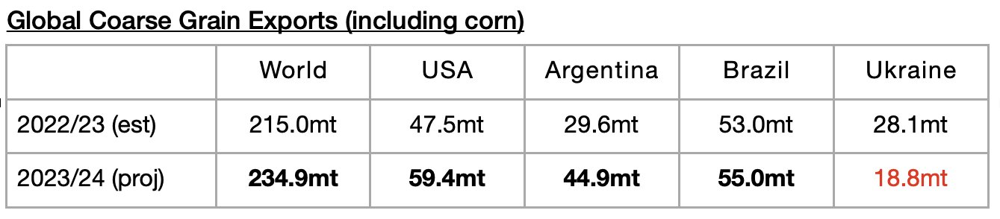

# More Grain Exports Expected Next Season

**Date:** May 19, 2023  
**Publisher:** Breakwave Advisors | **Category:** Market Insights  
**Original URL:** [https://www.breakwaveadvisors.com/insights/2023/5/19/more-grain-exports-expected-next-season](https://www.breakwaveadvisors.com/insights/2023/5/19/more-grain-exports-expected-next-season)  

---

*By*[*Jeffrey Landsberg*](https://www.linkedin.com/in/jeffrey-landsberg-70ab957/)

The United States Department of Agriculture (USDA) recently released its initial global grain trade forecast for the upcoming 2023/24 season. Global grain exports are expected to total 500.4 million tons, which is 14.8 million tons (3%) more than is expected for the current 2022/23 season. As we have been stressing in our Weekly Dry Bulk Reports, however, the current 2022/23 season is expected to see exports total only 485.8 million tons, which would mark a year-on-year decline of 27.5 million tons (-5%).

This season’s contraction continues to put pressure on the dry bulk market. Collectively, global coarse grain, wheat, soybean, and soybean exports (soybeans and soymeal are not classified as grain) are expected to total 687 million tons in the 2023/24 season. This is 22.4 million tons (3%) more than is expected for the current 2022/23 season. The current 2022/23 season, though, is expected to see coarse grain, wheat, soybean, and soybean exports total only 664.6 million tons. This would mark a year-on-year decline of 14.6 million tons (-2%).

For next year, expectations are most bullish for coarse grain exports. The USDA is forecasting that global coarse grain exports in the upcoming 2023/24 season will total 234.9 million tons. This would mark a year-on-year increase of 19.9 million tons (9%). Much better harvests are expected in the United States and Argentina. The war in Ukraine, though, is expected to continue to have a very significant impact on Ukraine’s coarse grain production and exports.

> **Figure 1: Chart**  
> [Local Asset](file:///C:/Users/Dell/Github/Shipping/corpus/03-breakwave/insights/2023/assets/2023-05-19_more-grain-exports-expected-next-season_img_chart_4b9e4c745d2f.jpg)
