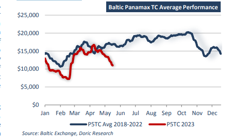
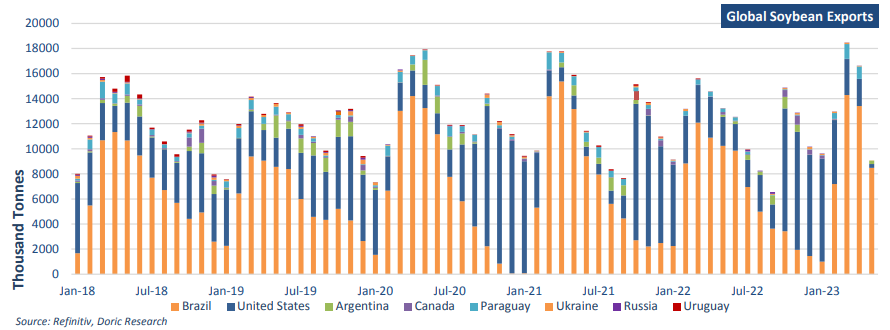

# Doric Weekly Market Insight

**Date:** May 22, 2023  
**Publisher:** Breakwave Advisors | **Category:** Market Insights  
**Original URL:** [https://www.breakwaveadvisors.com/insights/2023/5/22/doric-weekly-market-insight](https://www.breakwaveadvisors.com/insights/2023/5/22/doric-weekly-market-insight)  

---

## “In Spite of the Cheerful Tone in the Soybean Market, the Main Carriers of Grains in These Staple Seaborn Runs Have Diverted Lately From Their Usual Flight Plan, Ending the Week at P682 (Ecsa Rv) Levels of Just $12,827 Daily. As a Flotilla of Ballasters Can Attest, One Swallow Does Not a Summer Make Neither Can a Single Load Pocket Enrich the Freight Market Overall.”

***By***[***Michalis Voutsinas***](https://www.linkedin.com/in/michalis-voutsinas-587544163/)

Following last week's softish tone, the twentieth trading week started on the wrong foot. The leading Capesize index signalled the retreat on Monday morning and since then all main indices were in the red. Reporting double-digit losses week-on-week, the Baltic Capesize and Panamax 82 TCA indices concluded today at $17,459 and $11,001 daily respectively. Whilst Capes chopped some of their recent gains this week, Kamsarmaxes returned violently back down to late February levels. On the geared segment front, the Baltic Supramax index finished the week lower at $11,846 daily, last seen in 27 February. In a similar vein, the more stable Handies balanced at $11,018 daily on this Friday's closing, at two-month minima.

On the macro front, the world’s second largest economy sustained the good momentum of late, according to National Bureau of Statistics of China. As the economic and social activities have fully resumed, the year-on-year growth for most production and demand indicators improved, services and consumption witnessed fast recovery, and employment and prices were generally stable. In April, the Index of Services Production increased by 13.5 percent year-onyear, 4.3 percentage points faster than that of the previous month. Specifically, that of accommodation and catering, wholesales and retails, transportation, storage and post, information transmission, software and information technology services grew by 48.7 percent, 18.8 percent, 17.6 percent and 13.2 percent year-on-year respectively, materially higher than that of the previous month. In sync, the total retail sales of consumer goods reached 3,491.0 billion yuan, up by 18.4 percent year-on-year. Grouped by types of consumption, the retail sales of goods were 3,115.9 billion yuan, up by 15.9 percent; the income of catering was 375.1 billion yuan, up by 43.8 percent. In the first four months, the total retail sales of consumer goods reached 14,983.3 billion yuan, up by 8.5 percent year-on-year, 2.7 percentage points faster than that of the first three months.

In sharp contrast, the investment in real estate development during the first four months of the current year came at 3,551.4 billion yuan, considerably lower by 6.2 percent year-on-year. Among them, the investment in residential buildings lay at 2,707.2 billion yuan, down 4.9 percent. From January to April, the floor space under construction was 7,712.71 million square meters, a year-on-year decrease of 5.6 percent. The floor space of residential buildings under construction, in particular, was 5,429.68 million square meters, down 5.9 percent. In tandem, the floor space of buildings newly started was just 312.2 million square meters, down 21.2 percent.

China’s retail sales of consumer goods and service sectors remain bright spots as factory and real estate data fail to add further steam. Against this backdrop, China soybean imports continued growing amid economic recovery, recent price declines and possible shortage of soybean supplies. Refinitiv trade flows tracked 8.8 million tonnes of soybean imports in China this April, a five-year high for the month. Moreover, 10.2 and 10.3 million tonnes of soybeans are heading for China and will arrive in Chinese ports in May and June, respectively. Accumulated soybean imports in the first half of the year are expected to reach 49.3 million tonnes, which is an all-time high and well above last year's respective period. Brazil is the leading supplier of China soybean imports. A total of 7.1 million tonnes of Brazilian soybeans arrived in China in April. Refinitiv trade flows indicate that soybean imports from Brazil will further grow to 8.6 and 9.7 million tonnes for May and June, respectively.

> **Figure 1: 1 (8)**  
> **Interactive Data & Source:** [Doric](https://www.doric.gr/) | [Local Asset](file:///C:/Users/Dell/Github/Shipping/corpus/03-breakwave/insights/2023/assets/2023-05-22_doric-weekly-market-insight_img_128829_96707c38cbcf.png)

In spite of the cheerful tone in the soybean market, the main carriers of grains in these staple seaborn runs have diverted lately from their usual flight plan, ending the week at P6_82 (ECSA RV) levels of just $12,827 daily. As a flotilla of ballasters can attest, one swallow does not a summer make neither can a single load pocket enrich the freight market overall.

> **Figure 2: 1 (9)**  
> **Interactive Data & Source:** [Doric](https://www.doric.gr/) | [Local Asset](file:///C:/Users/Dell/Github/Shipping/corpus/03-breakwave/insights/2023/assets/2023-05-22_doric-weekly-market-insight_img_128929_e47a8fd2e186.png)

Data source:[Doric](https://www.doric.gr/)
