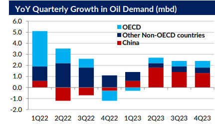

# Gibson's Tanker Market Report

**Date:** May 24, 2023  
**Publisher:** Breakwave Advisors | **Category:** Market Insights  
**Original URL:** [https://www.breakwaveadvisors.com/insights/2023/5/22/gibsons-tanker-market-report](https://www.breakwaveadvisors.com/insights/2023/5/22/gibsons-tanker-market-report)  

---

## Economic Headwinds

In early April, the OPEC+ coalition made a surprise decision to implement fresh production cuts, with concerns over the global economy and banking crisis being cited as one of the reasons behind the cut. Oil prices rallied as a result but in more recent weeks these gains have been erased. On the global economic front, there indeed have been some troubling indications, most notably in OECD countries. Europe’s GDP growth remained more or less flat in Q1 2023, up by just 0.1% compared to the previous quarter. The region’s manufacturing PMI, a key indicator of industrial activity, was assessed at 45.8 in April, showing the sharpest contraction since May 2020. Meanwhile, forward expectations for Europe’s industrial powerhouse Germany continue to wane. The ZEW institute’s indicator of economic sentiment declined to minus 10.7 in May, its first sub-zero reading this year. The weakness in economic indicators is filtering through oil consumption, with OECD Europe’s oil demand in 1Q 2023 down by 200 kbd, of which Germany accounted for just over half of the overall decline, according to the IEA.

In the US, the economy is still growing, albeit at a slower pace. US GDP expanded by 1.1% year-on-year in Q1 2023, down from 2.6% in Q4 2022. Total oil demand is also down in Q1 2023, by 250 kbd yearon-year, although some rebound in weekly consumption data was seen in April. The banking crisis, as evidenced by the recent collapse of First Republic Bank and the volatility in other US regional banking shares, is also far from over.

With economic growth in advanced economies clearly decelerating and industrial activity slowing, concerns are that high interest rates and ongoing banking turbulence will only lead to additional credit tightening and apply further breaks on consumer spending. The recent slump in oil prices is merely the evidence that concerns over global economic health (and perhaps the uncertainty related to the latest US debt-ceiling stand-off) prevail over OPEC+ production cuts.

> **Figure 1: 1 (10)**  
> **Interactive Data & Source:** [Gibsons Co](https://www.gibsons.co.uk/market-reports) | [Local Asset](file:///C:/Users/Dell/Github/Shipping/corpus/03-breakwave/insights/2023/assets/2023-05-24_gibsons-tanker-market-report_img_1281029_1db938ec056e.png)

Yet, the IEA stresses that the current market sentiment and softer oil prices stand in stark contrast to the expected tightening in global oil demand/supply balances. Whilst acknowledging the economic turbulence, the agency still revised up its outlook for global oil demand this year by 200 kbd to 2.2 mbd, primarily on the back of expectations of robust demand growth in China, where the surge in personal mobility saw Chinese oil demand reach record levels in March. In its latest monthly oil report, the IEA upped its expectations for China’s oil demand growth this year, with robust increases anticipated in gasoline demand due to domestic travel, naphtha demand amid ongoing steam-cracker capacity additions and jet/kerosine demand on the back on domestic and international air travel. Demand for gasoil, however, is expected to see only marginal growth year-on year as it is primarily driven by the industrial output, where there are early signs of trouble. The country’s industry activity is slowing, with the April’s Caixin China General Manufacturing PMI down to 49.5 in April from 50 in March (any reading below 50 shows a contraction in activity).

The IEA warns that the combination of robust global oil demand growth and OPEC+ production constraint could see demand exceeding supply by nearly 2 mbd in the 2nd half of year. Whether or not this materialises is yet to be seen, as there are sensitivities both on demand and supply side. Economic turbulence and weak industrial/trade activity could accelerate, hurting demand; whilst robust Russian crude and products oil exports at the time when the Middle East OPEC members, led by Saudi Arabia, bear the brunt of actual output cuts, could potentially lead to some friction between OPEC+ members.

Data source:[Gibson Shipbrokers](https://www.gibsons.co.uk/market-reports)
