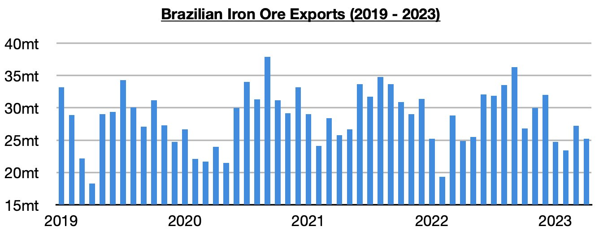

# Ongoing Growth in Brazilian Iron Ore Exports

**Date:** May 24, 2023  
**Publisher:** Breakwave Advisors | **Category:** Market Insights  
**Original URL:** [https://www.breakwaveadvisors.com/insights/2023/5/24/ongoing-growth-in-brazilian-iron-ore-exports](https://www.breakwaveadvisors.com/insights/2023/5/24/ongoing-growth-in-brazilian-iron-ore-exports)  

---

*By*[*Jeffrey Landsberg*](https://www.linkedin.com/in/jeffrey-landsberg-70ab957/)

As we highlighted in a recent Weekly Dry Bulk Report earlier this month, Brazil exported a total of 25.2 million tons of iron ore in April. This has marked a month-on-month decline of 2 million tons (-7%) but a year-on-year increase of 300,000 tons (1%).

> **Figure 1: Chart (1)**  
> [Local Asset](file:///C:/Users/Dell/Github/Shipping/corpus/03-breakwave/insights/2023/assets/2023-05-24_ongoing-growth-in-brazilian-iron-ore-exports_img_chart28129_0b638dcbc0d7.jpg)

The first four months of this year have seen Brazil’s iron ore exports increase year-on-year by 2.3 million tons (2%). In comparison, during all last year Brazil's iron ore exports contracted year-on-year by 12.9 million tons (-4%). We have stressed that the dry bulk market (in particular, the capesize segment) has been needing growth in Brazilian iron ore exports this year, and growth has in fact returned. Ongoing growth would help allow capesize rates to strengthen.
