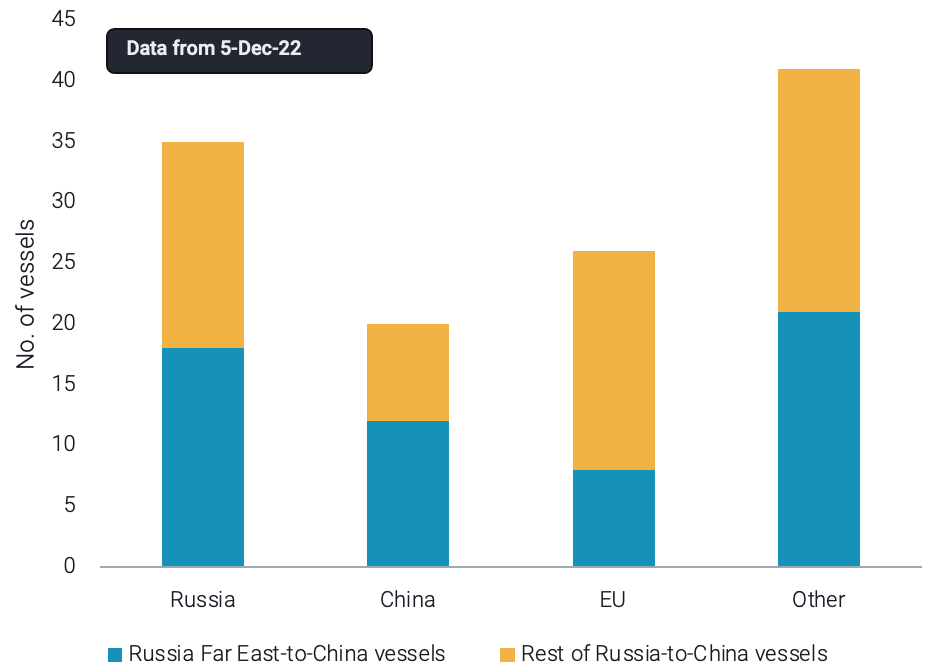
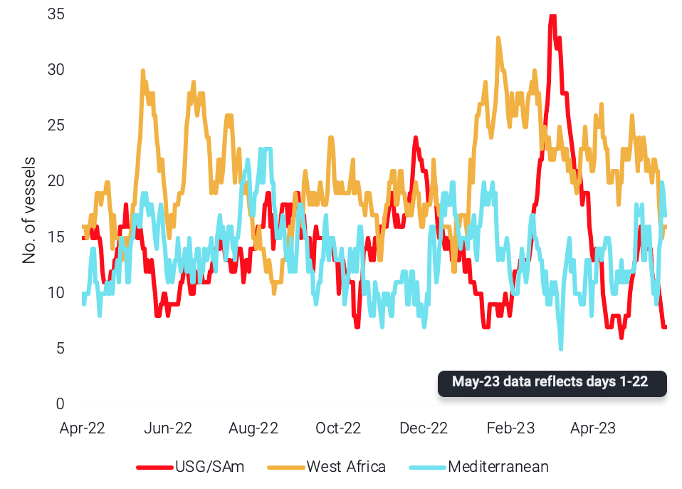

# Vortexa Freight Weekly

**Date:** May 25, 2023  
**Publisher:** Breakwave Advisors | **Category:** Market Insights  
**Original URL:** [https://www.breakwaveadvisors.com/insights/2023/5/25/vortexa-freight-weekly](https://www.breakwaveadvisors.com/insights/2023/5/25/vortexa-freight-weekly)  

---

*By*[*Dylan Simpson*](https://www.linkedin.com/search/results/all/?fetchDeterministicClustersOnly=false&heroEntityKey=urn%3Ali%3Afsd_profile%3AACoAACDtdn0BzHNR8syu_G8WxL-JXL-9PRT5AP4&keywords=dylan%20simpson&origin=RICH_QUERY_SUGGESTION&position=0&searchId=55ecee69-a408-47b2-8686-68f172e21af1&sid=mVl)

### Analysis / East of Suez / Dirty

## Chinese Inspection Has Not Triggered Congestion, But Intense Scrutiny Could Impact Aframax and Suezmax Opaque Fleet Supply

> **Figure 1: Vessels 10+ Years Old Carrying Russian Crude to China By**  
> *Vessels 10+ years old carrying Russian crude to China by effective controller nationality and origin*  
> **Interactive Data & Source:** [Vortexa](https://www.vortexa.com//oil-gas-data-traders-analysts-data-scientists?gclid=Cj0KCQjw8_qRBhCXARIsAE2AtRZKOvMnbilZ_6_91d7huSFFy71pWLrnPwGwOHVzXsmsG-1a1mZnQw8aAt89EALw_wcB&hsa_acc=1782073842&hsa_ad=548425387665&hsa_cam=14746637662&hsa_grp=125038601902&hsa_kw=&hsa_mt=&hsa_net=adwords&hsa_src=g&hsa_tgt=dsa-1431852288425&hsa_ver=3&utm_campaign=%5BCD%5D%20-%20DSA%20-%20EMEA&utm_medium=cpc&utm_medium=ppc&utm_source=google&utm_source=adwords&utm_term=) | [Local Asset](file:///C:/Users/Dell/Github/Shipping/corpus/03-breakwave/insights/2023/assets/2023-05-25_vortexa-freight-weekly_img_unnamed-2023-05-25t134723117_1aff13269cec.png)

- There have been reports of Chinese ports raising their scrutiny regarding port inspection when it comes to older tankers. The latest port to implement tighter measures is the port of Qingdao, focusing on 10+ years old foreign tankers that have changed hands in the past 3 years.
- According to our congestion data, there has not been any significant impact so far on Chinese ports for laden crude tankers. Looking at our data, an increasing number of 10+ years old Aframaxes and Suezmaxes are discharging in China (post-Russian invasion), alluding to the fact that these are predominantly carrying Russian crude.
- 41 of these vessels (not operated by Chinese, European Union or Russian entities) are likely candidates for port inspections as the majority of them belong to newly formed entities who acquired the tankers post invasion. If these vessels are penalised during inspection, Aframax and Suezmax opaque fleet supply could be impacted, with newly-formed operators possibly set to look for younger vessels. This could eventually tighten mainstream supply even further.

### Analysis / West of Suez / Dirty

## Suezmax Tonne-Miles Expected to Bounce Back in May, However Early Signals Indicate Operation in Shorter-Haul Routes for June

> **Figure 2: Ballast Distribution for Suezmaxes Discharging in Europe By**  
> *Ballast distribution for Suezmaxes discharging in Europe by selected regions (no. of vessels)*  
> **Interactive Data & Source:** [Vortexa](https://www.vortexa.com//oil-gas-data-traders-analysts-data-scientists?gclid=Cj0KCQjw8_qRBhCXARIsAE2AtRZKOvMnbilZ_6_91d7huSFFy71pWLrnPwGwOHVzXsmsG-1a1mZnQw8aAt89EALw_wcB&hsa_acc=1782073842&hsa_ad=548425387665&hsa_cam=14746637662&hsa_grp=125038601902&hsa_kw=&hsa_mt=&hsa_net=adwords&hsa_src=g&hsa_tgt=dsa-1431852288425&hsa_ver=3&utm_campaign=%5BCD%5D%20-%20DSA%20-%20EMEA&utm_medium=cpc&utm_medium=ppc&utm_source=google&utm_source=adwords&utm_term=) | [Local Asset](file:///C:/Users/Dell/Github/Shipping/corpus/03-breakwave/insights/2023/assets/2023-05-25_vortexa-freight-weekly_img_unnamed-2023-05-25t135005294_a00bdb6c2820.png)

- Preliminary figures for global Suezmax tonne-miles stand at a 20% decline m-o-m but with one week remaining for a complete figure, it is likely that May levels will finish stronger than April.
- This is supported by the strong utilisation of Suezmaxes out of key markets such as the US Gulf and West Africa while the employment of this vessel class in Russia remains firm at high levels.
- Looking forward to June however, tonne-miles could likely drop once again. Suezmaxes discharging in Europe are decreasingly signalling further distances such as West Africa and the US for loading. This is likely pointing to the fact that the current strong exports out of these two regions are likely not sustainable which will drive the involvement of this vessel class in shorter haul routes.

Data Source:[Vortexa](https://www.vortexa.com//oil-gas-data-traders-analysts-data-scientists?gclid=Cj0KCQjw8_qRBhCXARIsAE2AtRZKOvMnbilZ_6_91d7huSFFy71pWLrnPwGwOHVzXsmsG-1a1mZnQw8aAt89EALw_wcB&hsa_acc=1782073842&hsa_ad=548425387665&hsa_cam=14746637662&hsa_grp=125038601902&hsa_kw=&hsa_mt=&hsa_net=adwords&hsa_src=g&hsa_tgt=dsa-1431852288425&hsa_ver=3&utm_campaign=%5BCD%5D%20-%20DSA%20-%20EMEA&utm_medium=cpc&utm_medium=ppc&utm_source=google&utm_source=adwords&utm_term=)
