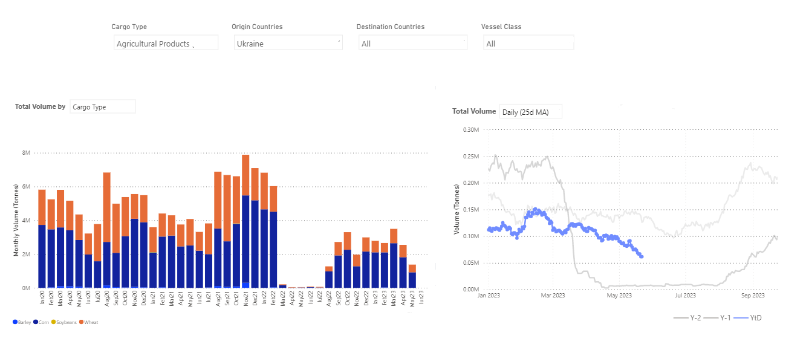
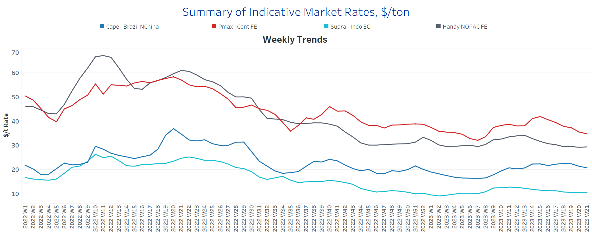
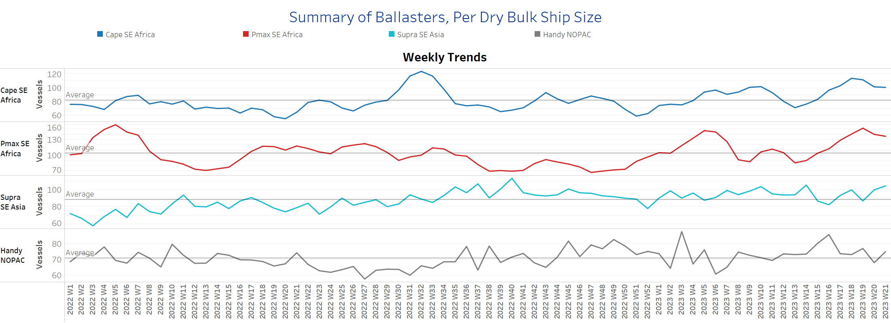
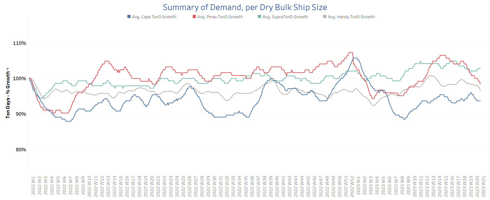
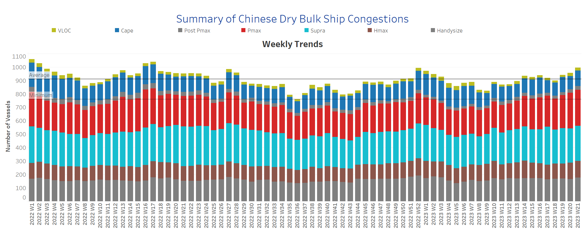

# Signal Dry Bulk Weekly Report

**Date:** May 26, 2023  
**Publisher:** Breakwave Advisors | **Category:** Market Insights  
**Original URL:** [https://www.breakwaveadvisors.com/insights/2023/5/26/signal-dry-bulk-weekly-report](https://www.breakwaveadvisors.com/insights/2023/5/26/signal-dry-bulk-weekly-report)  

---

## Chart of the Week Dry Bulk: Ukraine Grains to All Destinations

Despite signs of recovery in the 1Q, the volume of flows is still lower than last year

> **Figure 1: Data Source: The Signal Ocean Platform**  
> *Data Source: The Signal Ocean Platform, Dry Bulk Flowshttps://go.signalocean.com/e/983831/dry-dynamic-drybulkflows/2nzhdm/321955743?h=olvQJblfjdhCN66ma6KDF7nxt2xFcQdU0D_YySc2VAk*  
> **Interactive Data & Source:** [Signal Ocean Platform](https://go.signalocean.com/e/983831/amic-drybulkflows-downloadable/2nzhdq/321955743?h=olvQJblfjdhCN66ma6KDF7nxt2xFcQdU0D_YySc2VAk) | [Local Asset](file:///C:/Users/Dell/Github/Shipping/corpus/03-breakwave/insights/2023/assets/2023-05-26_signal-dry-bulk-weekly-report_img_unnamed-2023-05-26t110124308_bb650ab8ff02.png)

In the closing days of May, the freight market experienced a notable slowdown in momentum, primarily observed in the Capesize segment. Conversely, the smaller vessel size segments have maintained a relatively stable outlook. However, uncertainty continues to prevail as the demand picture remains relatively weak. Growing concerns surround China's economic growth and its iron ore import needs, as there are indications of moderation in the iron ore spot price.

Turning to the grain segment, the market witnessed an extension of the Black Sea Grain Initiative, which is a positive development. Nevertheless, challenges pertaining to ship inspections at Black Sea ports remain a significant consideration. The volume of Ukraine grain exports to all destinations is still striving to establish a consistent growth pace. As depicted in the provided image, there were some signs of recovery in the first quarter regarding the volume of Ukrainian grain exports. However, this progress was later undermined by the recent weakness in May, with levels dropping even lower than those of the previous year. The upcoming month will shed light on whether there will be a turnaround following the extension deal.

For more information on this week's trends, see the analysis sections below:
Freight Market, Supply, Demand and Port Congestion

## Section 1/ Freight - Market Rates ($/T)

### Capesize - Softening | Panamax - Weaker | Supramax - Handysize - Steady

‘The Big Picture’ - Capesize and Panamax Bulkers and Smaller Ship Sizes

> **Figure 2: Market Chart 2**  
> **Interactive Data & Source:** [Signal Ocean Platform](https://www.thesignalgroup.com/signal-ocean-platform) | [Local Asset](file:///C:/Users/Dell/Github/Shipping/corpus/03-breakwave/insights/2023/assets/2023-05-26_signal-dry-bulk-weekly-report_img_unnamed-2023-05-26t110304822_9e1a8dc8dc61.png)

In the fourth week of May, the performance of freight rates across different vessel size categories presented a mixed outlook. The Panamax segment experienced relatively weaker performance compared to other categories, while a steady sentiment prevailed in the Supramax segment.

- Capesize vessel freight rates fell below $22/tonne, and there is the prospect of a downward correction toward the end of May.
- Panamax vessel freight rates from the Continent to the Far East fell below $35/tonne, nearly $7/tonne below from the week 15 peak.
- Supramax freight rates for the Indo-ECI route have consistently hovered around $10.5 per tonne, showing stability without any notable volatility. As we approach the final week of May, there are indications that this trend of stable rates will continue without significant fluctuations.
- Handysize freight rates for the NOPAC Far East route have held below $30/tonne for the past four weeks, with signs of a slight upward trend in the last few days of May.

## Section 2/ Supply - Ballasters (# Vessels)

### Capesize - Panamax - Supramax - Handysize Increasing

> **Figure 3: Supply Trend Lines for Key Load Areas**  
> **Interactive Data & Source:** [Signal Ocean Platform](https://www.thesignalgroup.com/signal-ocean-platform) | [Local Asset](file:///C:/Users/Dell/Github/Shipping/corpus/03-breakwave/insights/2023/assets/2023-05-26_signal-dry-bulk-weekly-report_img_unnamed-2023-05-26t110411723_1ff20eaa51ed.png)

The number of ballasters continues to show an upward trend across larger ship categories, indicating sustained growth. Furthermore, there are signs of an increase in ballasters among Supramax and Handysize ships.

- Capesize SE Africa: The ongoing count of vessels remains consistently above 100, exemplifying a notable surge of nearly 60% in comparison to the previous peak witnessed seven weeks ago.
- Panamax SE Africa: The vessel count held steady at around 140, registering a decrease of 10 vessels compared to the previous week, yet remaining significantly elevated by nearly 30 vessels above the annual average.
- Supramax SE Asia: The number of vessels increased to 105, 10 more than the previous week and almost 17 more than the average for the year.
- Handysize NOPAC: The number of vessels is now at 75, almost 7 more than the previous week and 14 more than the low in week 6.

.

> **Figure 4: Section 3/ Demand - TonDays Softening**  
> **Interactive Data & Source:** [Signal Ocean Platform](https://www.thesignalgroup.com/signal-ocean-platform) | [Local Asset](file:///C:/Users/Dell/Github/Shipping/corpus/03-breakwave/insights/2023/assets/2023-05-26_signal-dry-bulk-weekly-report_img_unnamed-2023-05-26t110557943_f2ff65f15a74.png)

The number of ballasters continues to show an upward trend across larger ship categories, indicating a sustained growth. Furthermore, there are signs of an increase in ballasters among Supramax and Handysize ships.

- Capesize SE Africa:The ongoing count of vessels remains consistently above 100, exemplifying a notable surge of nearly 60% in comparison to the previous peak witnessed seven weeks ago.
- Panamax SE Africa: The vessel count held steady at around 140, registering a decrease of 10 vessels compared to the previous week, yet remaining significantly elevated by nearly 30 vessels above the annual average.
- Supramax SE Asia: The number of vessels increased to 105, 10 more than the previous week and almost 17 more than the average for the year.
- Handysize NOPAC: The number of vessels is now at 75, almost 7 more than the previous week and 14 more than the low in week 6.

## Section 4/ Port Congestion - No of Vessels Increasingdry Bulk Ships Congested at Chinese Ports

> **Figure 5: Market Chart 5**  
> **Interactive Data & Source:** [Signal Ocean Platform](https://www.thesignalgroup.com/signal-ocean-platform) | [Local Asset](file:///C:/Users/Dell/Github/Shipping/corpus/03-breakwave/insights/2023/assets/2023-05-26_signal-dry-bulk-weekly-report_img_unnamed-2023-05-26t110655546_cef0fea5aab2.png)

May witnessed a persistent increase in congestion for the third consecutive week, setting a new record high. Notably, the Capesize and Handysize segments experienced noticeable increments in congestion levels.

- Capesize: The number of vessels now stands at 117, up 10 from the previous week of May.
- Panamax: The ship count remained steady at 266, reflecting a comparable level to the previous week and marking the highest count since the start of the year.
- Supramax: The current ship count has reached 262, reflecting a rise of 7 ships compared to the previous week. However, it remains 7% lower than the peak recorded two weeks ago.
- Handysize: The count of congested ships has risen to 176, marking a growth of 10 ships compared to the previous week. Moreover, there has been a consistent upward trend since the end of week five, where the congestion level was around 133 ships.

Data Source:[Signal Ocean Platform](https://www.thesignalgroup.com/signal-ocean-platform)
