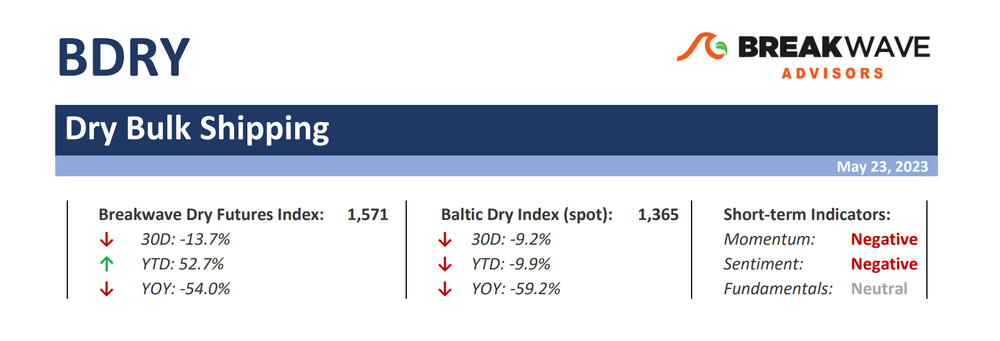
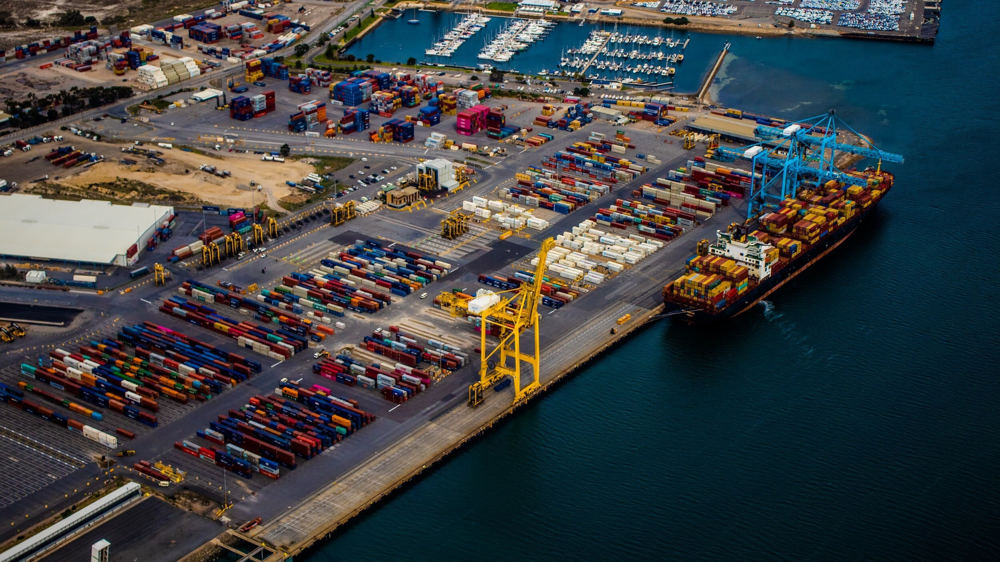

# Weekly Insights Review

**Date:** May 28, 2023  
**Publisher:** Breakwave Advisors | **Category:** Market Insights  
**Original URL:** [https://www.breakwaveadvisors.com/insights/2023/5/26/weekly-insights-review](https://www.breakwaveadvisors.com/insights/2023/5/26/weekly-insights-review)  

---

## Welcome to Our Weekly Insights Review

## Read Here Everything You Need to Know

> **Figure 1: Market Chart 1**  
> **Interactive Data & Source:** [Breakwave Advisors Market Insights](https://www.breakwaveadvisors.com/insights/2023/5/22/shipping-decarbonization-weekly-insights) | [Local Asset](file:///C:/Users/Dell/Github/Shipping/corpus/03-breakwave/insights/2023/assets/2023-05-28_weekly-insights-review_img_unnamed283329_6a6f0a2081bd.jpg)

## Shipping Decarbonization Weekly Insights

## Latest Trends on Fuel Transition, Shipyard Actions, Government, Ports, Financing and Industry Players

One of the world’s biggest emitters of greenhouse gases, India aims to cut emissions to net zero by 2070, and the shipping minister said three of its ports would initially have bunker facilities for green hydrogen and ammonia.
[Read More](https://www.breakwaveadvisors.com/insights/2023/5/22/shipping-decarbonization-weekly-insights)

> **Figure 2: Market Chart 2**  
> **Interactive Data & Source:** [Breakwave Advisors Market Insights](https://www.breakwaveadvisors.com/insights/2023/5/23/brs-dry-bulk-weekly-newsletter) | [Local Asset](file:///C:/Users/Dell/Github/Shipping/corpus/03-breakwave/insights/2023/assets/2023-05-28_weekly-insights-review_img_unnamed283529_198d84321b35.jpg)

## Brs Dry Bulk Weekly Newsletter

## Between the Promise of Tomorrow & the Reality of Today

In our earlier issue dated 13th April, we dissected several talking points that shaped India’s narrative as an alternative to China for decades to come.
[Read More](https://www.breakwaveadvisors.com/insights/2023/5/23/brs-dry-bulk-weekly-newsletter)

> **Figure 3: Market Chart 3**  
> **Interactive Data & Source:** [Breakwave Advisors Market Insights](https://www.breakwaveadvisors.com/insights/2023/5/23/mazars-comment-all-quiet-on-the-western-front-perhaps-too-quiet) | [Local Asset](file:///C:/Users/Dell/Github/Shipping/corpus/03-breakwave/insights/2023/assets/2023-05-28_weekly-insights-review_img_unnamed283629_7fcb40a3540d.jpg)

## Mazars Comment: All Quiet on the Western Front. Perhaps Too Quiet.

## Despite the Upward Movement in Stocks, Risks Remain Elevated.

Last week saw some positive momentum in markets. This was because of two reasons
[Read More](https://www.breakwaveadvisors.com/insights/2023/5/23/mazars-comment-all-quiet-on-the-western-front-perhaps-too-quiet)

## Breakwave Bi-Weekly Dry Bulk Report

**Freight futures contango evaporates as optimism turns into caution**– Not much has changed in the spot market during the past few weeks, yet Capesize futures took a dive and have now erased any premium that was present over the last few months.
[Read More](https://www.breakwaveadvisors.com/insights/2023/5/22/breakwave-bi-weekly-dry-bulk-report-may-23-2023)

> **Figure 4: Db+report+top (2)**  
> **Interactive Data & Source:** [Breakwave Advisors Market Insights](https://www.breakwaveadvisors.com/insights/2023/5/22/doric-weekly-market-insight) | [Local Asset](file:///C:/Users/Dell/Github/Shipping/corpus/03-breakwave/insights/2023/assets/2023-05-28_weekly-insights-review_img_db2breport2btop28229_be62f3bdf225.png)

## Doric Weekly Market Insight

## Following Last Week's Softish Tone, the Twentieth Trading Week Started on the Wrong Foot

In spite of the cheerful tone in the soybean market, the main carriers of grains in these staple seaborn runs have diverted lately from their usual flight plan, ending the week at P6_82 (ECSA RV) levels of just $12,827 daily. As a flotilla of ballasters can attest, one swallow does not a summer make neither can a single load pocket enrich the freight market overall.
[Read More](https://www.breakwaveadvisors.com/insights/2023/5/22/doric-weekly-market-insight)

> **Figure 5: Market Chart 5**  
> **Interactive Data & Source:** [Breakwave Advisors Market Insights](https://www.breakwaveadvisors.com/insights/2023/5/24/ongoing-growth-in-brazilian-iron-ore-exports) | [Local Asset](file:///C:/Users/Dell/Github/Shipping/corpus/03-breakwave/insights/2023/assets/2023-05-28_weekly-insights-review_img_unnamed283729_4d8352c9f6ae.jpg)

## Ongoing Growth in Brazilian Iron Ore Exports

> **Figure 6: As We Highlighted in a Recent Weekly Dry Bulk Report Earlier**  
> *As we highlighted in a recent Weekly Dry Bulk Report earlier this month, Brazil exported a total of 25.2 million tons of iron ore in April.Read More*  
> **Interactive Data & Source:** [Breakwave Advisors Market Insights](https://www.breakwaveadvisors.com/insights/2023/5/24/ongoing-growth-in-brazilian-iron-ore-exports) | [Local Asset](file:///C:/Users/Dell/Github/Shipping/corpus/03-breakwave/insights/2023/assets/2023-05-28_weekly-insights-review_img_unnamed283829_b6dc7d041f27.jpg)

## Growth Has in Fact Returned

## Vortexa Freight Weekly

> **Figure 7: Vortexa Freight Weekly**  
> **Interactive Data & Source:** [Breakwave Advisors Market Insights](https://www.breakwaveadvisors.com/insights/2023/5/25/vortexa-freight-weekly) | [Local Asset](file:///C:/Users/Dell/Github/Shipping/corpus/03-breakwave/insights/2023/assets/2023-05-28_weekly-insights-review_img_unnamed283929_9032d3baf77e.jpg)

## Suezmaxes Set for Short Hail Trade in June

Chinese inspection has not triggered congestion, but intense scrutiny could impact Aframax and Suezmax opaque fleet supply
[Read More](https://www.breakwaveadvisors.com/insights/2023/5/25/vortexa-freight-weekly)

## Shipfix-Global Market Update

## Macro/geopolitics, Commodity Markets, Freight and Bunker Markets

Yesterday, purchasing managers' indices were released in several of the world’s larger economies.
[Read More](https://www.breakwaveadvisors.com/insights/2023/5/25/shipfix-global-market-update)

> **Figure 8: Market Chart 8**  
> **Interactive Data & Source:** [Breakwave Advisors Market Insights](https://www.breakwaveadvisors.com/insights/2023/5/25/asias-refining-margins-rebound-but-how-sustainable-is-this-emerging-recovery) | [Local Asset](file:///C:/Users/Dell/Github/Shipping/corpus/03-breakwave/insights/2023/assets/2023-05-28_weekly-insights-review_img_unnamed284029_e965c607271e.jpg)

## Asia’s Refining Margins Rebound But How Sustainable Is This Emerging Recovery?

## Early Signs of Recovery

Asia’s refining margins are firming somewhat but competition from new Middle East and African refineries could limit any strength.
[Read More](https://www.breakwaveadvisors.com/insights/2023/5/25/asias-refining-margins-rebound-but-how-sustainable-is-this-emerging-recovery)

> **Figure 9: Market Chart 9**  
> [Local Asset](file:///C:/Users/Dell/Github/Shipping/corpus/03-breakwave/insights/2023/assets/2023-05-28_weekly-insights-review_img_unnamed284129_a368804459c1.jpg)

## Signal Dry Bulk Weekly Report

## Snapshot of Spot Freight Rates, Supply-Demand Trends, Port Congestions

In the closing days of May, the freight market experienced a notable slowdown in momentum, primarily observed in the Capesize segment. Conversely, the smaller vessel size segments have maintained a relatively stable outlook.
Read More

> **Figure 10: Market Chart 10**  
> [Local Asset](file:///C:/Users/Dell/Github/Shipping/corpus/03-breakwave/insights/2023/assets/2023-05-28_weekly-insights-review_img_unnamed284229_9062e652d8ac.jpg)
