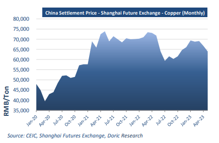
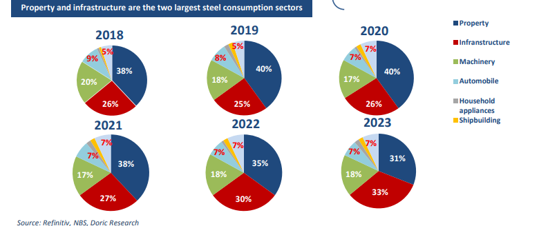

# Doric Weekly Market Insight

**Date:** May 29, 2023  
**Publisher:** Breakwave Advisors | **Category:** Market Insights  
**Original URL:** [https://www.breakwaveadvisors.com/insights/2023/5/29/doric-weekly-market-insight](https://www.breakwaveadvisors.com/insights/2023/5/29/doric-weekly-market-insight)  

---

## “While Global Stock Markets Continue to Anticipate a "Soft Landing" and Remain at Their Highest Levels, the Price of Copper Is Following Closely Baltic Indices on Their Downward Trend”

*By*[*Michalis Voutsinas*](https://www.linkedin.com/in/michalis-voutsinas-587544163/)

With Baltic Capesize indices in a freefalling mode, the gauge of activity in the dry bulk sector didn't have any other choice but to report losses during the twenty-first week of the year. After steaming for eleven trading days north of the 3000-point-mark and touching five-month highs, Baltic Dry Index trended downwards to 2681 points on this Friday's closing. Whilst Baltic indices were losing their recent highs, market uncertainty was on a rise. The absence of the good old seasonal second- quarter boost didn't support market on its attempt to touch higher maxima. Spot market was not the only one in a reconsideration mood lately though. Investors are increasingly worried about the possibility of recession in the US." That was the opening paragraph of our Weekly Insight this week a year ago.

Twelve months later, much on the macroeconomic front has changed. In the US, investors were focused on government debt ceiling talks between President Joe Biden and House Speaker Kevin McCarthy rather than the possibility of a recession. The latest update from this front was that the White House and House Republicans hurried to finalise a deal on government spending that would avert an unprecedented default on US debt and remove, at the same time, a huge cloud of uncertainty hanging over the country’s economy. On the other hand, it was Europe’s largest economy that slid into a mild recession this week, according to downwardly revised official figures. After a 0.5 percent contraction in the final quarter of last year, German gross domestic product shrank in the first quarter of this year as well, meeting the definition of a technical recession.

In the spot arena, last year’s mid-May harsh downward correction revisited us once again, with Baltic indices being incapable to resist the gravitational forces. In particular, the leading Capesize index signalled the retreat on Monday morning and since then all main indices were in the red. Reporting double-digit weekly losses, the Baltic Capesize index concluded today at two-month lows of $13,956 daily. In sync, Kamsarmaxes returned violently back down to late February levels, balancing today at $10,072 daily, or down by 64.4% year-on-year. In reference to the geared segments, the Baltic Supramax index finished the week lower at $10,403 daily, last seen in the February 23. In a similar vein, the more stable Handies lay at $10,585 daily on this Friday's closing, at two-and-a-half-month minima.

While global stock markets continue to anticipate a "soft landing" and remain at their highest levels, the price of copper is following closely Baltic indices on their downward trend. The price of the pinkishorange metal has fallen by more than 15 percent since its high point at the beginning of 2023, after havin g rebounded during the last

> **Figure 1: 1 (3)**  
> **Interactive Data & Source:** [Doric](https://www.doric.gr/) | [Local Asset](file:///C:/Users/Dell/Github/Shipping/corpus/03-breakwave/insights/2023/assets/2023-05-29_doric-weekly-market-insight_img_128329_f8f83b5da855.png)

quarter of last year against the backdrop of the reopening of the Chinese economy. Known as “Dr. Copper” for its ability to gauge the health of the global market, the metal is widely used in buildings, infrastructure and household appliances. The steep fall in spot price reflects a rapid rise in stockpiles of the metal outside China, as US and European industrial activity begins to slow after a year of monetary tightening. Additionally, growing concerns that China’s industrial rebound was not materialising had also a negative bearing on the commodity price. On the same wavelength, steel rebar prices in China hit their lowest in three years this week, underscoring flagging growth in the world's second-largest economy, particularly in its weak property sector. The spot price of HRB400 20mm steel rebar - used to reinforce concrete for buildings and infrastructure - fell to 3,510 yuan ($507.80) per tonne in Shanghai, data from consultancy Mysteel showed. That's the lowest reading since April 2020, when the start of the Covid-19 pandemic had curbed most industrial activity, according to Refinitiv. Iron ore futures reported weekly losses as well despite their rebound on Friday, pressured by a bleak demand outlook in top steel producer China. The typical summer slowdown in construction in China, beginning in June, is expected to curb demand for steel, putting a downward pressure on the prices of steel-making ingredients.

> **Figure 2: 1 (4)**  
> **Interactive Data & Source:** [Doric](https://www.doric.gr/) | [Local Asset](file:///C:/Users/Dell/Github/Shipping/corpus/03-breakwave/insights/2023/assets/2023-05-29_doric-weekly-market-insight_img_128429_935f94a6c162.png)

In a challenging period for the good old economy, metals markets along with Baltic indices may face a gruelling summer, as Chinese demand falters after the second quarter's peak season.

Data source:[Doric](https://www.doric.gr/)
