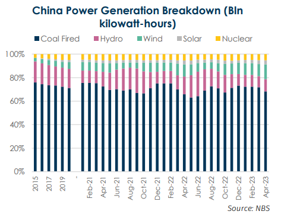
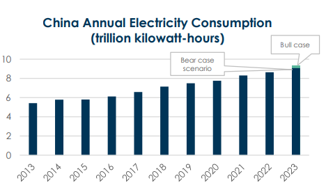
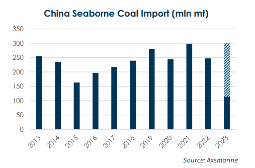

# BRS Dry Bulk Weekly Newsletter

**Date:** May 30, 2023  
**Publisher:** Breakwave Advisors | **Category:** Market Insights  
**Original URL:** [https://www.breakwaveadvisors.com/insights/2023/5/30/brs-dry-bulk-weekly-newsletter](https://www.breakwaveadvisors.com/insights/2023/5/30/brs-dry-bulk-weekly-newsletter)  

---

> **Figure 1: Brs Logo No Background (1)**  
> [Local Asset](file:///C:/Users/Dell/Github/Shipping/corpus/03-breakwave/insights/2023/assets/2023-05-30_brs-dry-bulk-weekly-newsletter_img_brslogo-nobackground28129_f39a57dd6dc6.png)

## China Power System Brings More Volatility to the Shipping Market

According to market sources, on 1 st-2 nd May 2023, the real-time electricity price in the spot trading center of the Shandong electricity market set a record: for the longest duration (21 hours), electricity prices data were negative, with a minimum price of -85 yuan/megawatt-hour. The negative clearing price indicated that power generation companies, not only do not charge fees from the end users but instead, are willing to pay them to get rid of their excess electricity. This happens when supply greatly exceeds demand, usually triggered by an excessive renewable energy generation (e.g., wind, solar power generation) or a sharp decrease in electricity demand.

There were two main reasons behind the occurrence of such counter-intuitive pricing.

Firstly, there was a decrease in industrial electricity consumption during the Labor Day holiday due to closures or shorter working hours from many factories, resulting in a significantly drop in electricity demand and lower load on the power grid.

In addition, with favorable weather during this period, there was a substantial increase in wind and solar power generation, leading to an overall oversupply of power generation compared to actual demand. Instead of halting power generation, which could incur higher restarting costs, some power generation companies preferred to offload the electricity by paying customers.

Secondly, the growth of renewable energy generation which are not dispatchable such as wind and solar power. Unlike conventional coal-fired power generation, renewable energy generation is subjected to fluctuations and intermittence; and the increase of installed capacity of renewable energy sources (see below chart) result in a higher likelihood of mismatch between peak periods of renewable power generation and user demand. This translates to more frequent negative spot trading prices.

> **Figure 2: 1 (2)**  
> [Local Asset](file:///C:/Users/Dell/Github/Shipping/corpus/03-breakwave/insights/2023/assets/2023-05-30_brs-dry-bulk-weekly-newsletter_img_128229_2c30326a4929.png)

Despite the seasonal patterns, the share of coal fire power generation has been decreasing year by year, gradually being replaced by renewable energy sources.

### Background of the Chinese Electricity Trading Market

To optimize the domestic electricity market, the government has set four goals to reform the industry which consist of promoting:

1. The national strategy of transmitting electricity from the western to the eastern regions, while maximizing the utilization of clean energy to cut emissions.

2. Supply-side structural reform and encouraging provinces rich in resources to expand and consolidate energy-related economic growth.

3. The market to play a greater role in optimizing resource allocation. Promoting industrial restructuring and the consumption of clean energy through market-based trading mechanisms and means.

4. The sustainable development of the power industry.

Accordingly, since June last year, various provinces and cities have been establishing and improving their regional electricity trading markets, generating generated many positive factors.

In 2022, the cumulated transaction volume of power trading centers in China reached 5.254,34 trillion kilowatt-hours, an increase of 39% compared to the previous year. whereas it accounted for 60.8% of the total residential electricity consumption, an increase of 15.4 percentage points compared to the previous year. Meanwhile, the total volume of long-term direct power transactions in the national electricity market represented 4.140,75 trillion kilowatt-hours of the total, 36.2% higher year-on-year.

According to government reports, by 2025, a unified national electricity market system will be preliminarily established, in a bid to enhance the efficiency of the electricity trading system and allocate the resources and green power across country’s regions by the means of free market transactions. Ideally, this will be beneficial to the development of market trading and price mechanisms for new energy and energy storage.

### Outlook for the Chinese Electricity Market

For 2023, consensus would be that the total annual electricity consumption of the entire country shall increase from last year's 8.6372 trillion kilowatt-hours to over 9 trillion kilowatt-hours. Although the market has remained optimistic about the increase in electricity consumption this year, there are still significant differences among different institutions, varying from 5% to 8%. For instance, State Grid and China Electricity Council, the two most authoritative domestic power institutions, forecast an annual growth rate of 6-8% and 5-6%, respectively.

> **Figure 3: 1 (3)**  
> [Local Asset](file:///C:/Users/Dell/Github/Shipping/corpus/03-breakwave/insights/2023/assets/2023-05-30_brs-dry-bulk-weekly-newsletter_img_128329_5814ffaf8f45.png)

Despite renewable energy development and the gradually decreasing share of coal-fired generation in the power industry, coal still represent 69.77% of China’s total power generation. Coalfired generation is expected to maintain a low-speed growth rate (0.5%-1%) but continue to play an important role in the power generation industry.

Coal fired generation has been benefiting from the decline in coal prices, growth in electricity demand, coal-electricity joint ventures reform and electricity market reforms, pushing expectations at an annual growth of coal fired generation above 3%.

According to the latest NBS (National Bureau of Statistics), for the first four months, China coal fired power generation stood at 1.9467 trillion kilowatt-hours, up 4% year on year; total power generation was recorded at 2.7309 trillion kilowatt-hours, up 3.4% year on year.

### What’s the Impact on Seaborne Thermal Coal and Shipping Markets?

Thanks to the marginal increment from the coal fire power generation, the 4% increment from the power plants turned out to be a volume increment of 88.8% year on year for the shipping market. In the first four months, China's coal imports reached 142.48 million tons, beyond the expectations of most people. If we extrapolate the import volume for the entire year based on the first-quarter figures, the import volume shall surpass 400 million tons. Just when everyone started to have a glimmer of hope on coal imports inbounds, the reality of negative electricity prices once again reminds us that past explosive growth is hard to replicate and sustain. Ultimately, the increasing supply of renewable energy has been affecting coal demand has significantly declined during the off-peak season, leading to price drops.

In the short term, due to slower-than-expected resumption of construction and real estate activities since the post-pandemic era, as well as the current cooler weather, demand for imported coal will remain relatively low. Even in the case of a brief rebound in coal demand, the solution is more likely to be de-stocking, instead of seeking import opportunities.

Looking at the entire year and supported by a projected 3% increase in annual coal-fired generation, coal demand shall remain high, shielding expectations that China's annual coal import volume is likely to reach a record-breaking 350 million tons, with around 300 million tons being imported via seaborne transport.

> **Figure 4: 1 (4)**  
> [Local Asset](file:///C:/Users/Dell/Github/Shipping/corpus/03-breakwave/insights/2023/assets/2023-05-30_brs-dry-bulk-weekly-newsletter_img_128429_2c418915054a.png)

Well supported from the power industry, China seaborne coal import is expected to reach 300 mln mt in 2023.

In the shipping industry, the potential fluctuation of the coal market would have some effect, notably more volatility is foreseen for the vessels dedicated to China-Indo coal runs. Based on power plants’ recent tenders, operators are bidding at lower freight level than current market levels, suggesting a poorer market in the next month to come.
