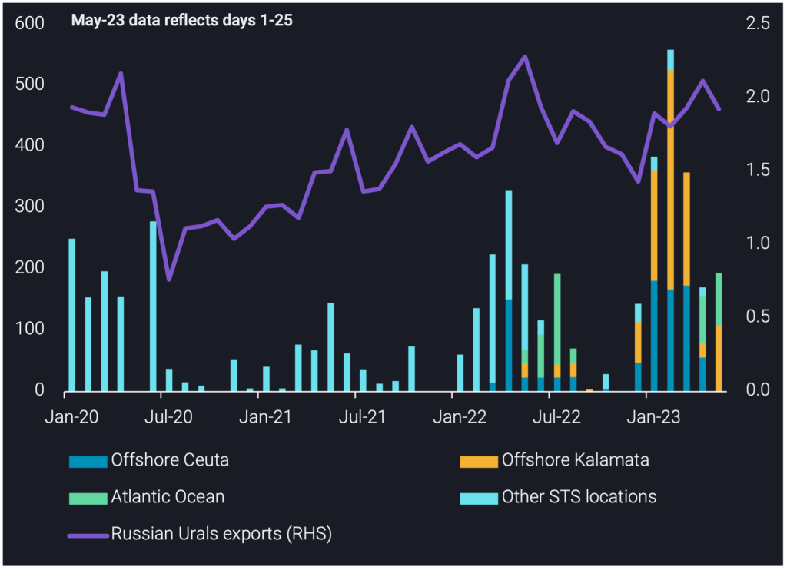
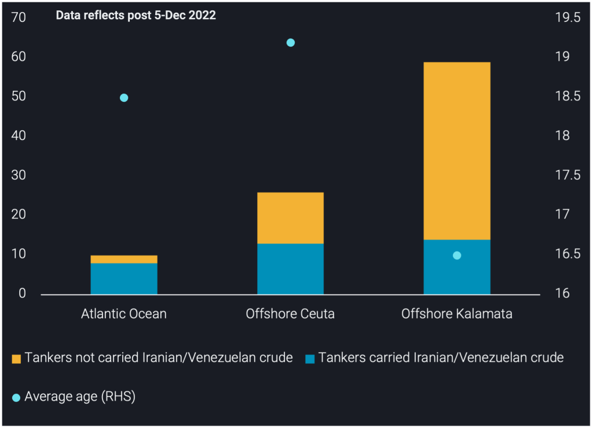

# New locations arise for Russian Urals STS activity

**Date:** May 31, 2023  
**Publisher:** Breakwave Advisors | **Category:** Market Insights  
**Original URL:** [https://www.breakwaveadvisors.com/insights/2023/5/31/new-locations-arise-for-russian-urals-sts-activity](https://www.breakwaveadvisors.com/insights/2023/5/31/new-locations-arise-for-russian-urals-sts-activity)  

---

## We Explore the Latest Trends and Shifts in Urals Sts Locations, Their Relevance and the Profile of Tankers Involved.

*By*[*Armen Azizian*](https://www.linkedin.com/search/results/all/?fetchDeterministicClustersOnly=true&heroEntityKey=urn%3Ali%3Afsd_profile%3AACoAABcR8rABbq0IzC6LkmXkEIICI-LUmZ3s9SU&keywords=armen%20azizian&origin=RICH_QUERY_SUGGESTION&position=0&searchId=f68b6f48-28f7-48b5-a237-7a725d4348ed&sid=E%3BX)

As we approach the six-month mark of the EU-ban on Russian crude imports, we are seeing an increase in ship-to-ship transfers (STS) of Russian Urals in previously obscure locations.

## New Locations: Offshore Canary Islands & Cape Verde

The Atlantic Ocean is emerging as a hub for STS transfers of Russian Urals, accounting for 90kbd in May (days 1-25), 44% of all transfers. In contrast, offshore Kalamata accounted for the remaining 56%, serving as a key STS hub for Urals since the EU-ban implementation.

The Atlantic Ocean includes three locations: Offshore Canary Islands (Spain), where we observed four transfers, Offshore Cape Verde (Portugal), where we observed one transfer and open sea areas in the North Atlantic, where we observed three transfers. Offshore Canary Islands and Cape Verde are new STS locations, whereas we already observed STS in the open sea areas in the North Atlantic in 2022.

Total STS activity of Russian Urals is 190kbd in May (days 1-25), nearly 400kbd below the peak in February. The need for intermediaries to disguise cargo flows is not as relevant as it may have been initially post-ban given the main buyers are firmly established, i.e. India and China. Furthermore, winter is over, so the need to keep ice-class tankers in proximity to the Baltics is no longer of essence.

## Atlantic Ocean Replaces Offshore Ceuta As Urals Sts Hub

After 5 Dec 2022, we observed[**offshore Ceuta**](https://www.vortexa.com/insights/crude/new-key-locations-emerging-for-russian-urals-sts-activity/)emerge as a key STS hub for Russian Urals, averaging 175kbd in Q1-2023. However, there have been no STS transfers offshore Ceuta in May for two key reasons. Firstly, Spain imposed[**tighter coastline restrictions**](https://splash247.com/spain-cracks-down-on-ship-to-ship-transfers/)on STS operations. Secondly, tides have subsided in the Atlantic as we approach summer months, so tankers that are ultimately sailing back around the Cape of Good Hope take less of a detour to load.

The Atlantic Ocean shares similarities with offshore Ceuta, making it a direct alternative:

- VLCCs load parcels of Urals from Aframaxes and then sail via the Cape of Good Hope towards China fully-laden, reflecting the same logistics as offshore Ceuta.
- Aframax feeders shuttle between the Baltics and the Atlantic Ocean, similar to their route between the Baltics and offshore Ceuta.
- The Atlantic Ocean accounts for 45% of Urals STS transfers since April 2023, a similar proportion to Ceuta in Q1-2023 (42%).

A key difference between the Atlantic and Ceuta STS transfers is that offshore UK (Falmouth) is being used as an anchorage point for feeders ballasting back from the Atlantic, before sailing for Baltics to load Urals – this was not common during the Ceuta STS trade.

> **Figure 1: Russian Urals Transferred Via Sts**  
> *Russian Urals transferred via STS, by STS transfer month and STS locations (kbd, LHS)vsRussian Urals exports (mbd, RHS)*  
> **Interactive Data & Source:** [Analytics Vortexa](https://analytics.vortexa.com/?dateRange=2020-01-01T00%3A00%3A00.000Z__2023-05-25T23%3A59%3A59.999Z&filtersEnabled=%5B%22p%22%2C%22o%22%2C%22d%22%2C%22d_r%22%2C%22v%22%2C%22intra%22%2C%22sts_o%22%2C%22c_o%22%2C%22sts%22%2C%22c%22%5D&from=%5B%22b996521be9c996db3560ca234a56286ac38f798d34be229437555fab4f12a6a5%22%5D&geoBreakdownDestinationGlobal=region&gradeAnalysisClassification=api&metric=bpd&page=Flows&products=%5B%22c8803c073c2980d9849784c16bcd41d7f7b7561d2c8c1799a16166527b120242%22%5D&shipToShipOnlyXFilter=1&tabId=c09c3166-ba3a-481b-9c9a-d2957a6c65b3&v=2) | [Local Asset](file:///C:/Users/Dell/Github/Shipping/corpus/03-breakwave/insights/2023/assets/2023-05-31_new-locations-arise-for-russian-urals-sts-activity_img_chart-1-for-insight-1024x742_60ffd8d571e5.png)

## Vlccs Awaiting Feeders in the Atlantic Ocean

Since April 2023, five VLCCs have ballasted to the Atlantic. Three are currently awaiting Urals feeders, whilst two departed after loading Urals via STS offshore Canary Islands, Cape Verde and the open sea areas in the North Atlantic. Of the five VLCCs, four are Chinese operated whilst one is Singapore operated. The vessels average 18 years of age and all have previously carried Iranian/Venezuelan crude.

## Tankers Active in Atlantic Ocean Sts Show Higher Risk Profile

A crucial phenomenon observed in 2022 and the first five months of 2023 was the switch made by tankers from already sanctioned trade (Iran and Venezuela) to Russian trade. Of the 10 tankers that have conducted STS transfers in the Atlantic Ocean so far, eight have carried sanctioned crude before. In contrast, 50% and 24% of tankers conducting STS transfers offshore Ceuta and Kalamata, respectively, have previously carried sanctioned crude. This hints at tankers in the Atlantic Ocean to be of a higher risk profile than both offshore Ceuta and Kalamata.

Since 5 Dec 2022, Chinese operators accounted for 90% of STS activity in the Atlantic Ocean, while they accounted for 60% of STS activity offshore Ceuta and only 7% offshore Kalamata. Greek operators accounted for the largest proportion offshore Kalamata (22%).

Tanker ages show similarities between Urals STS activity in the Atlantic Ocean and offshore Ceuta. The average age of tankers involved in the Atlantic Ocean is 18.5 and offshore Ceuta is 19 years. Meanwhile, the average age was 16 years for tankers offshore Kalamata. The older fleet in the Atlantic Ocean once again supports the higher risk profile of tankers in this new location and reflects the Atlantic Ocean as an alternative to offshore Ceuta.

Open sea areas in the North Atlantic were used as a STS zone for Russian Urals in the summer 2022. During this period, both Aframaxes and VLCCs switched AIS off, going “dark” to disguise their STS transfers. Although this recent round of transfers in the Atlantic Ocean have seen tankers keep AIS on, it does not exclude the option of dark STS transfers happening in this location, especially given the familiarity of their operators to the Iranian/Venezuelan trade.

> **Figure 2: Count of Tankers in Urals Sts Transfers**  
> *Count of tankers in Urals STS transfers, split by former activity or absence from Iranian/Venezuelan trade and STS location (no. of vessels, LHS) vs Average tanker age (years, RHS)*  
> **Interactive Data & Source:** [Vortexa](https://www.vortexa.com//oil-gas-data-traders-analysts-data-scientists?gclid=Cj0KCQjw8_qRBhCXARIsAE2AtRZKOvMnbilZ_6_91d7huSFFy71pWLrnPwGwOHVzXsmsG-1a1mZnQw8aAt89EALw_wcB&hsa_acc=1782073842&hsa_ad=548425387665&hsa_cam=14746637662&hsa_grp=125038601902&hsa_kw=&hsa_mt=&hsa_net=adwords&hsa_src=g&hsa_tgt=dsa-1431852288425&hsa_ver=3&utm_campaign=%5BCD%5D%20-%20DSA%20-%20EMEA&utm_medium=cpc&utm_medium=ppc&utm_source=google&utm_source=adwords&utm_term=) | [Local Asset](file:///C:/Users/Dell/Github/Shipping/corpus/03-breakwave/insights/2023/assets/2023-05-31_new-locations-arise-for-russian-urals-sts-activity_img_insight-new-picture-2-1024x742_fa921ca37b51.png)

## Outlook: More Transfers in Atlantic Ocean Likely But Total Volumes to Remain Subdued

Looking ahead, we expect Russian Urals STS activity to continue in these new locations in the Atlantic Ocean, and offshore Kalamata, which has been a prominent location since the EU-ban implementation. However, we do not expect total Urals STS volumes to reach the levels observed in February, as the need for STS operations is no longer as high as the initial months post-ban. Also, India’s demand for Russian crude continues to grow, leading to increased competition for the price-sensitive Chinese players behind the Atlantic STS operations.

Data Source:[Vortexa](https://www.vortexa.com//oil-gas-data-traders-analysts-data-scientists?gclid=Cj0KCQjw8_qRBhCXARIsAE2AtRZKOvMnbilZ_6_91d7huSFFy71pWLrnPwGwOHVzXsmsG-1a1mZnQw8aAt89EALw_wcB&hsa_acc=1782073842&hsa_ad=548425387665&hsa_cam=14746637662&hsa_grp=125038601902&hsa_kw=&hsa_mt=&hsa_net=adwords&hsa_src=g&hsa_tgt=dsa-1431852288425&hsa_ver=3&utm_campaign=%5BCD%5D%20-%20DSA%20-%20EMEA&utm_medium=cpc&utm_medium=ppc&utm_source=google&utm_source=adwords&utm_term=)
