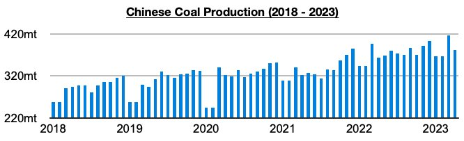
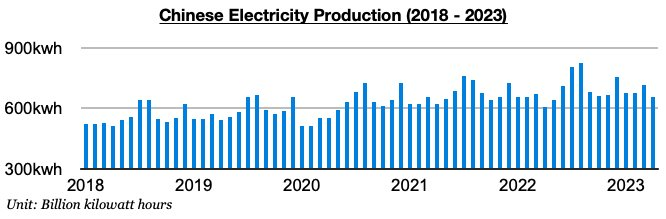
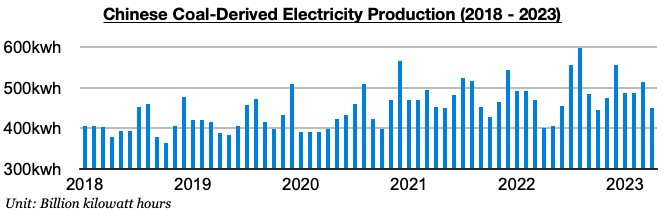

# Stronger Growth in China's Coal-Derived Electricity Production

**Date:** May 31, 2023  
**Publisher:** Breakwave Advisors | **Category:** Market Insights  
**Original URL:** [https://www.breakwaveadvisors.com/insights/2023/5/30/stronger-growth-in-chinas-coal-derived-electricity-production](https://www.breakwaveadvisors.com/insights/2023/5/30/stronger-growth-in-chinas-coal-derived-electricity-production)  

---

*By*[*Jeffrey Landsberg*](https://www.linkedin.com/in/jeffrey-landsberg-70ab957/)

China produced 381.5 million tons of coal in April. This has marked a month-on-month decline of 35.7 million tons (-9%) but is up year-on-year by 18.7 million tons (5%). As we have been stressing in our work, the central government last year shifted to no longer focusing on improving mine safety and instead focusing on ensuring robust coal production. Coal production has stayed robust this year (even as a large number of coal mine accidents and deaths have continued to occur), but each of the last two months have seen coal production growth come in lower than coal-derived electricity generation growth.

> **Figure 1: Chart 1 (74)**  
> [Local Asset](file:///C:/Users/Dell/Github/Shipping/corpus/03-breakwave/insights/2023/assets/2023-05-31_stronger-growth-in-chinas-coal-derived-electricity-production_img_chart1287429_a7ccbaf47f9c.jpg)

China's electricity production totaled 658.4 billion kilowatt hours last month. This has marked a month-on-month decline of 58.9 billion kilowatt hours (-8%) but is up year-on-year by 49.8 billion kilowatt hours (8%).

> **Figure 2: Chart 2 (63)**  
> [Local Asset](file:///C:/Users/Dell/Github/Shipping/corpus/03-breakwave/insights/2023/assets/2023-05-31_stronger-growth-in-chinas-coal-derived-electricity-production_img_chart2286329_01d19ec39812.jpg)

Coal-derived electricity generation continues to make up the bulk of the nation’s electricity production and totaled 449.4 billion kilowatt hours last month. This has marked a month-on-month decline of 65.2 billion kilowatt hours (-13%) but is up year-on-year by 48.6 billion kilowatt hours (12%). Coal-derived electricity generation growth has now exceeded coal production growth for two straight months. Previously, coal production growth had exceeded coal-derived electricity generation growth during fourteen of the prior sixteen months.

> **Figure 3: Chart 3 (45)**  
> [Local Asset](file:///C:/Users/Dell/Github/Shipping/corpus/03-breakwave/insights/2023/assets/2023-05-31_stronger-growth-in-chinas-coal-derived-electricity-production_img_chart3284529_267742124e85.jpg)
